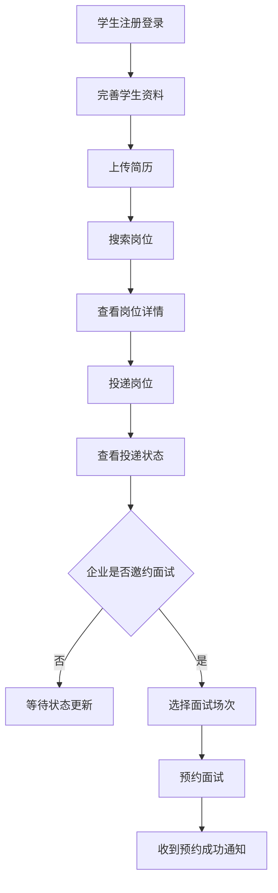
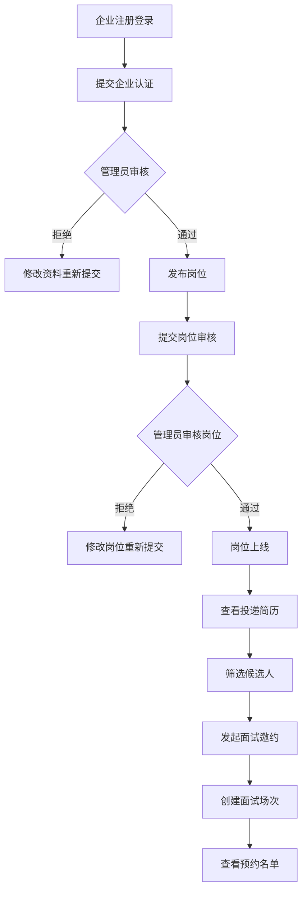
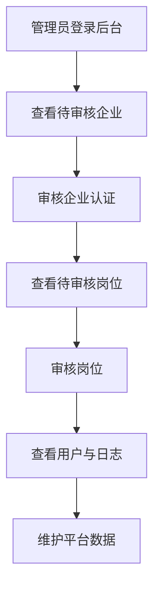
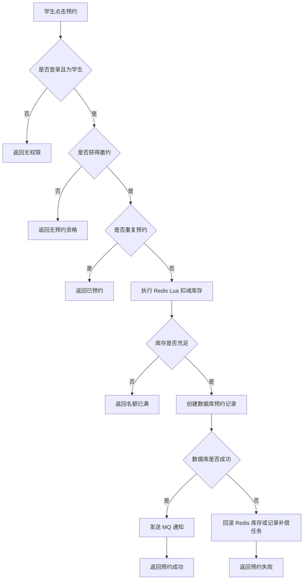

# 校园智能招聘与面试预约平台 PRD

文档版本：v1.0  
文档状态：初稿  
产品名称：校园智能招聘与面试预约平台  
面向对象：学生、企业 HR、平台管理员  
项目定位：Java 后端校招项目 / 校园招聘业务系统 / 面试预约管理系统  
建议技术栈：Spring Boot 3 + MyBatis-Plus + MySQL + Redis + RabbitMQ + Elasticsearch + MinIO + Docker Compose + Vue 3

---

## 1. 文档信息

### 1.1 文档目的

本文档用于描述“校园智能招聘与面试预约平台”的产品目标、用户角色、业务范围、功能需求、业务规则、非功能需求、验收标准和版本规划。

本文档主要供以下人员使用：

| 角色 | 用途 |
|---|---|
| 产品经理 | 明确需求范围、业务规则和验收标准 |
| 后端开发 | 理解业务流程、状态流转、权限边界和接口需求 |
| 前端开发 | 理解页面功能、交互路径和状态展示 |
| 测试人员 | 编写测试用例和验收测试 |
| 项目负责人 | 评估范围、排期、风险和交付质量 |
| 面试展示 | 说明项目不是简单 CRUD，而是有完整业务闭环和后端技术亮点 |

### 1.2 版本记录

| 版本 | 日期 | 作者 | 说明 |
|---|---|---|---|
| v1.0 | 2026-05-13 | 产品经理 | 初始版本，覆盖核心 PRD |

---

## 2. 产品背景

### 2.1 背景说明

在高校求职、实习招聘、社团招新、实验室项目招募等场景中，学生通常需要在微信群、Excel 表、公众号、学校就业平台等多个渠道之间切换。信息分散、岗位状态不透明、投递记录难追踪、面试预约效率低，是常见痛点。

企业或组织侧同样存在问题：

- 岗位发布和审核流程不统一。
- 简历收集方式分散。
- 投递状态难管理。
- 面试时间协调成本高。
- 无法直观看到岗位投递效果。
- 通知依赖人工沟通，效率低。

本项目希望提供一个面向校园场景的招聘与面试预约平台，打通从岗位发布到面试预约的完整流程。

### 2.2 业务机会

本项目不做成普通招聘网站，而聚焦“校园招聘 + 面试预约 + 技术展示”：

1. 校园场景更贴近学生身份，项目故事更自然。
2. 岗位、简历、投递、面试预约构成完整业务闭环。
3. 面试名额预约天然适合引入 Redis Lua、防超卖、MQ 异步通知等后端亮点。
4. 文件上传、搜索、审核流、权限控制、状态机等都能自然落地。
5. 项目适合校招面试展示，避免只做博客、商城、后台管理系统。

---

## 3. 产品定位与目标

### 3.1 产品定位

| 项目 | 内容 |
|---|---|
| 产品名称 | 校园智能招聘与面试预约平台 |
| 产品类型 | 校园招聘系统 / 实习投递系统 / 面试预约系统 |
| 服务对象 | 学生、企业 HR、平台管理员 |
| 核心价值 | 提供岗位发布、岗位搜索、简历投递、企业筛选、面试预约、消息通知的一体化平台 |
| 技术价值 | 通过真实业务场景承载 Java 后端高频技术点 |

### 3.2 产品目标

| 目标编号 | 目标 | 说明 |
|---|---|---|
| G-001 | 完成招聘主流程闭环 | 学生可投递，企业可筛选，管理员可审核 |
| G-002 | 降低面试预约沟通成本 | 企业创建场次，学生自助预约 |
| G-003 | 保证高并发预约正确性 | 面试名额不能超卖，不能重复预约 |
| G-004 | 提升岗位发现效率 | 支持岗位搜索、筛选、排序、推荐 |
| G-005 | 提供后台治理能力 | 企业审核、岗位审核、用户管理、日志审计 |
| G-006 | 突出后端工程能力 | 权限、缓存、MQ、搜索、文件、部署、压测均可展示 |

### 3.3 成功指标

| 指标 | 目标值 / 验收方式 |
|---|---|
| 主流程跑通 | 学生注册、上传简历、投递、预约面试完整可演示 |
| 权限隔离 | 学生、企业、管理员接口权限互不越权 |
| 防重复投递 | 同一学生不能重复投递同一岗位 |
| 防预约超卖 | 并发预约成功人数不超过场次容量 |
| 文件上传 | 简历和企业资质可上传、预览或下载 |
| 消息通知 | 投递、审核、预约结果能生成站内信 |
| 搜索体验 | 支持岗位关键词、城市、薪资、学历筛选 |
| 部署体验 | Docker Compose 可启动核心依赖 |
| 面试展示 | 至少能讲清楚 5 个后端亮点 |

---

## 4. 用户角色与画像

### 4.1 游客

| 项目 | 说明 |
|---|---|
| 身份 | 未登录用户 |
| 目标 | 浏览岗位，了解平台 |
| 主要行为 | 查看岗位列表、岗位详情、注册账号 |
| 权限限制 | 不能投递、收藏、预约、查看企业后台 |

### 4.2 学生

| 项目 | 说明 |
|---|---|
| 身份 | 高校学生 / 求职学生 |
| 目标 | 找实习、投简历、预约面试、查看进度 |
| 主要行为 | 完善资料、上传简历、搜索岗位、投递岗位、预约面试 |
| 关注点 | 岗位是否真实、投递状态是否更新、面试时间是否方便 |
| 痛点 | 信息分散、重复填表、面试时间沟通麻烦 |

### 4.3 企业 HR

| 项目 | 说明 |
|---|---|
| 身份 | 企业招聘人员 |
| 目标 | 发布岗位、收集简历、筛选候选人、安排面试 |
| 主要行为 | 企业认证、发布岗位、查看投递、发起面试邀约、创建面试场次 |
| 关注点 | 投递管理效率、候选人质量、面试预约效率 |
| 痛点 | 简历分散、状态难追踪、通知成本高 |

### 4.4 管理员

| 项目 | 说明 |
|---|---|
| 身份 | 平台运营或系统管理员 |
| 目标 | 审核企业和岗位，维护平台秩序 |
| 主要行为 | 审核企业认证、审核岗位、管理用户、查看日志 |
| 关注点 | 内容合规、数据安全、操作可追踪 |
| 痛点 | 缺少统一审核和审计工具 |

---

## 5. 产品范围

### 5.1 MVP 范围

| 模块 | MVP 功能 |
|---|---|
| 用户认证 | 注册、登录、登出、Token 校验、获取当前用户 |
| 权限管理 | 学生、企业、管理员角色；接口权限控制 |
| 学生资料 | 基本资料、技能标签、求职意向 |
| 企业认证 | 企业资料提交、资质文件上传、管理员审核 |
| 简历管理 | 上传简历、查看简历、设置默认简历、删除简历 |
| 岗位管理 | 企业发布岗位、编辑岗位、提交审核、上下架 |
| 岗位搜索 | 关键词、城市、薪资、学历、经验筛选 |
| 投递管理 | 学生投递岗位、查看投递记录、企业处理投递 |
| 面试预约 | 企业创建场次、学生预约、取消预约、防超卖 |
| 消息通知 | 投递成功、审核结果、面试预约通知 |
| 后台管理 | 用户管理、企业审核、岗位审核、日志查询 |
| 部署文档 | Docker Compose 一键启动依赖服务 |

### 5.2 非 MVP 范围

| 功能 | 说明 |
|---|---|
| 在线聊天 IM | 后续扩展，不进入第一版 |
| 真实短信通知 | MVP 用站内信代替 |
| 邮件通知 | 可作为后续增强 |
| AI 简历解析 | 可作为亮点扩展，不作为第一版必做 |
| 支付功能 | 当前业务无支付闭环 |
| 复杂推荐算法 | MVP 用标签匹配和热门排序 |
| 微服务架构 | 校招项目先保证单体工程质量 |
| 移动 App | 第一版只做 Web 端 |

---

## 6. 核心业务流程

### 6.1 学生求职主流程



### 6.2 企业招聘主流程



### 6.3 管理员审核流程



### 6.4 面试预约防超卖流程



---

## 7. 功能需求

## 7.1 用户认证模块

### 7.1.1 功能描述

用户认证模块负责学生、企业、管理员的登录认证和基础身份识别。

### 7.1.2 功能列表

| 编号 | 功能 | 用户 | 优先级 |
|---|---|---|---|
| AUTH-001 | 学生注册 | 游客 | P0 |
| AUTH-002 | 企业注册 | 游客 | P0 |
| AUTH-003 | 用户登录 | 游客 | P0 |
| AUTH-004 | 用户登出 | 登录用户 | P0 |
| AUTH-005 | 获取当前用户信息 | 登录用户 | P0 |
| AUTH-006 | 获取用户权限列表 | 登录用户 | P0 |
| AUTH-007 | 登录日志记录 | 系统 | P1 |

### 7.1.3 用户故事

| 编号 | 用户故事 |
|---|---|
| US-AUTH-001 | 作为学生，我希望可以注册账号，以便使用投递和预约功能 |
| US-AUTH-002 | 作为企业 HR，我希望可以注册企业账号，以便发布岗位和筛选简历 |
| US-AUTH-003 | 作为登录用户，我希望登录后系统能识别我的角色，以便进入对应工作台 |

### 7.1.4 业务规则

| 编号 | 规则 |
|---|---|
| BR-AUTH-001 | 用户名必须唯一 |
| BR-AUTH-002 | 密码必须加密存储，不允许明文保存 |
| BR-AUTH-003 | 禁用用户不能登录 |
| BR-AUTH-004 | 用户登录后返回 Token |
| BR-AUTH-005 | 学生和企业使用同一登录入口，管理员使用后台登录入口 |
| BR-AUTH-006 | Token 过期后访问受保护接口返回未认证 |

### 7.1.5 异常场景

| 场景 | 系统行为 |
|---|---|
| 用户名重复 | 注册失败，提示用户名已存在 |
| 密码错误 | 登录失败，提示账号或密码错误 |
| 用户被禁用 | 登录失败，提示账号已禁用 |
| Token 过期 | 返回 401 |
| 角色不匹配 | 登录失败或跳转对应角色页面 |

---

## 7.2 权限管理模块

### 7.2.1 功能描述

权限管理模块用于控制学生、企业、管理员访问不同功能和数据。

### 7.2.2 功能列表

| 编号 | 功能 | 用户 | 优先级 |
|---|---|---|---|
| PERM-001 | 角色管理 | 管理员 | P1 |
| PERM-002 | 菜单权限 | 管理员 | P1 |
| PERM-003 | 接口鉴权 | 系统 | P0 |
| PERM-004 | 数据权限控制 | 系统 | P0 |
| PERM-005 | 当前用户权限返回 | 登录用户 | P0 |

### 7.2.3 角色定义

| 角色 | 说明 |
|---|---|
| STUDENT | 学生 |
| COMPANY | 企业 HR |
| ADMIN | 管理员 |

### 7.2.4 权限矩阵

| 功能 | 游客 | 学生 | 企业 | 管理员 |
|---|---:|---:|---:|---:|
| 浏览岗位 | ✅ | ✅ | ✅ | ✅ |
| 查看岗位详情 | ✅ | ✅ | ✅ | ✅ |
| 上传简历 | ❌ | ✅ | ❌ | ❌ |
| 投递岗位 | ❌ | ✅ | ❌ | ❌ |
| 预约面试 | ❌ | ✅ | ❌ | ❌ |
| 提交企业认证 | ❌ | ❌ | ✅ | ❌ |
| 发布岗位 | ❌ | ❌ | ✅ | ✅ |
| 查看岗位投递 | ❌ | ❌ | ✅ | ✅ |
| 创建面试场次 | ❌ | ❌ | ✅ | ✅ |
| 审核企业 | ❌ | ❌ | ❌ | ✅ |
| 审核岗位 | ❌ | ❌ | ❌ | ✅ |
| 管理用户 | ❌ | ❌ | ❌ | ✅ |
| 查看操作日志 | ❌ | ❌ | ❌ | ✅ |

### 7.2.5 数据权限规则

| 数据对象 | 权限规则 |
|---|---|
| 学生资料 | 学生只能查看和修改自己的资料 |
| 简历 | 学生只能管理自己的简历；企业只能查看投递到自己岗位的简历 |
| 企业资料 | 企业只能管理自己的企业资料 |
| 岗位 | 企业只能管理自己发布的岗位 |
| 投递 | 学生只能看自己的投递；企业只能看投递到自己岗位的记录 |
| 面试预约 | 学生只能看自己的预约；企业只能看自己岗位下的预约 |
| 日志 | 仅管理员可见 |

---

## 7.3 学生资料模块

### 7.3.1 功能描述

学生资料模块用于维护学生求职资料、技能标签、求职意向。

### 7.3.2 功能列表

| 编号 | 功能 | 优先级 |
|---|---|---|
| STU-001 | 查看学生资料 | P0 |
| STU-002 | 编辑学生资料 | P0 |
| STU-003 | 管理技能标签 | P1 |
| STU-004 | 设置求职意向 | P1 |

### 7.3.3 字段需求

| 字段 | 必填 | 说明 |
|---|---:|---|
| realName | 是 | 真实姓名 |
| school | 是 | 学校 |
| major | 是 | 专业 |
| grade | 否 | 年级 |
| education | 否 | 学历 |
| city | 否 | 期望城市 |
| jobIntention | 否 | 求职意向 |
| skills | 否 | 技能标签 |
| advantage | 否 | 个人优势 |

### 7.3.4 业务规则

| 编号 | 规则 |
|---|---|
| BR-STU-001 | 学生资料只能由本人修改 |
| BR-STU-002 | 投递前建议完善资料，但 MVP 不强制 |
| BR-STU-003 | 技能标签用于岗位推荐和简历展示 |

---

## 7.4 企业认证模块

### 7.4.1 功能描述

企业认证模块用于确保发布岗位的企业具备基本真实性，避免学生看到虚假岗位。

### 7.4.2 功能列表

| 编号 | 功能 | 用户 | 优先级 |
|---|---|---|---|
| COM-001 | 提交企业认证 | 企业 | P0 |
| COM-002 | 查看认证状态 | 企业 | P0 |
| COM-003 | 修改认证资料 | 企业 | P1 |
| COM-004 | 审核企业认证 | 管理员 | P0 |
| COM-005 | 查看认证历史 | 管理员 | P1 |

### 7.4.3 字段需求

| 字段 | 必填 | 说明 |
|---|---:|---|
| companyName | 是 | 企业名称 |
| industry | 否 | 行业 |
| scale | 否 | 企业规模 |
| city | 是 | 城市 |
| address | 否 | 详细地址 |
| contactName | 是 | 联系人 |
| contactPhone | 是 | 联系电话 |
| licenseFileId | 是 | 企业资质文件 |

### 7.4.4 业务规则

| 编号 | 规则 |
|---|---|
| BR-COM-001 | 企业认证通过前不能发布岗位 |
| BR-COM-002 | 企业提交认证后状态变为待审核 |
| BR-COM-003 | 管理员审核通过后企业状态变为已认证 |
| BR-COM-004 | 审核拒绝必须填写拒绝原因 |
| BR-COM-005 | 企业资料重大修改后可重新进入审核 |

### 7.4.5 状态机

| 当前状态 | 可流转到 | 触发人 | 说明 |
|---|---|---|---|
| UNVERIFIED | PENDING | 企业 | 提交认证 |
| PENDING | APPROVED | 管理员 | 审核通过 |
| PENDING | REJECTED | 管理员 | 审核拒绝 |
| REJECTED | PENDING | 企业 | 修改后重新提交 |

---

## 7.5 文件与简历模块

### 7.5.1 功能描述

文件模块负责上传和管理简历、头像、企业资质等文件。简历模块负责学生简历记录管理。

### 7.5.2 功能列表

| 编号 | 功能 | 用户 | 优先级 |
|---|---|---|---|
| FILE-001 | 上传文件 | 登录用户 | P0 |
| FILE-002 | 下载文件 | 有权限用户 | P0 |
| FILE-003 | 文件格式校验 | 系统 | P0 |
| RES-001 | 创建简历记录 | 学生 | P0 |
| RES-002 | 简历列表 | 学生 | P0 |
| RES-003 | 设置默认简历 | 学生 | P0 |
| RES-004 | 删除简历 | 学生 | P1 |
| RES-005 | 企业查看投递简历 | 企业 | P0 |

### 7.5.3 文件限制

| 类型 | 允许格式 | 最大大小 |
|---|---|---:|
| 简历 | pdf、doc、docx | 10MB |
| 企业资质 | jpg、png、pdf | 10MB |
| 头像 | jpg、png、webp | 2MB |

### 7.5.4 业务规则

| 编号 | 规则 |
|---|---|
| BR-FILE-001 | 文件统一存储到 MinIO |
| BR-FILE-002 | MySQL 只保存文件元数据，不保存文件二进制 |
| BR-FILE-003 | 企业只能查看投递到自己岗位的简历 |
| BR-FILE-004 | 学生可设置一份默认简历 |
| BR-FILE-005 | 如果投递时不传 resumeId，则使用默认简历 |

---

## 7.6 岗位管理模块

### 7.6.1 功能描述

岗位管理模块支持企业发布岗位、编辑岗位、提交审核、上下架岗位，管理员审核岗位，学生浏览已发布岗位。

### 7.6.2 功能列表

| 编号 | 功能 | 用户 | 优先级 |
|---|---|---|---|
| JOB-001 | 创建岗位草稿 | 企业 | P0 |
| JOB-002 | 编辑岗位 | 企业 | P0 |
| JOB-003 | 提交岗位审核 | 企业 | P0 |
| JOB-004 | 审核岗位 | 管理员 | P0 |
| JOB-005 | 上架岗位 | 企业/管理员 | P0 |
| JOB-006 | 下架岗位 | 企业/管理员 | P0 |
| JOB-007 | 岗位详情 | 游客/学生/企业 | P0 |
| JOB-008 | 岗位过期自动下架 | 系统 | P1 |

### 7.6.3 字段需求

| 字段 | 必填 | 说明 |
|---|---:|---|
| title | 是 | 岗位名称 |
| category | 否 | 岗位分类 |
| city | 是 | 工作城市 |
| salaryMin | 否 | 最低薪资 |
| salaryMax | 否 | 最高薪资 |
| salaryUnit | 是 | 薪资单位 |
| education | 否 | 学历要求 |
| experience | 否 | 经验要求 |
| description | 是 | 岗位描述 |
| requirement | 是 | 岗位要求 |
| tags | 否 | 技能标签 |
| expireTime | 否 | 截止时间 |

### 7.6.4 业务规则

| 编号 | 规则 |
|---|---|
| BR-JOB-001 | 企业认证通过后才能创建岗位 |
| BR-JOB-002 | 企业只能编辑自己发布的岗位 |
| BR-JOB-003 | 待审核岗位学生不可见 |
| BR-JOB-004 | 审核通过的岗位才可出现在搜索结果中 |
| BR-JOB-005 | 审核拒绝必须填写原因 |
| BR-JOB-006 | 已发布岗位可以下架 |
| BR-JOB-007 | 过期岗位由定时任务自动下架 |

### 7.6.5 岗位状态机

| 当前状态 | 可流转到 | 触发人 | 说明 |
|---|---|---|---|
| DRAFT | PENDING_REVIEW | 企业 | 提交审核 |
| PENDING_REVIEW | PUBLISHED | 管理员 | 审核通过 |
| PENDING_REVIEW | REJECTED | 管理员 | 审核拒绝 |
| REJECTED | DRAFT | 企业 | 修改后保存 |
| PUBLISHED | OFFLINE | 企业/管理员 | 下架 |
| PUBLISHED | EXPIRED | 系统 | 过期自动下架 |
| OFFLINE | PENDING_REVIEW | 企业 | 修改后重新提交 |

---

## 7.7 岗位搜索模块

### 7.7.1 功能描述

岗位搜索模块支持学生按关键词、城市、薪资、学历、经验、标签等条件搜索岗位。

### 7.7.2 功能列表

| 编号 | 功能 | 优先级 |
|---|---|---|
| SEARCH-001 | 关键词搜索 | P0 |
| SEARCH-002 | 城市筛选 | P0 |
| SEARCH-003 | 薪资范围筛选 | P0 |
| SEARCH-004 | 学历筛选 | P0 |
| SEARCH-005 | 标签筛选 | P1 |
| SEARCH-006 | 最新排序 | P0 |
| SEARCH-007 | 热门排序 | P1 |
| SEARCH-008 | 搜索结果高亮 | P2 |

### 7.7.3 业务规则

| 编号 | 规则 |
|---|---|
| BR-SEARCH-001 | 只搜索已发布岗位 |
| BR-SEARCH-002 | 关键词匹配岗位标题、企业名称、岗位描述、标签 |
| BR-SEARCH-003 | MVP 可先用 MySQL 模糊搜索，后续升级 Elasticsearch |
| BR-SEARCH-004 | 热门排序可基于浏览数、投递数、收藏数加权 |
| BR-SEARCH-005 | 无结果时返回空列表，不抛异常 |

---

## 7.8 投递管理模块

### 7.8.1 功能描述

投递模块负责学生投递岗位、查看投递状态，企业查看和处理投递。

### 7.8.2 功能列表

| 编号 | 功能 | 用户 | 优先级 |
|---|---|---|---|
| APP-001 | 投递岗位 | 学生 | P0 |
| APP-002 | 我的投递列表 | 学生 | P0 |
| APP-003 | 投递详情 | 学生 | P0 |
| APP-004 | 企业投递列表 | 企业 | P0 |
| APP-005 | 企业查看简历 | 企业 | P0 |
| APP-006 | 修改投递状态 | 企业 | P0 |
| APP-007 | 投递状态日志 | 系统 | P1 |

### 7.8.3 业务规则

| 编号 | 规则 |
|---|---|
| BR-APP-001 | 学生必须登录后才能投递 |
| BR-APP-002 | 学生必须有简历才能投递 |
| BR-APP-003 | 同一学生不能重复投递同一岗位 |
| BR-APP-004 | 已下架、未发布、过期岗位不能投递 |
| BR-APP-005 | 企业只能查看投递到自己岗位的投递记录 |
| BR-APP-006 | 投递状态流转必须合法 |
| BR-APP-007 | 投递成功后发送站内信 |
| BR-APP-008 | 投递记录和投递状态日志应在同一事务中完成 |

### 7.8.4 投递状态机

| 当前状态 | 可流转到 | 触发人 | 说明 |
|---|---|---|---|
| DELIVERED | VIEWED | 企业 | 查看简历 |
| VIEWED | INTERVIEW_INVITED | 企业 | 邀约面试 |
| VIEWED | REJECTED | 企业 | 不合适 |
| INTERVIEW_INVITED | BOOKED | 学生 | 预约面试 |
| BOOKED | FINISHED | 企业/系统 | 面试完成 |
| BOOKED | CANCELED | 学生/企业 | 取消预约 |

---

## 7.9 面试预约模块

### 7.9.1 功能描述

面试预约模块用于企业创建面试场次，学生选择可用场次进行预约。该模块是本项目核心技术亮点之一。

### 7.9.2 功能列表

| 编号 | 功能 | 用户 | 优先级 |
|---|---|---|---|
| INT-001 | 创建面试场次 | 企业 | P0 |
| INT-002 | 编辑面试场次 | 企业 | P1 |
| INT-003 | 查询可预约场次 | 学生 | P0 |
| INT-004 | 预约面试 | 学生 | P0 |
| INT-005 | 取消预约 | 学生/企业 | P1 |
| INT-006 | 查看预约名单 | 企业 | P0 |
| INT-007 | 防重复预约 | 系统 | P0 |
| INT-008 | 防名额超卖 | 系统 | P0 |
| INT-009 | 预约成功通知 | 系统 | P0 |

### 7.9.3 业务规则

| 编号 | 规则 |
|---|---|
| BR-INT-001 | 企业只能为自己的岗位创建面试场次 |
| BR-INT-002 | 学生必须获得面试邀约后才能预约 |
| BR-INT-003 | 学生不能重复预约同一场次 |
| BR-INT-004 | 场次剩余名额为 0 时不能预约 |
| BR-INT-005 | 预约成功后场次剩余名额减少 |
| BR-INT-006 | 取消预约后可恢复名额 |
| BR-INT-007 | 高并发预约必须保证不超卖 |
| BR-INT-008 | 使用 Redis Lua 保证名额判断和扣减原子性 |
| BR-INT-009 | 数据库唯一索引兜底防止重复预约 |
| BR-INT-010 | 数据库写入失败时需要回滚库存或记录补偿任务 |

### 7.9.4 面试场次状态机

| 当前状态 | 可流转到 | 触发人 | 说明 |
|---|---|---|---|
| OPEN | FULL | 系统 | 名额约满 |
| OPEN | CLOSED | 企业 | 手动关闭 |
| OPEN | EXPIRED | 系统 | 时间过期 |
| FULL | OPEN | 系统 | 有人取消释放名额 |
| FULL | EXPIRED | 系统 | 时间过期 |
| CLOSED | OPEN | 企业 | 重新开放 |

### 7.9.5 预约状态机

| 当前状态 | 可流转到 | 触发人 | 说明 |
|---|---|---|---|
| BOOKED | CANCELED | 学生/企业 | 取消预约 |
| BOOKED | FINISHED | 企业/系统 | 面试完成 |
| CANCELED | BOOKED | 学生 | 重新预约，需要重新扣减名额 |

---

## 7.10 消息通知模块

### 7.10.1 功能描述

消息通知模块用于向学生、企业发送投递、审核、面试预约相关站内信。

### 7.10.2 功能列表

| 编号 | 功能 | 用户 | 优先级 |
|---|---|---|---|
| MSG-001 | 我的消息列表 | 登录用户 | P0 |
| MSG-002 | 消息详情 | 登录用户 | P0 |
| MSG-003 | 标记已读 | 登录用户 | P0 |
| MSG-004 | 投递成功通知 | 系统 | P0 |
| MSG-005 | 审核结果通知 | 系统 | P0 |
| MSG-006 | 面试预约通知 | 系统 | P0 |
| MSG-007 | MQ 消费幂等 | 系统 | P0 |

### 7.10.3 业务规则

| 编号 | 规则 |
|---|---|
| BR-MSG-001 | 消息只允许接收人查看 |
| BR-MSG-002 | 业务事件产生后可异步生成站内信 |
| BR-MSG-003 | MQ 消费必须支持幂等 |
| BR-MSG-004 | 重复 messageId 不应生成重复消息 |
| BR-MSG-005 | 消费失败应支持重试或死信处理 |

---

## 7.11 管理后台模块

### 7.11.1 功能描述

管理员后台用于维护平台秩序，包含企业审核、岗位审核、用户管理、日志查询等功能。

### 7.11.2 功能列表

| 编号 | 功能 | 优先级 |
|---|---|---|
| ADMIN-001 | 数据看板 | P1 |
| ADMIN-002 | 用户列表 | P0 |
| ADMIN-003 | 禁用/恢复用户 | P0 |
| ADMIN-004 | 企业审核列表 | P0 |
| ADMIN-005 | 企业审核详情 | P0 |
| ADMIN-006 | 岗位审核列表 | P0 |
| ADMIN-007 | 岗位审核详情 | P0 |
| ADMIN-008 | 操作日志查询 | P1 |
| ADMIN-009 | 登录日志查询 | P1 |
| ADMIN-010 | 字典管理 | P2 |

### 7.11.3 业务规则

| 编号 | 规则 |
|---|---|
| BR-ADMIN-001 | 只有管理员可访问后台 |
| BR-ADMIN-002 | 审核企业和岗位必须记录操作日志 |
| BR-ADMIN-003 | 禁用用户后用户不能登录 |
| BR-ADMIN-004 | 管理员不能查看用户密码明文 |
| BR-ADMIN-005 | 日志不能记录密码、Token 等敏感信息 |

---

## 8. 页面需求概览

### 8.1 公共页面

| 页面 | 功能 |
|---|---|
| 登录页 | 学生、企业登录 |
| 注册页 | 学生、企业注册 |
| 忘记密码页 | 模拟找回密码 |
| 403 页 | 无权限提示 |
| 404 页 | 页面不存在提示 |
| 500 页 | 系统错误提示 |

### 8.2 学生端页面

| 页面 | 功能 |
|---|---|
| 学生首页 | 推荐岗位、热门岗位、投递概览 |
| 岗位列表 | 搜索、筛选、排序 |
| 岗位详情 | 查看岗位、投递、收藏 |
| 简历管理 | 上传、预览、下载、设置默认 |
| 我的投递 | 查看投递状态 |
| 投递详情 | 查看状态流转 |
| 面试预约 | 选择场次预约 |
| 我的预约 | 查看和取消预约 |
| 消息中心 | 查看站内信 |
| 个人资料 | 编辑学生信息 |
| 账号设置 | 修改手机号、邮箱、密码 |

### 8.3 企业端页面

| 页面 | 功能 |
|---|---|
| 企业工作台 | 投递、岗位、面试数据概览 |
| 企业认证页 | 提交认证资料 |
| 企业资料页 | 编辑企业信息 |
| 岗位管理 | 发布、编辑、上下架岗位 |
| 投递管理 | 查看投递、筛选简历 |
| 投递详情 | 查看简历、修改投递状态 |
| 面试场次管理 | 创建、编辑、关闭场次 |
| 预约名单 | 查看预约学生 |
| 消息中心 | 查看企业通知 |

### 8.4 管理后台页面

| 页面 | 功能 |
|---|---|
| 数据看板 | 用户、岗位、投递统计 |
| 用户管理 | 查询、禁用、恢复用户 |
| 企业审核 | 审核企业认证 |
| 岗位审核 | 审核岗位内容 |
| 字典管理 | 管理岗位分类、学历等字典 |
| 操作日志 | 查看关键操作 |
| 登录日志 | 查看登录记录 |
| 系统配置 | 配置文件限制、缓存 TTL 等 |

---

## 9. 数据需求

### 9.1 核心数据表

| 表名 | 说明 |
|---|---|
| sys_user | 用户表 |
| sys_role | 角色表 |
| sys_menu | 菜单权限表 |
| sys_user_role | 用户角色关联表 |
| sys_role_menu | 角色菜单关联表 |
| student_profile | 学生资料表 |
| student_skill | 学生技能表 |
| company_profile | 企业资料表 |
| company_audit | 企业审核记录表 |
| file_object | 文件对象表 |
| resume | 简历表 |
| job | 岗位表 |
| job_tag | 岗位标签表 |
| job_favorite | 岗位收藏表 |
| application | 投递表 |
| application_log | 投递状态日志表 |
| interview_slot | 面试场次表 |
| interview_booking | 面试预约表 |
| message | 站内信表 |
| operation_log | 操作日志表 |
| login_log | 登录日志表 |
| sys_dict | 系统字典表 |

### 9.2 关键唯一约束

| 表 | 唯一约束 | 用途 |
|---|---|---|
| sys_user | username | 防止用户名重复 |
| job_favorite | student_id + job_id | 防重复收藏 |
| application | student_id + job_id | 防重复投递 |
| interview_booking | slot_id + student_id | 防重复预约 |
| message | message_id | MQ 消费幂等 |

### 9.3 关键索引

| 表 | 索引字段 | 用途 |
|---|---|---|
| job | status、city、category、create_time | 岗位搜索 |
| job | company_id | 企业岗位管理 |
| application | student_id、status | 我的投递 |
| application | company_id、job_id、status | 企业投递列表 |
| interview_slot | job_id、status、start_time | 查询可预约场次 |
| interview_booking | student_id、status | 我的预约 |
| message | receiver_id、read_status | 我的消息 |
| operation_log | user_id、module、create_time | 日志查询 |

---

## 10. 接口需求概览

### 10.1 通用响应

```json
{
  "code": 0,
  "message": "success",
  "data": {}
}
```

### 10.2 核心接口列表

| 模块 | 方法 | URL | 说明 |
|---|---|---|---|
| 认证 | POST | /api/auth/register | 注册 |
| 认证 | POST | /api/auth/login | 登录 |
| 认证 | POST | /api/auth/logout | 登出 |
| 认证 | GET | /api/auth/me | 当前用户 |
| 学生 | PUT | /api/student/profile | 保存学生资料 |
| 企业 | POST | /api/company/certification | 提交企业认证 |
| 文件 | POST | /api/files/upload | 上传文件 |
| 简历 | POST | /api/resumes | 创建简历 |
| 简历 | GET | /api/resumes/my | 我的简历 |
| 岗位 | GET | /api/jobs | 岗位列表 |
| 岗位 | GET | /api/jobs/{id} | 岗位详情 |
| 岗位 | POST | /api/company/jobs | 创建岗位 |
| 岗位 | PUT | /api/company/jobs/{id} | 编辑岗位 |
| 岗位 | PUT | /api/company/jobs/{id}/submit | 提交审核 |
| 投递 | POST | /api/applications | 投递岗位 |
| 投递 | GET | /api/applications/my | 我的投递 |
| 投递 | GET | /api/company/applications | 企业投递列表 |
| 投递 | PUT | /api/company/applications/{id}/status | 修改投递状态 |
| 面试 | POST | /api/company/interview/slots | 创建面试场次 |
| 面试 | GET | /api/interview/slots | 查询可预约场次 |
| 面试 | POST | /api/interview/bookings | 预约面试 |
| 面试 | PUT | /api/interview/bookings/{id}/cancel | 取消预约 |
| 消息 | GET | /api/messages/my | 我的消息 |
| 消息 | PUT | /api/messages/{id}/read | 标记已读 |
| 后台 | PUT | /api/admin/companies/{id}/audit | 审核企业 |
| 后台 | PUT | /api/admin/jobs/{id}/audit | 审核岗位 |
| 后台 | GET | /api/admin/users | 用户列表 |
| 后台 | GET | /api/admin/logs/operation | 操作日志 |

---

## 11. 非功能需求

### 11.1 性能需求

| 编号 | 需求 |
|---|---|
| NFR-PERF-001 | 岗位列表普通查询 1 秒内返回 |
| NFR-PERF-002 | 岗位详情使用 Redis 缓存优化高频访问 |
| NFR-PERF-003 | 面试预约接口支持并发压测，不能超卖 |
| NFR-PERF-004 | 后台列表均使用分页查询 |
| NFR-PERF-005 | 文件上传大小受限，避免大文件拖垮服务 |

### 11.2 安全需求

| 编号 | 需求 |
|---|---|
| NFR-SEC-001 | 密码加密存储 |
| NFR-SEC-002 | 受保护接口必须登录 |
| NFR-SEC-003 | 企业不能访问其他企业数据 |
| NFR-SEC-004 | 学生不能访问其他学生数据 |
| NFR-SEC-005 | 文件下载必须校验权限 |
| NFR-SEC-006 | 日志不能记录密码、Token 等敏感信息 |

### 11.3 可用性需求

| 编号 | 需求 |
|---|---|
| NFR-USE-001 | 表单必填项有明确提示 |
| NFR-USE-002 | 空数据页面有空状态 |
| NFR-USE-003 | 上传、搜索、提交等操作有加载状态 |
| NFR-USE-004 | 失败操作有可理解的错误提示 |
| NFR-USE-005 | 关键操作有二次确认 |

### 11.4 可维护性需求

| 编号 | 需求 |
|---|---|
| NFR-MAIN-001 | Controller、Service、Mapper 分层清晰 |
| NFR-MAIN-002 | 入参使用 DTO，出参使用 VO |
| NFR-MAIN-003 | 统一异常处理 |
| NFR-MAIN-004 | 统一错误码 |
| NFR-MAIN-005 | 核心状态使用枚举 |
| NFR-MAIN-006 | Redis Key、MQ Exchange、Queue 使用常量管理 |

### 11.5 可部署性需求

| 编号 | 需求 |
|---|---|
| NFR-DEP-001 | 提供 Docker Compose |
| NFR-DEP-002 | MySQL、Redis、RabbitMQ、MinIO、Elasticsearch 可一键启动 |
| NFR-DEP-003 | 提供 application-dev.yml 和 application-prod.yml |
| NFR-DEP-004 | 密码和密钥通过环境变量配置 |
| NFR-DEP-005 | README 提供启动步骤 |

---

## 12. 验收标准

### 12.1 通用验收标准

| 编号 | 验收项 |
|---|---|
| AC-GEN-001 | 所有接口返回统一响应格式 |
| AC-GEN-002 | 所有需要登录的接口未登录访问返回 401 |
| AC-GEN-003 | 无权限访问返回 403 |
| AC-GEN-004 | 参数错误返回明确错误信息 |
| AC-GEN-005 | 业务异常不向前端暴露系统堆栈 |
| AC-GEN-006 | 核心操作记录操作日志 |
| AC-GEN-007 | Docker Compose 可启动核心依赖 |

### 12.2 认证模块验收标准

| 编号 | 验收项 |
|---|---|
| AC-AUTH-001 | 学生可以注册 |
| AC-AUTH-002 | 企业可以注册 |
| AC-AUTH-003 | 用户名重复时注册失败 |
| AC-AUTH-004 | 登录成功后返回 Token |
| AC-AUTH-005 | 密码错误时登录失败 |
| AC-AUTH-006 | 禁用用户不能登录 |
| AC-AUTH-007 | 登出后 Token 失效 |

### 12.3 企业认证验收标准

| 编号 | 验收项 |
|---|---|
| AC-COM-001 | 企业可提交认证资料 |
| AC-COM-002 | 未上传资质文件时认证失败 |
| AC-COM-003 | 管理员可审核通过企业 |
| AC-COM-004 | 管理员可拒绝企业并填写原因 |
| AC-COM-005 | 未认证企业不能发布岗位 |

### 12.4 简历验收标准

| 编号 | 验收项 |
|---|---|
| AC-RES-001 | 学生可上传 PDF/DOC/DOCX 简历 |
| AC-RES-002 | 超过大小限制上传失败 |
| AC-RES-003 | 非法文件类型上传失败 |
| AC-RES-004 | 学生可设置默认简历 |
| AC-RES-005 | 企业只能查看投递到自己岗位的简历 |

### 12.5 岗位验收标准

| 编号 | 验收项 |
|---|---|
| AC-JOB-001 | 认证企业可创建岗位草稿 |
| AC-JOB-002 | 企业可编辑自己的岗位 |
| AC-JOB-003 | 企业不能编辑其他企业岗位 |
| AC-JOB-004 | 岗位提交审核后变为待审核 |
| AC-JOB-005 | 审核通过岗位可被学生搜索 |
| AC-JOB-006 | 审核拒绝岗位不可被搜索 |
| AC-JOB-007 | 已发布岗位可下架 |
| AC-JOB-008 | 过期岗位自动下架 |

### 12.6 投递验收标准

| 编号 | 验收项 |
|---|---|
| AC-APP-001 | 学生可投递已发布岗位 |
| AC-APP-002 | 无简历时不能投递 |
| AC-APP-003 | 同一学生不能重复投递同一岗位 |
| AC-APP-004 | 投递成功生成投递记录 |
| AC-APP-005 | 投递成功写入状态日志 |
| AC-APP-006 | 企业只能查看自己岗位的投递 |
| AC-APP-007 | 非法状态流转失败 |

### 12.7 面试预约验收标准

| 编号 | 验收项 |
|---|---|
| AC-INT-001 | 企业可创建面试场次 |
| AC-INT-002 | 学生必须获得邀约后才能预约 |
| AC-INT-003 | 学生只能预约开放且有名额的场次 |
| AC-INT-004 | 同一学生不能重复预约同一场次 |
| AC-INT-005 | 预约成功后剩余名额减少 |
| AC-INT-006 | 取消预约后剩余名额恢复 |
| AC-INT-007 | 并发预约成功人数不能超过总名额 |
| AC-INT-008 | 预约成功后发送站内信 |
| AC-INT-009 | 数据库写入失败时需要库存补偿 |

### 12.8 消息验收标准

| 编号 | 验收项 |
|---|---|
| AC-MSG-001 | 投递成功生成站内信 |
| AC-MSG-002 | 审核结果生成站内信 |
| AC-MSG-003 | 预约成功生成站内信 |
| AC-MSG-004 | 消息可标记已读 |
| AC-MSG-005 | 重复 MQ 消息不会生成重复站内信 |

---

## 13. 迭代计划

| 迭代 | 周期 | 目标 | 交付内容 |
|---|---|---|---|
| Sprint 0 | 2 天 | 项目初始化 | 后端工程、前端工程、数据库脚本、Docker Compose |
| Sprint 1 | 第 1 周 | 用户与权限 | 注册、登录、Token、RBAC、全局异常、统一返回 |
| Sprint 2 | 第 2 周 | 学生与企业基础 | 学生资料、企业认证、文件上传 |
| Sprint 3 | 第 3 周 | 岗位管理 | 岗位发布、审核、搜索基础 |
| Sprint 4 | 第 4 周 | 简历与投递 | 简历管理、投递、企业筛选、状态流转 |
| Sprint 5 | 第 5 周 | 面试预约 | 场次、预约、防重复、防超卖 |
| Sprint 6 | 第 6 周 | 消息与搜索增强 | RabbitMQ、站内信、ES 搜索、热门岗位 |
| Sprint 7 | 第 7 周 | 后台与日志 | 用户管理、审核列表、操作日志、数据看板 |
| Sprint 8 | 第 8 周 | 测试与交付 | JMeter 压测、README、接口文档、部署文档 |

---

## 14. 风险与应对

| 风险 | 影响 | 应对方案 |
|---|---|---|
| 功能范围过大 | 项目做不完 | 坚持 MVP，先跑通主流程 |
| 技术点堆砌 | 面试讲不清 | 每个技术点必须绑定业务场景 |
| 面试预约并发复杂 | 容易出现超卖 | Redis Lua + 唯一索引 + 压测验证 |
| MQ 一致性问题 | 通知重复或丢失 | messageId 幂等 + 重试机制 |
| ES 同步不一致 | 搜索结果滞后 | MQ 同步 + 定时补偿 |
| 文件权限漏洞 | 简历泄露 | 文件下载必须校验权限 |
| 权限边界不清 | 出现越权访问 | 权限矩阵 + 数据权限校验 |
| 前后端联调拖慢 | 接口理解不一致 | 提前定义接口字段和错误码 |

---

## 15. 错误码设计

| 错误码 | 模块 | 含义 |
|---:|---|---|
| 0 | 通用 | 成功 |
| 400 | 通用 | 参数错误 |
| 401 | 认证 | 未登录 |
| 403 | 权限 | 无权限 |
| 404 | 通用 | 资源不存在 |
| 500 | 通用 | 系统异常 |
| 10001 | 用户 | 用户名已存在 |
| 10002 | 用户 | 密码错误 |
| 10003 | 用户 | 用户被禁用 |
| 20001 | 企业 | 企业未认证 |
| 20002 | 企业 | 企业认证待审核 |
| 30001 | 简历 | 未上传简历 |
| 30002 | 投递 | 重复投递 |
| 30003 | 岗位 | 岗位不存在 |
| 30004 | 岗位 | 岗位未发布 |
| 40001 | 面试 | 未获得面试邀约 |
| 40002 | 面试 | 重复预约 |
| 40003 | 面试 | 名额已满 |
| 40004 | 面试 | 场次已过期 |
| 50001 | 文件 | 文件类型不支持 |
| 50002 | 文件 | 文件过大 |
| 60001 | MQ | 消息消费失败 |

---

## 16. 埋点与统计需求

| 指标 | 来源 | 用途 |
|---|---|---|
| 岗位浏览次数 | 岗位详情访问 | 热门岗位排行 |
| 岗位投递次数 | 投递记录 | 企业岗位效果 |
| 简历查看次数 | 企业查看简历 | 学生反馈 |
| 搜索关键词 | 搜索请求 | 分析热门岗位方向 |
| 面试预约成功数 | 预约记录 | 分析面试转化 |
| 企业审核通过率 | 审核记录 | 管理看板 |
| 用户注册数 | 用户表 | 用户增长 |
| 日活跃用户 | 登录日志 / 行为日志 | 活跃度分析 |
| 投递转面试率 | 投递与预约数据 | 招聘效果分析 |

---

## 17. 面试展示重点

| 技术点 | 业务场景 | 面试讲法 |
|---|---|---|
| RBAC 权限 | 学生、企业、管理员角色隔离 | 用户-角色-菜单-权限模型 |
| 数据权限 | 企业只能看自己的岗位和投递 | 防水平越权 |
| Redis 缓存 | 岗位详情、热门岗位 | 缓存穿透、击穿、雪崩 |
| Redis Lua | 面试名额预约 | 原子扣减，防超卖 |
| RabbitMQ | 投递和预约通知 | 异步解耦、削峰、消费幂等 |
| Elasticsearch | 岗位搜索 | 倒排索引、分词、相关性排序 |
| MinIO | 简历和资质文件 | 对象存储、权限下载 |
| AOP 日志 | 审核和状态变更 | 自定义注解、操作审计 |
| Docker Compose | 本地部署 | 一键启动中间件 |
| JMeter | 并发预约压测 | 验证无超卖 |

---

## 18. 附录：术语说明

| 术语 | 说明 |
|---|---|
| RBAC | Role-Based Access Control，基于角色的权限控制 |
| DTO | Data Transfer Object，接口入参对象 |
| VO | View Object，接口出参对象 |
| MQ | Message Queue，消息队列 |
| ES | Elasticsearch，全文搜索引擎 |
| MinIO | 对象存储服务 |
| Lua | Redis 中用于执行原子脚本的脚本语言 |
| 防超卖 | 在并发情况下保证成功预约数不超过库存/名额 |
| 幂等 | 同一操作重复执行不会产生重复副作用 |
| 状态机 | 对业务对象状态流转进行约束的模型 |

---

## 19. 参考资料

- Aha! PRD 模板说明：<https://www.aha.io/roadmapping/guide/requirements-management/what-is-a-good-product-requirements-document-template>
- Atlassian 验收标准说明：<https://www.atlassian.com/work-management/project-management/acceptance-criteria>
- Figma 开发交付最佳实践：<https://www.figma.com/best-practices/guide-to-developer-handoff/>
- OpenAPI Specification：<https://swagger.io/specification/>
