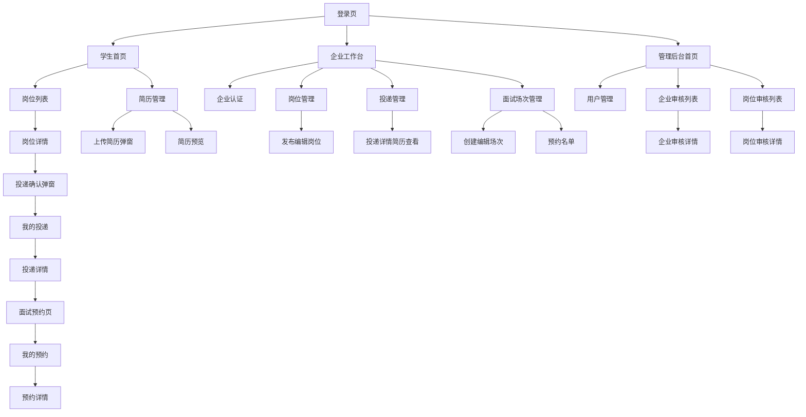

# 校园智能招聘与面试预约平台：低保真原型图全集

版本：v1.0  
导出日期：2026-05-13  
适用范围：Web 端 / 企业端 / 管理后台 / 校招项目展示  
项目名称：校园智能招聘与面试预约平台

---

## 0. 说明

本文档提供“校园智能招聘与面试预约平台”的低保真原型图全集，覆盖公共页面、学生端、企业端、管理员后台、通用弹窗与状态页。

低保真原型图重点表达页面结构、信息层级、按钮位置、操作路径、空状态、错误状态、加载状态和权限差异；不表达最终颜色、字体、图标、间距和视觉风格。

低保真原型适合在早期快速统一产品结构和用户流程；正式交付开发时，还需要配合接口字段、状态说明、权限矩阵和验收标准。

---

# 1. 页面总览

## 1.1 公共页面

| 编号 | 页面 | 路径建议 |
|---|---|---|
| P-001 | 登录页 | `/login` |
| P-002 | 注册页 | `/register` |
| P-003 | 忘记密码页 | `/forgot-password` |
| P-004 | 403 无权限页 | `/403` |
| P-005 | 404 页面不存在 | `/404` |
| P-006 | 系统错误页 | `/500` |

## 1.2 学生端页面

| 编号 | 页面 | 路径建议 |
|---|---|---|
| S-001 | 学生首页 | `/student/home` |
| S-002 | 岗位搜索 / 岗位列表 | `/jobs` |
| S-003 | 岗位详情 | `/jobs/:id` |
| S-004 | 简历管理 | `/student/resumes` |
| S-005 | 上传简历弹窗 | Modal |
| S-006 | 简历预览页 | `/student/resumes/:id` |
| S-007 | 我的投递 | `/student/applications` |
| S-008 | 投递详情 | `/student/applications/:id` |
| S-009 | 面试预约页 | `/student/interviews/book` |
| S-010 | 我的预约 | `/student/interviews` |
| S-011 | 预约详情 | `/student/interviews/:id` |
| S-012 | 我的收藏 | `/student/favorites` |
| S-013 | 消息中心 | `/student/messages` |
| S-014 | 个人资料 | `/student/profile` |
| S-015 | 账号设置 | `/student/settings` |

## 1.3 企业端页面

| 编号 | 页面 | 路径建议 |
|---|---|---|
| C-001 | 企业工作台 | `/company/dashboard` |
| C-002 | 企业认证提交页 | `/company/certification` |
| C-003 | 企业认证状态页 | `/company/certification/status` |
| C-004 | 企业资料页 | `/company/profile` |
| C-005 | 岗位管理列表 | `/company/jobs` |
| C-006 | 发布 / 编辑岗位页 | `/company/jobs/edit` |
| C-007 | 岗位详情管理页 | `/company/jobs/:id` |
| C-008 | 投递管理列表 | `/company/applications` |
| C-009 | 投递详情 / 简历查看页 | `/company/applications/:id` |
| C-010 | 面试场次管理 | `/company/interview/slots` |
| C-011 | 创建 / 编辑面试场次 | `/company/interview/slots/edit` |
| C-012 | 面试预约名单 | `/company/interview/slots/:id/bookings` |
| C-013 | 企业消息中心 | `/company/messages` |

## 1.4 管理员后台页面

| 编号 | 页面 | 路径建议 |
|---|---|---|
| A-001 | 管理员登录页 | `/admin/login` |
| A-002 | 管理后台首页 / 数据看板 | `/admin/dashboard` |
| A-003 | 用户管理 | `/admin/users` |
| A-004 | 企业审核列表 | `/admin/company-audits` |
| A-005 | 企业审核详情 | `/admin/company-audits/:id` |
| A-006 | 岗位审核列表 | `/admin/job-audits` |
| A-007 | 岗位审核详情 | `/admin/job-audits/:id` |
| A-008 | 字典管理 | `/admin/dicts` |
| A-009 | 操作日志 | `/admin/logs/operation` |
| A-010 | 登录日志 | `/admin/logs/login` |
| A-011 | 消息管理 | `/admin/messages` |
| A-012 | 系统配置 | `/admin/settings` |

---

# 2. 全局布局

## 2.1 学生端顶部导航

```text
┌────────────────────────────────────────────────────────────────────┐
│ Logo 校园招聘平台   首页   岗位   简历   投递   面试   消息   头像 │
└────────────────────────────────────────────────────────────────────┘
```

| 元素 | 说明 |
|---|---|
| Logo | 点击返回首页 |
| 首页 | 学生首页 |
| 岗位 | 岗位搜索页 |
| 简历 | 简历管理页 |
| 投递 | 我的投递，学生可见 |
| 面试 | 我的预约，学生可见 |
| 消息 | 消息中心 |
| 头像 | 个人资料、账号设置、退出登录 |

## 2.2 企业端布局

```text
┌────────────────────────────────────────────────────────────┐
│ Logo 企业中心                         消息  账号  退出登录   │
├──────────────┬─────────────────────────────────────────────┤
│ 工作台        │                                             │
│ 企业认证      │                                             │
│ 企业资料      │                  内容区域                   │
│ 岗位管理      │                                             │
│ 投递管理      │                                             │
│ 面试管理      │                                             │
│ 消息中心      │                                             │
└──────────────┴─────────────────────────────────────────────┘
```

## 2.3 管理后台布局

```text
┌────────────────────────────────────────────────────────────┐
│ Logo 管理后台                         管理员  消息  退出     │
├──────────────┬─────────────────────────────────────────────┤
│ 数据看板      │                                             │
│ 用户管理      │                                             │
│ 企业审核      │                  内容区域                   │
│ 岗位审核      │                                             │
│ 字典管理      │                                             │
│ 操作日志      │                                             │
│ 登录日志      │                                             │
└──────────────┴─────────────────────────────────────────────┘
```


# 3. 公共页面原型

## P-001 登录页

```text
┌──────────────────────────────────────────────┐
│              校园智能招聘平台                 │
├──────────────────────────────────────────────┤
│  登录账号                                     │
│  ┌──────────────────────────────────────┐    │
│  │ 用户名 / 手机号 / 邮箱                │    │
│  └──────────────────────────────────────┘    │
│  登录密码                                     │
│  ┌──────────────────────────────────────┐    │
│  │ ********                             │    │
│  └──────────────────────────────────────┘    │
│  登录身份：  ○ 学生   ○ 企业                 │
│  ┌──────────────────────────────────────┐    │
│  │                 登录                  │    │
│  └──────────────────────────────────────┘    │
│  没有账号？去注册       忘记密码？            │
│  管理员入口：/admin/login                    │
└──────────────────────────────────────────────┘
```

| 元素 | 类型 | 说明 |
|---|---|---|
| username | 输入框 | 用户名 / 手机号 / 邮箱 |
| password | 密码框 | 用户密码 |
| userType | 单选 | STUDENT / COMPANY |
| 登录按钮 | Button | 提交登录 |
| 注册入口 | Link | 跳转注册 |
| 忘记密码 | Link | 跳转找回密码 |

| 行为 | 结果 |
|---|---|
| 点击登录 | 校验账号、密码、角色 |
| 学生登录成功 | 跳转学生首页 |
| 企业登录成功 | 跳转企业工作台 |
| 密码错误 | 当前页提示“账号或密码错误” |
| 用户禁用 | 提示“账号已被禁用，请联系管理员” |

## P-002 注册页

```text
┌──────────────────────────────────────────────┐
│                  用户注册                     │
├──────────────────────────────────────────────┤
│  注册身份： ○ 学生   ○ 企业                  │
│  用户名                                      │
│  ┌──────────────────────────────────────┐    │
│  │                                      │    │
│  └──────────────────────────────────────┘    │
│  手机号                                      │
│  ┌──────────────────────────────────────┐    │
│  │                                      │    │
│  └──────────────────────────────────────┘    │
│  邮箱                                        │
│  ┌──────────────────────────────────────┐    │
│  │                                      │    │
│  └──────────────────────────────────────┘    │
│  密码                                        │
│  ┌──────────────────────────────────────┐    │
│  │                                      │    │
│  └──────────────────────────────────────┘    │
│  确认密码                                     │
│  ┌──────────────────────────────────────┐    │
│  │                                      │    │
│  └──────────────────────────────────────┘    │
│  [ ] 同意用户协议                             │
│  ┌──────────────────────────────────────┐    │
│  │                 注册                  │    │
│  └──────────────────────────────────────┘    │
│  已有账号？去登录                             │
└──────────────────────────────────────────────┘
```

| 状态    | 页面表现            |
| ----- | --------------- |
| 用户名重复 | 输入框下方提示“用户名已存在” |
| 密码不一致 | 确认密码下方提示        |
| 未同意协议 | 注册按钮不可用或点击提示    |
| 注册成功  | 跳转登录页或自动登录      |

## P-003 忘记密码页

```text
┌──────────────────────────────────────────────┐
│                  找回密码                     │
├──────────────────────────────────────────────┤
│  账号 / 邮箱 / 手机号                         │
│  ┌──────────────────────────────────────┐    │
│  │                                      │    │
│  └──────────────────────────────────────┘    │
│  验证码                                      │
│  ┌────────────────────────┐ ┌──────────┐    │
│  │                        │ │ 获取验证码│    │
│  └────────────────────────┘ └──────────┘    │
│  新密码                                      │
│  ┌──────────────────────────────────────┐    │
│  │                                      │    │
│  └──────────────────────────────────────┘    │
│  确认新密码                                   │
│  ┌──────────────────────────────────────┐    │
│  │                                      │    │
│  └──────────────────────────────────────┘    │
│  ┌──────────────────────────────────────┐    │
│  │               重置密码                │    │
│  └──────────────────────────────────────┘    │
└──────────────────────────────────────────────┘
```

## P-004 403 无权限页

```text
┌──────────────────────────────────────────────┐
│                    403                       │
│              当前账号无权访问该页面           │
│        [返回首页]        [切换账号]           │
└──────────────────────────────────────────────┘
```

## P-005 404 页面不存在

```text
┌──────────────────────────────────────────────┐
│                    404                       │
│              页面不存在或已被删除             │
│        [返回首页]        [返回上一页]         │
└──────────────────────────────────────────────┘
```

## P-006 系统错误页

```text
┌──────────────────────────────────────────────┐
│                    500                       │
│              系统开小差了，请稍后重试         │
│        [刷新页面]        [返回首页]           │
└──────────────────────────────────────────────┘
```


# 4. 学生端原型

## S-001 学生首页

```text
┌────────────────────────────────────────────────────────────────────┐
│ Logo 校园招聘平台   首页   岗位   简历   投递   面试   消息   头像 │
├────────────────────────────────────────────────────────────────────┤
│  欢迎回来，张三                                                    │
│  今日推荐 12 个岗位，3 条投递状态有更新                             │
│  ┌──────────────────────────────────────────────┐ ┌────────────┐  │
│  │ 搜索岗位 / 公司 / 技能关键词                  │ │ 搜索       │  │
│  └──────────────────────────────────────────────┘ └────────────┘  │
├────────────────────────────────────────────────────────────────────┤
│  ┌────────────┐ ┌────────────┐ ┌────────────┐ ┌────────────┐      │
│  │ 已投递 12   │ │ 邀约面试 3  │ │ 收藏岗位 8  │ │ 未读消息 5  │      │
│  └────────────┘ └────────────┘ └────────────┘ └────────────┘      │
├────────────────────────────────────────────────────────────────────┤
│  推荐岗位                                                          │
│  ┌──────────────────────────────────────────────────────────────┐  │
│  │ Java 后端实习生 | XX科技 | 北京 | 150-300/天                 │  │
│  │ 标签：Spring Boot Redis MySQL                                │  │
│  │ [查看详情] [投递]                                             │  │
│  └──────────────────────────────────────────────────────────────┘  │
│  热门岗位                                                          │
│  ┌──────────────────────────────────────────────────────────────┐  │
│  │ 算法实习生 | YY智能 | 上海 | 200-400/天                      │  │
│  │ [查看详情] [投递]                                             │  │
│  └──────────────────────────────────────────────────────────────┘  │
└────────────────────────────────────────────────────────────────────┘
```

## S-002 岗位搜索 / 岗位列表页

```text
┌────────────────────────────────────────────────────────────────────┐
│ Logo   首页   岗位   简历   投递   面试   消息   头像              │
├────────────────────────────────────────────────────────────────────┤
│  岗位搜索                                                          │
│  ┌──────────────────────────────────────────────┐ ┌────────────┐  │
│  │ Java / Redis / 后端 / 公司名                  │ │ 搜索       │  │
│  └──────────────────────────────────────────────┘ └────────────┘  │
│  城市：[全部 v]  薪资：[不限 v]  学历：[不限 v]  经验：[不限 v]      │
│  排序：[最新 v]  标签：[Java] [Redis] [Spring Boot]                 │
├────────────────────────────────────────────────────────────────────┤
│  共找到 128 个岗位                                                  │
│  ┌──────────────────────────────────────────────────────────────┐  │
│  │ Java 后端实习生                         150-300/天  北京     │  │
│  │ XX科技有限公司 | 已认证 | 本科 | 经验不限                     │  │
│  │ 岗位描述摘要：参与后端业务接口开发、缓存优化...              │  │
│  │ 标签：Java Spring Boot Redis MySQL                           │  │
│  │ [查看详情] [收藏] [投递]                                      │  │
│  └──────────────────────────────────────────────────────────────┘  │
│  ┌──────────────────────────────────────────────────────────────┐  │
│  │ 后端开发实习生                         180-350/天  上海     │  │
│  │ [查看详情] [收藏] [已投递]                                    │  │
│  └──────────────────────────────────────────────────────────────┘  │
│                  < 上一页   1 2 3 4 5   下一页 >                  │
└────────────────────────────────────────────────────────────────────┘
```

| 状态 | 页面表现 |
|---|---|
| 加载中 | 列表显示骨架屏 |
| 无结果 | 显示“未找到相关岗位”，提供清空筛选按钮 |
| 已收藏 | 收藏按钮变为“已收藏” |
| 已投递 | 投递按钮置灰 |
| 游客访问 | 可看列表，点击投递跳登录 |

## S-003 岗位详情页

```text
┌────────────────────────────────────────────────────────────────────┐
│ Logo   首页   岗位   简历   投递   面试   消息   头像              │
├────────────────────────────────────────────────────────────────────┤
│  Java 后端实习生                                                   │
│  XX科技有限公司 | 已认证                                           │
│  北京 | 150-300/天 | 本科 | 经验不限 | 每周 4 天                    │
│  标签：Java / Spring Boot / Redis / MySQL / RabbitMQ               │
│  [立即投递] [收藏岗位] [返回列表]                                  │
├────────────────────────────────────────────────────────────────────┤
│  岗位描述                                                          │
│  1. 参与后端业务接口开发                                           │
│  2. 参与数据库表设计和接口联调                                     │
│  3. 参与缓存、消息队列等后端能力建设                               │
├────────────────────────────────────────────────────────────────────┤
│  岗位要求                                                          │
│  1. 熟悉 Java 基础和 Spring Boot                                   │
│  2. 熟悉 MySQL、Redis 基础                                         │
│  3. 有项目经验优先                                                 │
├────────────────────────────────────────────────────────────────────┤
│  企业信息                                                          │
│  公司名称：XX科技有限公司                                          │
│  行业：互联网                                                      │
│  规模：100-499人                                                   │
│  地址：北京市海淀区                                                │
├────────────────────────────────────────────────────────────────────┤
│  相似岗位                                                          │
│  ┌────────────────────┐ ┌────────────────────┐ ┌────────────────┐ │
│  │ 后端实习生          │ │ Java 开发助理       │ │ 平台开发实习生 │ │
│  └────────────────────┘ └────────────────────┘ └────────────────┘ │
└────────────────────────────────────────────────────────────────────┘
```

## S-004 简历管理页

```text
┌────────────────────────────────────────────────────────────────────┐
│ Logo   首页   岗位   简历   投递   面试   消息   头像              │
├────────────────────────────────────────────────────────────────────┤
│  我的简历                                          [上传简历]       │
│  支持 PDF / DOC / DOCX，最大 10MB                                   │
├────────────────────────────────────────────────────────────────────┤
│  ┌──────────────────────────────────────────────────────────────┐  │
│  │ Java后端实习简历.pdf                         默认简历         │  │
│  │ 文件大小：832KB   上传时间：2026-05-13                       │  │
│  │ [预览] [下载] [设为默认] [删除]                               │  │
│  └──────────────────────────────────────────────────────────────┘  │
│  ┌──────────────────────────────────────────────────────────────┐  │
│  │ 前端实习简历.pdf                                             │  │
│  │ 文件大小：740KB   上传时间：2026-05-10                       │  │
│  │ [预览] [下载] [设为默认] [删除]                               │  │
│  └──────────────────────────────────────────────────────────────┘  │
└────────────────────────────────────────────────────────────────────┘
```

## S-005 上传简历弹窗

```text
┌──────────────────────────────────────────────┐
│                上传简历                       │
├──────────────────────────────────────────────┤
│  简历名称                                     │
│  ┌──────────────────────────────────────┐    │
│  │ Java 后端实习简历                     │    │
│  └──────────────────────────────────────┘    │
│  上传文件                                     │
│  ┌──────────────────────────────────────┐    │
│  │   拖拽文件到此处，或点击选择文件       │    │
│  │   支持 PDF / DOC / DOCX，最大 10MB    │    │
│  └──────────────────────────────────────┘    │
│  [ ] 设为默认简历                             │
│          [取消]              [确认上传]       │
└──────────────────────────────────────────────┘
```

## S-006 简历预览页

```text
┌────────────────────────────────────────────────────────────────────┐
│  简历预览：Java后端实习简历.pdf                    [下载] [返回]   │
├────────────────────────────────────────────────────────────────────┤
│  ┌──────────────────────────────────────────────────────────────┐  │
│  │                                                              │  │
│  │                    PDF / 文档预览区域                         │  │
│  │                                                              │  │
│  └──────────────────────────────────────────────────────────────┘  │
└────────────────────────────────────────────────────────────────────┘
```

## S-007 我的投递页

```text
┌────────────────────────────────────────────────────────────────────┐
│ Logo   首页   岗位   简历   投递   面试   消息   头像              │
├────────────────────────────────────────────────────────────────────┤
│  我的投递                                                          │
│  状态：[全部] [已投递] [已查看] [邀约面试] [已预约] [不合适]        │
├────────────────────────────────────────────────────────────────────┤
│  岗位名称              企业             投递时间        状态        │
│  Java 后端实习生       XX科技           2026-05-13      已查看      │
│  [查看详情]                                                        │
│  前端实习生            YY科技           2026-05-12      邀约面试    │
│  [查看详情] [预约面试]                                             │
│  算法实习生            ZZ智能           2026-05-11      不合适      │
│  [查看详情]                                                        │
└────────────────────────────────────────────────────────────────────┘
```

## S-008 投递详情页

```text
┌────────────────────────────────────────────────────────────────────┐
│  投递详情                                            [返回列表]     │
├────────────────────────────────────────────────────────────────────┤
│  岗位信息                                                          │
│  Java 后端实习生 | XX科技 | 北京 | 150-300/天                       │
│  [查看岗位详情]                                                     │
├────────────────────────────────────────────────────────────────────┤
│  投递信息                                                          │
│  投递时间：2026-05-13 10:20                                        │
│  使用简历：Java后端实习简历.pdf                                    │
│  当前状态：已查看                                                   │
├────────────────────────────────────────────────────────────────────┤
│  状态流转                                                          │
│  ● 已投递       2026-05-13 10:20                                   │
│  ● 已查看       2026-05-13 15:30                                   │
│  ○ 邀约面试                                                         │
│  ○ 已预约                                                           │
│  ○ 已完成                                                           │
└────────────────────────────────────────────────────────────────────┘
```

## S-009 面试预约页

```text
┌────────────────────────────────────────────────────────────────────┐
│  面试预约：Java 后端实习生                         [返回投递详情]  │
├────────────────────────────────────────────────────────────────────┤
│  岗位：Java 后端实习生                                              │
│  企业：XX科技有限公司                                               │
│  面试方式：线上 / 腾讯会议                                           │
├────────────────────────────────────────────────────────────────────┤
│  可预约场次                                                         │
│  ┌──────────────────────────────────────────────────────────────┐  │
│  │ 2026-05-20 10:00-10:30    剩余名额：3/10                     │  │
│  │ 面试官：王 HR             地点：腾讯会议                      │  │
│  │ [立即预约]                                                    │  │
│  └──────────────────────────────────────────────────────────────┘  │
│  ┌──────────────────────────────────────────────────────────────┐  │
│  │ 2026-05-20 14:00-14:30    剩余名额：0/10                     │  │
│  │ [名额已满]                                                    │  │
│  └──────────────────────────────────────────────────────────────┘  │
└────────────────────────────────────────────────────────────────────┘
```

## S-010 我的预约页

```text
┌────────────────────────────────────────────────────────────────────┐
│  我的预约                                                          │
│  状态：[全部] [已预约] [已取消] [已完成]                            │
├────────────────────────────────────────────────────────────────────┤
│  岗位名称             企业         面试时间              状态       │
│  Java 后端实习生      XX科技       05-20 10:00-10:30     已预约     │
│  [查看详情] [取消预约]                                             │
│  前端实习生           YY科技       05-22 14:00-14:30     已完成     │
│  [查看详情]                                                        │
└────────────────────────────────────────────────────────────────────┘
```

## S-011 预约详情页

```text
┌────────────────────────────────────────────────────────────────────┐
│  预约详情                                            [返回列表]     │
├────────────────────────────────────────────────────────────────────┤
│  岗位：Java 后端实习生                                              │
│  企业：XX科技有限公司                                               │
│  面试时间：2026-05-20 10:00-10:30                                  │
│  面试地点：腾讯会议 / 会议号 123456                                 │
│  当前状态：已预约                                                   │
├────────────────────────────────────────────────────────────────────┤
│  注意事项                                                          │
│  1. 请提前 10 分钟进入会议                                          │
│  2. 请准备个人简历和项目介绍                                        │
│  3. 如需取消，请至少提前 2 小时操作                                 │
├────────────────────────────────────────────────────────────────────┤
│  [取消预约] [返回我的预约]                                          │
└────────────────────────────────────────────────────────────────────┘
```

## S-012 我的收藏页

```text
┌────────────────────────────────────────────────────────────────────┐
│  我的收藏                                                          │
├────────────────────────────────────────────────────────────────────┤
│  ┌──────────────────────────────────────────────────────────────┐  │
│  │ Java 后端实习生 | XX科技 | 北京 | 150-300/天                 │  │
│  │ [查看详情] [取消收藏] [投递]                                  │  │
│  └──────────────────────────────────────────────────────────────┘  │
└────────────────────────────────────────────────────────────────────┘
```

## S-013 消息中心

```text
┌────────────────────────────────────────────────────────────────────┐
│  消息中心                                                          │
│  筛选：[全部] [未读] [已读] [投递] [面试] [审核]                    │
├────────────────────────────────────────────────────────────────────┤
│  ┌──────────────────────────────────────────────────────────────┐  │
│  │ [未读] 面试预约成功                                           │  │
│  │ 你已成功预约 XX科技 Java 后端实习生面试，时间为 05-20 10:00。 │  │
│  │ 2026-05-13 16:20                         [标记已读] [查看]   │  │
│  └──────────────────────────────────────────────────────────────┘  │
└────────────────────────────────────────────────────────────────────┘
```

## S-014 个人资料页

```text
┌────────────────────────────────────────────────────────────────────┐
│  个人资料                                                          │
├────────────────────────────────────────────────────────────────────┤
│  头像： [上传头像]                                                  │
│  真实姓名： ┌────────────────────┐                                │
│  学校：     ┌────────────────────┐                                │
│  专业：     ┌────────────────────┐                                │
│  年级：     ┌────────────────────┐                                │
│  学历：     [本科 v]                                                │
│  期望城市： [北京 v]                                                │
│  求职意向： ┌────────────────────┐                                │
│  技能标签： [Java] [Spring Boot] [Redis] [+ 添加]                   │
│  个人优势：                                                         │
│  ┌──────────────────────────────────────────────────────────────┐  │
│  │                                                              │  │
│  └──────────────────────────────────────────────────────────────┘  │
│  [保存资料]                                                        │
└────────────────────────────────────────────────────────────────────┘
```

## S-015 账号设置页

```text
┌────────────────────────────────────────────────────────────────────┐
│  账号设置                                                          │
├────────────────────────────────────────────────────────────────────┤
│  基础信息                                                          │
│  用户名：zhangsan                                                  │
│  手机号：138****0000       [修改]                                  │
│  邮箱：test@example.com    [修改]                                  │
├────────────────────────────────────────────────────────────────────┤
│  安全设置                                                          │
│  登录密码              [修改密码]                                  │
│  登录设备              [查看设备]                                  │
├────────────────────────────────────────────────────────────────────┤
│  账号操作                                                          │
│  [退出登录]                                                        │
└────────────────────────────────────────────────────────────────────┘
```


# 5. 企业端原型

## C-001 企业工作台

```text
┌────────────────────────────────────────────────────────────┐
│ Logo 企业中心                         消息  账号  退出登录   │
├──────────────┬─────────────────────────────────────────────┤
│ 工作台        │ 企业工作台                                  │
│ 企业认证      │ 今日新增投递：12   待处理投递：35            │
│ 企业资料      │ 在线岗位：8       面试预约：6                 │
│ 岗位管理      │ ┌──────────┐ ┌──────────┐ ┌──────────┐      │
│ 投递管理      │ │ 待审核岗位 │ │ 新投递    │ │ 今日面试   │      │
│ 面试管理      │ └──────────┘ └──────────┘ └──────────┘      │
│ 消息中心      │ 待处理事项                                  │
│              │ - 3 个岗位待管理员审核                      │
│              │ - 12 份新简历待查看                         │
│              │ - 2 个面试场次即将开始                      │
│              │ [发布岗位] [查看投递] [创建面试场次]          │
└──────────────┴─────────────────────────────────────────────┘
```

## C-002 企业认证提交页

```text
┌────────────────────────────────────────────────────────────┐
│ 企业认证提交                                                │
├────────────────────────────────────────────────────────────┤
│ 企业名称：   ┌──────────────────────────────┐              │
│ 所属行业：   [互联网 v]                                      │
│ 企业规模：   [100-499人 v]                                  │
│ 所在城市：   [北京 v]                                        │
│ 详细地址：   ┌──────────────────────────────┐              │
│ 联系人：     ┌──────────────────────────────┐              │
│ 联系电话：   ┌──────────────────────────────┐              │
│ 营业执照 / 资质文件：                                       │
│ ┌──────────────────────────────────────────────────────┐   │
│ │ 拖拽上传或点击选择文件                                │   │
│ └──────────────────────────────────────────────────────┘   │
│ [保存草稿]                         [提交认证]              │
└────────────────────────────────────────────────────────────┘
```

## C-003 企业认证状态页

```text
┌────────────────────────────────────────────────────────────┐
│ 企业认证状态                                                │
├────────────────────────────────────────────────────────────┤
│ 当前状态：待审核                                            │
│ 提交时间：2026-05-13 10:00                                  │
│ 企业名称：XX科技有限公司                                    │
│ 联系人：王 HR                                               │
│ 联系电话：138****0000                                       │
│ 审核说明：管理员将在 1-3 个工作日内完成审核                  │
│ [查看资料] [撤回修改]                                       │
└────────────────────────────────────────────────────────────┘
```

## C-004 企业资料页

```text
┌────────────────────────────────────────────────────────────┐
│ 企业资料                                                    │
├────────────────────────────────────────────────────────────┤
│ Logo：        [上传 Logo]                                   │
│ 企业名称：    XX科技有限公司                                │
│ 认证状态：    已认证                                        │
│ 行业：        互联网                                        │
│ 规模：        100-499人                                     │
│ 城市：        北京                                          │
│ 地址：        北京市海淀区                                  │
│ 联系人：      王 HR                                         │
│ 联系电话：    138****0000                                   │
│ 企业介绍：                                                  │
│ ┌──────────────────────────────────────────────────────┐   │
│ │                                                      │   │
│ └──────────────────────────────────────────────────────┘   │
│ [保存修改]                                                 │
└────────────────────────────────────────────────────────────┘
```

## C-005 岗位管理列表

```text
┌────────────────────────────────────────────────────────────┐
│ 岗位管理                                    [发布新岗位]     │
├────────────────────────────────────────────────────────────┤
│ 状态：[全部] [草稿] [待审核] [已发布] [已下架] [已拒绝]       │
│ 关键词：┌────────────────────┐ [搜索]                       │
├────────────────────────────────────────────────────────────┤
│ 岗位名称          状态       投递数      更新时间     操作    │
│ Java 实习生       已发布     25          05-13        编辑 下架│
│ 算法实习生        待审核     0           05-12        编辑 撤回│
│ 前端实习生        已拒绝     0           05-11        编辑 查看│
└────────────────────────────────────────────────────────────┘
```

## C-006 发布 / 编辑岗位页

```text
┌────────────────────────────────────────────────────────────┐
│ 发布岗位                                                    │
├────────────────────────────────────────────────────────────┤
│ 岗位名称：   ┌──────────────────────────────┐              │
│ 岗位分类：   [后端开发 v]                                    │
│ 工作城市：   [北京 v]                                        │
│ 薪资范围：   ┌────────┐ - ┌────────┐  单位：[天 v]           │
│ 学历要求：   [本科 v]                                        │
│ 经验要求：   [不限 v]                                        │
│ 截止时间：   [日期选择器]                                    │
│ 技能标签：   [Java] [Redis] [MySQL] [+ 添加标签]             │
│ 岗位描述：                                                  │
│ ┌──────────────────────────────────────────────────────┐   │
│ │                                                      │   │
│ └──────────────────────────────────────────────────────┘   │
│ 岗位要求：                                                  │
│ ┌──────────────────────────────────────────────────────┐   │
│ │                                                      │   │
│ └──────────────────────────────────────────────────────┘   │
│ [保存草稿]                         [提交审核]              │
└────────────────────────────────────────────────────────────┘
```

## C-007 岗位详情管理页

```text
┌────────────────────────────────────────────────────────────┐
│ 岗位详情管理                                  [编辑] [下架] │
├────────────────────────────────────────────────────────────┤
│ Java 后端实习生                                             │
│ 状态：已发布                                                │
│ 投递数：25    浏览数：382    收藏数：18                      │
│ 岗位描述：...                                               │
│ 岗位要求：...                                               │
├────────────────────────────────────────────────────────────┤
│ 最近投递                                                    │
│ 张三    某某大学    已查看      [查看简历]                   │
│ 李四    某某大学    已投递      [查看简历]                   │
└────────────────────────────────────────────────────────────┘
```

## C-008 投递管理列表

```text
┌────────────────────────────────────────────────────────────┐
│ 投递管理                                                    │
├────────────────────────────────────────────────────────────┤
│ 岗位：[全部岗位 v] 状态：[全部状态 v] 关键词：[学生姓名] [搜] │
├────────────────────────────────────────────────────────────┤
│ 学生        学校          岗位             投递时间   状态    │
│ 张三        某某大学      Java 后端实习生   05-13     已投递  │
│ [查看简历] [标记已查看] [邀约面试] [不合适]                  │
│ 李四        某某大学      Java 后端实习生   05-12     已查看  │
│ [查看简历] [邀约面试] [不合适]                              │
└────────────────────────────────────────────────────────────┘
```

## C-009 投递详情 / 简历查看页

```text
┌────────────────────────────────────────────────────────────┐
│ 投递详情                                      [返回列表]     │
├────────────────────────────┬───────────────────────────────┤
│ 学生信息                    │ 简历预览                       │
│ 姓名：张三                  │ ┌───────────────────────────┐ │
│ 学校：某某大学              │ │                           │ │
│ 专业：软件工程              │ │       PDF 预览区域          │ │
│ 年级：2023                  │ │                           │ │
│ 技能：Java Redis MySQL      │ └───────────────────────────┘ │
│ 投递岗位：Java 后端实习生   │                               │
│ 投递状态：已查看            │                               │
│ [标记已查看] [邀约面试]     │                               │
│ [不合适] [下载简历]         │                               │
└────────────────────────────┴───────────────────────────────┘
```

## C-010 面试场次管理

```text
┌────────────────────────────────────────────────────────────┐
│ 面试场次管理                              [创建面试场次]     │
├────────────────────────────────────────────────────────────┤
│ 岗位：[全部岗位 v] 状态：[全部状态 v]                         │
├────────────────────────────────────────────────────────────┤
│ 场次标题        岗位          时间              名额   状态   │
│ Java 一面       Java 实习生    05-20 10:00      3/10   开放   │
│ [查看预约] [编辑] [关闭]                                      │
│ Java 二面       Java 实习生    05-22 15:00      10/10  已满   │
│ [查看预约] [编辑]                                            │
└────────────────────────────────────────────────────────────┘
```

## C-011 创建 / 编辑面试场次

```text
┌────────────────────────────────────────────────────────────┐
│ 创建面试场次                                                │
├────────────────────────────────────────────────────────────┤
│ 关联岗位：   [Java 后端实习生 v]                             │
│ 场次标题：   ┌──────────────────────────────┐              │
│ 开始时间：   [日期时间选择器]                                │
│ 结束时间：   [日期时间选择器]                                │
│ 总名额：     ┌──────────┐                                   │
│ 面试方式：   ○ 线上   ○ 线下                                 │
│ 面试地点：   ┌──────────────────────────────┐              │
│ 面试说明：                                                  │
│ ┌──────────────────────────────────────────────────────┐   │
│ │                                                      │   │
│ └──────────────────────────────────────────────────────┘   │
│ [取消]                              [保存场次]              │
└────────────────────────────────────────────────────────────┘
```

## C-012 面试预约名单

```text
┌────────────────────────────────────────────────────────────┐
│ 面试预约名单：Java 一面                       [返回场次列表] │
├────────────────────────────────────────────────────────────┤
│ 场次时间：2026-05-20 10:00-10:30                            │
│ 名额：3/10    状态：开放                                    │
├────────────────────────────────────────────────────────────┤
│ 学生        学校          专业          预约时间      状态   │
│ 张三        某某大学      软件工程      05-13 16:20   已预约 │
│ [查看简历] [标记完成] [取消预约]                             │
│ 李四        某某大学      计算机        05-13 16:30   已预约 │
│ [查看简历] [标记完成] [取消预约]                             │
└────────────────────────────────────────────────────────────┘
```

## C-013 企业消息中心

```text
┌────────────────────────────────────────────────────────────┐
│ 企业消息中心                                                │
├────────────────────────────────────────────────────────────┤
│ [全部] [未读] [投递] [审核] [面试]                           │
├────────────────────────────────────────────────────────────┤
│ [未读] 新投递通知                                            │
│ 张三投递了 Java 后端实习生，请及时处理。                      │
│ 2026-05-13 10:21     [查看投递] [标记已读]                    │
│ [已读] 企业认证通过                                          │
│ 你的企业认证已通过，可以发布岗位。                            │
│ 2026-05-12 09:00     [查看详情]                              │
└────────────────────────────────────────────────────────────┘
```


# 6. 管理员后台原型

## A-001 管理员登录页

```text
┌──────────────────────────────────────────────┐
│                 管理后台登录                  │
├──────────────────────────────────────────────┤
│  管理员账号                                   │
│  ┌──────────────────────────────────────┐    │
│  │                                      │    │
│  └──────────────────────────────────────┘    │
│  密码                                        │
│  ┌──────────────────────────────────────┐    │
│  │                                      │    │
│  └──────────────────────────────────────┘    │
│  ┌──────────────────────────────────────┐    │
│  │                 登录                  │    │
│  └──────────────────────────────────────┘    │
└──────────────────────────────────────────────┘
```

## A-002 管理后台首页 / 数据看板

```text
┌────────────────────────────────────────────────────────────┐
│ Logo 管理后台                         管理员  消息  退出     │
├──────────────┬─────────────────────────────────────────────┤
│ 数据看板      │ 数据看板                                    │
│ 用户管理      │ ┌──────────┐ ┌──────────┐ ┌──────────┐      │
│ 企业审核      │ │ 用户数1024│ │ 企业数86  │ │ 岗位数240 │      │
│ 岗位审核      │ └──────────┘ └──────────┘ └──────────┘      │
│ 字典管理      │ ┌──────────┐ ┌──────────┐ ┌──────────┐      │
│ 操作日志      │ │ 今日投递156│ │ 待审企业8 │ │ 待审岗位17│      │
│ 登录日志      │ └──────────┘ └──────────┘ └──────────┘      │
│              │ 趋势图：近 7 日投递量                         │
│              │ ┌───────────────────────────────────────┐   │
│              │ │             折线图区域                  │   │
│              │ └───────────────────────────────────────┘   │
│              │ 待办事项                                    │
│              │ - 8 个企业认证待审核                         │
│              │ - 17 个岗位待审核                            │
└──────────────┴─────────────────────────────────────────────┘
```

## A-003 用户管理

```text
┌────────────────────────────────────────────────────────────┐
│ 用户管理                                                    │
├────────────────────────────────────────────────────────────┤
│ 用户类型：[全部 v] 状态：[全部 v] 关键词：[用户名/手机号] [搜]│
├────────────────────────────────────────────────────────────┤
│ 用户名        类型        手机号          状态       操作     │
│ zhangsan      学生        138****0000     正常       禁用     │
│ company01     企业        139****0000     正常       禁用     │
│ admin         管理员      -               正常       -        │
└────────────────────────────────────────────────────────────┘
```

## A-004 企业审核列表

```text
┌────────────────────────────────────────────────────────────┐
│ 企业审核                                                    │
├────────────────────────────────────────────────────────────┤
│ 状态：[待审核] [已通过] [已拒绝] 关键词：[企业名称] [搜索]     │
├────────────────────────────────────────────────────────────┤
│ 企业名称            联系人      提交时间       状态    操作   │
│ XX科技有限公司      王 HR       05-13 10:00    待审核  审核   │
│ YY智能科技          李 HR       05-12 15:00    已通过  查看   │
└────────────────────────────────────────────────────────────┘
```

## A-005 企业审核详情

```text
┌────────────────────────────────────────────────────────────┐
│ 企业审核详情                                  [返回列表]     │
├────────────────────────────────────────────────────────────┤
│ 企业名称：XX科技有限公司                                    │
│ 行业：互联网                                                │
│ 规模：100-499人                                             │
│ 城市：北京                                                  │
│ 地址：北京市海淀区                                          │
│ 联系人：王 HR                                               │
│ 联系电话：138****0000                                       │
├────────────────────────────────────────────────────────────┤
│ 资质文件                                                    │
│ ┌──────────────────────────────────────────────────────┐   │
│ │ 营业执照预览 / 文件下载                               │   │
│ └──────────────────────────────────────────────────────┘   │
├────────────────────────────────────────────────────────────┤
│ 审核意见                                                    │
│ ┌──────────────────────────────────────────────────────┐   │
│ │                                                      │   │
│ └──────────────────────────────────────────────────────┘   │
│ [审核拒绝]                         [审核通过]              │
└────────────────────────────────────────────────────────────┘
```

## A-006 岗位审核列表

```text
┌────────────────────────────────────────────────────────────┐
│ 岗位审核                                                    │
├────────────────────────────────────────────────────────────┤
│ 状态：[待审核] [已通过] [已拒绝] 关键词：[岗位/企业] [搜索]   │
├────────────────────────────────────────────────────────────┤
│ 岗位名称            企业              提交时间       状态 操作│
│ Java 后端实习生     XX科技            05-13 11:00    待审 审核│
│ 前端实习生          YY科技            05-12 10:00    通过 查看│
└────────────────────────────────────────────────────────────┘
```

## A-007 岗位审核详情

```text
┌────────────────────────────────────────────────────────────┐
│ 岗位审核详情                                  [返回列表]     │
├────────────────────────────────────────────────────────────┤
│ 岗位名称：Java 后端实习生                                   │
│ 企业：XX科技有限公司                                        │
│ 城市：北京                                                  │
│ 薪资：150-300/天                                            │
│ 学历：本科                                                  │
│ 标签：Java Redis MySQL                                      │
├────────────────────────────────────────────────────────────┤
│ 岗位描述                                                    │
│ ...                                                        │
├────────────────────────────────────────────────────────────┤
│ 岗位要求                                                    │
│ ...                                                        │
├────────────────────────────────────────────────────────────┤
│ 审核意见                                                    │
│ ┌──────────────────────────────────────────────────────┐   │
│ │                                                      │   │
│ └──────────────────────────────────────────────────────┘   │
│ [审核拒绝]                         [审核通过]              │
└────────────────────────────────────────────────────────────┘
```

## A-008 字典管理

```text
┌────────────────────────────────────────────────────────────┐
│ 字典管理                                      [新增字典项]   │
├────────────────────────────────────────────────────────────┤
│ 字典类型：[岗位分类 v] 关键词：[字典名称] [搜索]              │
├────────────────────────────────────────────────────────────┤
│ 字典类型        字典键          字典值          状态    操作   │
│ job_category    backend         后端开发        启用    编辑   │
│ education       bachelor        本科            启用    编辑   │
│ salary_unit     day             天              启用    编辑   │
└────────────────────────────────────────────────────────────┘
```

## A-009 操作日志

```text
┌────────────────────────────────────────────────────────────┐
│ 操作日志                                                    │
├────────────────────────────────────────────────────────────┤
│ 操作人：[用户名] 模块：[全部 v] 时间：[开始] - [结束] [搜索]  │
├────────────────────────────────────────────────────────────┤
│ 时间             操作人     模块       操作       IP    状态  │
│ 05-13 10:00      admin      企业审核   审核通过   ...   成功  │
│ 05-13 10:10      company01  岗位管理   提交审核   ...   成功  │
│ 05-13 10:20      zhangsan   投递管理   投递岗位   ...   成功  │
└────────────────────────────────────────────────────────────┘
```

## A-010 登录日志

```text
┌────────────────────────────────────────────────────────────┐
│ 登录日志                                                    │
├────────────────────────────────────────────────────────────┤
│ 用户名：[输入] 状态：[全部 v] 时间：[开始] - [结束] [搜索]    │
├────────────────────────────────────────────────────────────┤
│ 时间             用户名      用户类型     IP          状态    │
│ 05-13 09:00      zhangsan    学生         127.0.0.1   成功    │
│ 05-13 09:10      company01   企业         127.0.0.1   成功    │
│ 05-13 09:20      test        学生         127.0.0.1   失败    │
└────────────────────────────────────────────────────────────┘
```

## A-011 消息管理

```text
┌────────────────────────────────────────────────────────────┐
│ 消息管理                                                    │
├────────────────────────────────────────────────────────────┤
│ 类型：[全部 v] 接收人：[输入] 状态：[全部 v] [搜索]           │
├────────────────────────────────────────────────────────────┤
│ 标题             类型        接收人      发送时间      状态   │
│ 面试预约成功     面试        zhangsan    05-13 16:20   已读   │
│ 企业认证通过     审核        company01   05-12 09:00   未读   │
└────────────────────────────────────────────────────────────┘
```

## A-012 系统配置

```text
┌────────────────────────────────────────────────────────────┐
│ 系统配置                                                    │
├────────────────────────────────────────────────────────────┤
│ 文件上传限制                                                │
│ 简历最大大小：       ┌──────────┐ MB                         │
│ 允许文件类型：       [pdf] [doc] [docx]                       │
│ 预约规则                                                    │
│ 取消预约最晚时间：   ┌──────────┐ 小时前                     │
│ 场次过期处理：       [自动关闭 v]                             │
│ 缓存配置                                                    │
│ 岗位详情缓存 TTL：   ┌──────────┐ 分钟                       │
│ [保存配置]                                                 │
└────────────────────────────────────────────────────────────┘
```


# 7. 通用弹窗与状态

## 7.1 投递确认弹窗

```text
┌──────────────────────────────────────────────┐
│                确认投递                       │
├──────────────────────────────────────────────┤
│  岗位：Java 后端实习生                        │
│  企业：XX科技有限公司                         │
│  选择简历：                                   │
│  [Java后端实习简历.pdf v]                     │
│  投递后企业将可以查看你的简历。                │
│          [取消]              [确认投递]       │
└──────────────────────────────────────────────┘
```

## 7.2 面试预约确认弹窗

```text
┌──────────────────────────────────────────────┐
│                确认预约                       │
├──────────────────────────────────────────────┤
│  岗位：Java 后端实习生                        │
│  企业：XX科技有限公司                         │
│  时间：2026-05-20 10:00-10:30                │
│  地点：腾讯会议                               │
│  请确认你可以按时参加面试。                    │
│          [取消]              [确认预约]       │
└──────────────────────────────────────────────┘
```

## 7.3 删除确认弹窗

```text
┌──────────────────────────────────────────────┐
│                确认删除                       │
├──────────────────────────────────────────────┤
│  删除后不可恢复，确认继续吗？                  │
│          [取消]              [确认删除]       │
└──────────────────────────────────────────────┘
```

## 7.4 空状态

```text
┌──────────────────────────────────────────────┐
│                                              │
│                 暂无数据                      │
│        当前没有符合条件的内容                  │
│              [重置筛选]                       │
└──────────────────────────────────────────────┘
```

## 7.5 加载状态

```text
┌──────────────────────────────────────────────┐
│  ▒▒▒▒▒▒▒▒▒▒▒▒▒▒▒▒▒▒▒▒▒▒▒▒▒▒▒▒▒▒              │
│  ▒▒▒▒▒▒▒▒▒▒▒▒▒▒▒▒▒▒▒▒                        │
│  ▒▒▒▒▒▒▒▒▒▒▒▒▒▒▒▒▒▒▒▒▒▒▒▒▒▒                  │
│  ▒▒▒▒▒▒▒▒▒▒▒▒▒▒▒▒                            │
└──────────────────────────────────────────────┘
```

## 7.6 表单校验错误

```text
┌──────────────────────────────────────────────┐
│  岗位名称                                     │
│  ┌──────────────────────────────────────┐    │
│  │                                      │    │
│  └──────────────────────────────────────┘    │
│  ⚠ 岗位名称不能为空                           │
└──────────────────────────────────────────────┘
```

---

# 8. 页面跳转关系



---

# 9. 开发拆分建议

| 前端模块 | 对应页面 |
|---|---|
| auth | 登录、注册、忘记密码 |
| student | 学生首页、资料、简历、投递、预约、收藏、消息 |
| company | 企业工作台、认证、岗位、投递、面试、消息 |
| admin | 管理后台、用户管理、审核、日志、配置 |
| common | 空状态、加载状态、确认弹窗、分页、搜索栏、表格 |

| 后端模块 | 对应页面 |
|---|---|
| auth | 登录、注册、当前用户 |
| user | 用户管理、账号设置 |
| student | 学生资料 |
| company | 企业资料、企业认证 |
| file | 文件上传、预览、下载 |
| resume | 简历管理 |
| job | 岗位列表、岗位详情、岗位管理、岗位审核 |
| application | 投递、筛选、状态流转 |
| interview | 场次、预约、防超卖 |
| message | 消息中心 |
| log | 操作日志、登录日志 |
| admin | 后台统计、审核、配置 |

---

# 10. 原型交付说明

这份低保真原型适合直接给开发开工，但正式 UI 开发前建议再补充：

1. 页面字段约束。
2. 前后端接口字段。
3. 组件复用规范。
4. 表单校验规则。
5. 空状态、错误状态、加载状态。
6. 权限不可见和不可操作规则。
7. 移动端适配策略。

低保真原型的核心价值是快速统一页面结构和用户流程，不建议一开始就陷入颜色、图标和动效。

---

# 11. 参考资料

- Figma 低保真原型说明：<https://www.figma.com/resource-library/low-fidelity-prototyping/>
- Figma 开发交付指南：<https://www.figma.com/best-practices/guide-to-developer-handoff/>
- Nielsen Norman Group 对 wireflow 的说明：<https://www.nngroup.com/topic/prototyping/>
