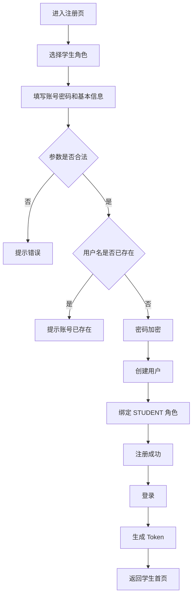
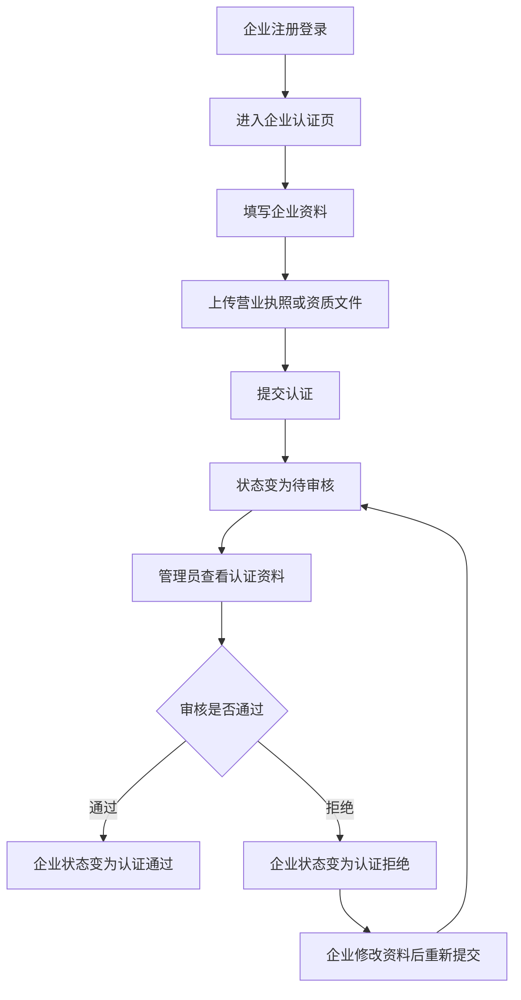
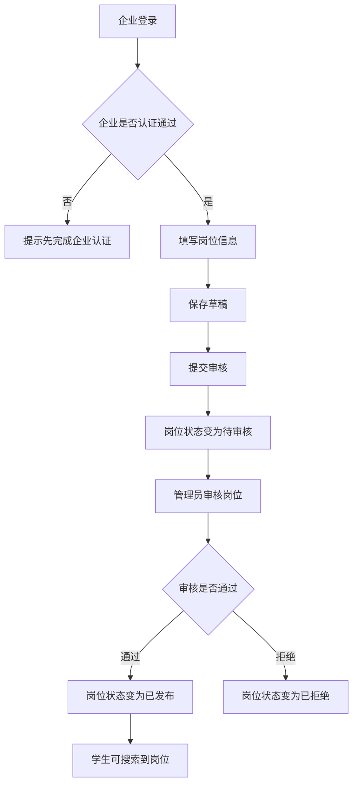
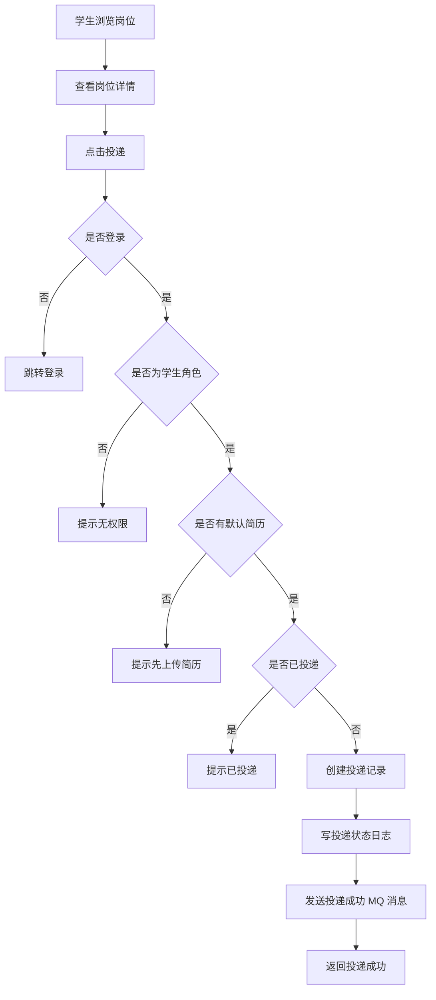
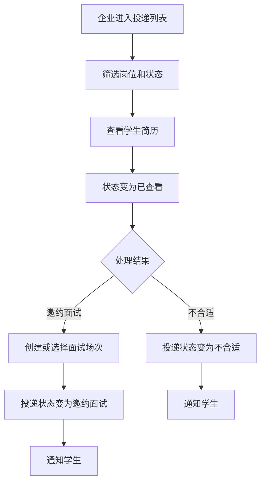
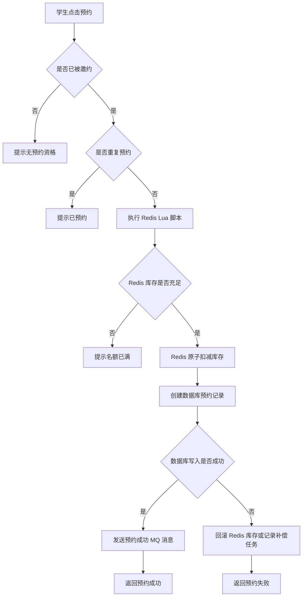
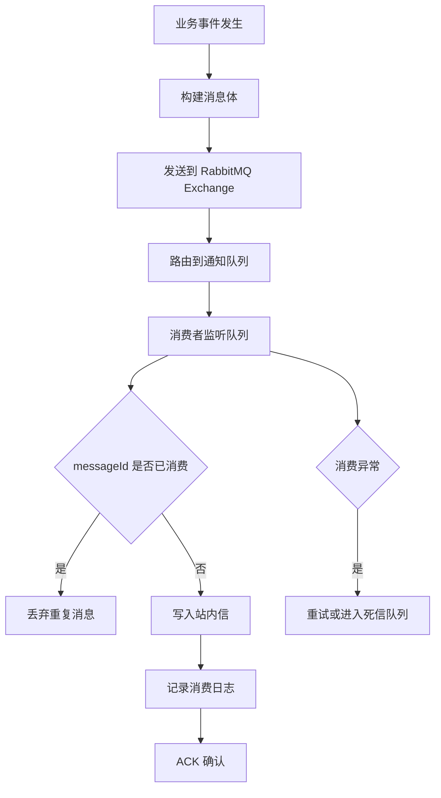
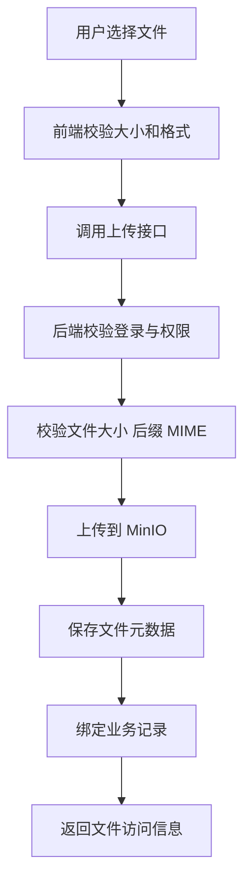

# 校园智能招聘与面试预约平台：![[校园招聘产品需求文档]] 与研发交付文档

版本：v1.0  
导出日期：2026-05-13  
项目类型：Java 后端校招项目  
建议技术栈：Spring Boot 3 + MyBatis-Plus + MySQL + Redis + RabbitMQ + Elasticsearch + MinIO + Docker Compose + Vue 3

---

## 0. 文档目的

本文档用于指导“校园智能招聘与面试预约平台”的研发落地，覆盖：

- PRD 产品需求文档
- ![[校园招聘低保真原型图]]
- 业务流程图
- 权限矩阵
- 数据字典
- 状态机
- 接口字段说明
- 验收标准
- 迭代排期
- 测试用例

本文档按开发可执行的粒度编写，目标是让后端、前端、测试都能明确“做什么、怎么做、做到什么算完成”。

---

# 1. PRD 产品需求文档

## 1.1 项目背景

校园招聘、实习招聘、实验室招新、社团技术岗招新等场景中，学生通常需要在微信群、表格、公众号、学校就业系统之间切换，体验割裂。企业或组织也缺少统一的岗位发布、简历收集、筛选和面试预约工具。

本项目希望构建一个面向校园场景的招聘与面试预约平台，打通：

> 岗位发布 → 岗位审核 → 岗位搜索 → 简历投递 → 企业筛选 → 面试邀约 → 面试预约 → 消息通知

同时，项目用于 Java 后端校招展示，因此需要在业务中自然落地 Redis、MQ、文件存储、搜索、权限、日志、Docker 部署和并发控制等技术点。

## 1.2 产品定位

| 项目 | 内容 |
|---|---|
| 产品名称 | 校园智能招聘与面试预约平台 |
| 产品类型 | 校园招聘 / 实习招聘 / 面试预约管理系统 |
| 目标用户 | 学生、企业 HR、平台管理员 |
| 核心价值 | 提供校园招聘从岗位发布到面试预约的完整闭环 |
| 技术展示重点 | RBAC、Redis 缓存、Redis Lua 防超卖、RabbitMQ 异步通知、MinIO 文件存储、Elasticsearch 搜索、Docker 部署 |

## 1.3 用户角色

| 角色 | 描述 | 核心诉求 |
|---|---|---|
| 游客 | 未登录用户 | 浏览公开岗位、查看岗位详情、注册账号 |
| 学生 | 已注册学生用户 | 完善资料、上传简历、搜索岗位、投递岗位、预约面试、查看消息 |
| 企业 HR | 企业端用户 | 提交企业认证、发布岗位、查看投递、筛选简历、创建面试场次 |
| 管理员 | 平台管理人员 | 审核企业、审核岗位、管理用户、查看日志和统计数据 |

## 1.4 产品目标

| 目标编号 | 产品目标 | 说明 |
|---|---|---|
| G-001 | 完成校园招聘主流程 | 学生从注册到投递，企业从认证到筛选，管理员完成审核 |
| G-002 | 打造后端技术亮点 | 在业务中落地 Redis、MQ、ES、MinIO、Docker 等技术 |
| G-003 | 支持高并发预约场景 | 面试名额预约不能超卖，支持压测验证 |
| G-004 | 提供完整后台管理 | 管理员可审核、统计、查看日志 |
| G-005 | 项目可运行可展示 | Docker Compose 一键启动，接口文档完整 |

## 1.5 MVP 范围

### 1.5.1 本期必须做

| 模块 | 功能 |
|---|---|
| 用户认证 | 注册、登录、登出、获取当前用户、Token 校验 |
| 权限管理 | 学生、企业、管理员三类角色；接口权限控制 |
| 学生资料 | 学生基本资料、技能标签、求职意向 |
| 企业认证 | 企业资料提交、资质上传、管理员审核 |
| 简历管理 | 简历上传、简历列表、默认简历、简历下载权限控制 |
| 岗位管理 | 企业发布岗位、编辑岗位、提交审核、上下架 |
| 岗位搜索 | 关键词搜索、城市筛选、薪资筛选、学历筛选 |
| 投递管理 | 学生投递岗位、查看投递记录、企业查看投递列表、修改投递状态 |
| 面试预约 | 企业创建场次、学生预约、取消预约、防重复预约、防超卖 |
| 消息通知 | 投递成功、审核结果、面试预约成功站内信 |
| 后台管理 | 用户管理、企业审核、岗位审核、操作日志 |
| 部署文档 | Docker Compose 启动 MySQL、Redis、RabbitMQ、MinIO、Elasticsearch |

### 1.5.2 本期不做

| 功能 | 不做原因 |
|---|---|
| 真实短信发送 | 需要第三方服务和费用，MVP 用站内信模拟 |
| 在线聊天 IM | 实现成本高，后续扩展 |
| AI 简历解析 | 可作为加分扩展，不进入 MVP |
| 支付能力 | 当前招聘业务无支付闭环 |
| 复杂推荐算法 | 先用标签匹配，后续再优化 |
| 微服务拆分 | 校招项目不建议过早复杂化 |

## 1.6 成功指标

| 指标 | 目标 |
|---|---|
| 核心流程完整性 | 学生投递、企业筛选、面试预约流程完整跑通 |
| 权限安全 | 不同角色不能访问越权接口 |
| 并发预约 | JMeter 并发预约下成功人数不超过场次名额 |
| 项目部署 | Docker Compose 可一键启动核心依赖 |
| 接口文档 | 核心接口均有请求/响应字段说明 |
| 简历展示 | 至少 5 个后端技术亮点可以讲清楚 |

---

# 2. 产品信息架构

## 2.1 学生端

```text
学生端
├── 登录 / 注册
├── 首页
│   ├── 搜索框
│   ├── 推荐岗位
│   └── 热门岗位
├── 岗位
│   ├── 岗位列表
│   ├── 岗位详情
│   └── 岗位收藏
├── 简历
│   ├── 简历上传
│   ├── 简历列表
│   └── 默认简历
├── 投递
│   ├── 我的投递
│   └── 投递详情
├── 面试
│   ├── 可预约场次
│   ├── 我的预约
│   └── 取消预约
└── 消息中心
```

## 2.2 企业端

```text
企业端
├── 企业登录 / 注册
├── 企业认证
├── 工作台
│   ├── 岗位数量
│   ├── 投递数量
│   └── 待处理事项
├── 岗位管理
│   ├── 发布岗位
│   ├── 编辑岗位
│   ├── 上下架岗位
│   └── 提交审核
├── 投递管理
│   ├── 投递列表
│   ├── 简历预览
│   └── 修改投递状态
├── 面试管理
│   ├── 创建面试场次
│   ├── 场次列表
│   └── 预约名单
└── 消息中心
```

## 2.3 管理后台

```text
管理后台
├── 登录
├── 数据看板
├── 用户管理
├── 企业审核
├── 岗位审核
├── 字典管理
├── 操作日志
└── 登录日志
```

---

# 3. 低保真原型图

## 3.1 登录页

```text
┌──────────────────────────────────────────────┐
│             校园智能招聘平台                  │
├──────────────────────────────────────────────┤
│  用户名 / 手机号                              │
│  ┌──────────────────────────────────────┐    │
│  │                                      │    │
│  └──────────────────────────────────────┘    │
│  密码                                        │
│  ┌──────────────────────────────────────┐    │
│  │                                      │    │
│  └──────────────────────────────────────┘    │
│  角色：○ 学生  ○ 企业                        │
│  ┌──────────────────────────────────────┐    │
│  │                 登录                  │    │
│  └──────────────────────────────────────┘    │
│  没有账号？去注册        忘记密码             │
└──────────────────────────────────────────────┘
```

| 元素   | 行为                       |
| ---- | ------------------------ |
| 登录按钮 | 校验用户名、密码、角色；成功后跳转对应首页    |
| 角色选择 | 学生跳学生端，企业跳企业端；管理员从后台入口登录 |
| 错误提示 | 密码错误、账号禁用、账号不存在、角色不匹配    |

## 3.2 学生首页 / 岗位搜索页

```text
┌────────────────────────────────────────────────────────────┐
│ Logo      首页  岗位  简历  投递  面试  消息       用户头像 │
├────────────────────────────────────────────────────────────┤
│ 搜索岗位                                                   │
│ ┌──────────────────────────────┐ ┌────────┐               │
│ │ Java 后端实习生 / 前端 / 算法 │ │ 搜索   │               │
│ └──────────────────────────────┘ └────────┘               │
│ 筛选：城市[下拉]  薪资[下拉]  学历[下拉]  排序[最新/热门]   │
├────────────────────────────────────────────────────────────┤
│ ┌──────────────────────────────────────────────────────┐   │
│ │ Java 后端实习生       150-300/天       北京           │   │
│ │ XX科技有限公司        本科 / 经验不限                 │   │
│ │ 标签：Spring Boot Redis MySQL                         │   │
│ │ [查看详情] [收藏] [投递]                              │   │
│ └──────────────────────────────────────────────────────┘   │
└────────────────────────────────────────────────────────────┘
```

| 状态 | 页面表现 |
|---|---|
| 未登录 | 可查看岗位，点击投递跳登录 |
| 已登录学生 | 可收藏、投递 |
| 已投递 | 投递按钮置灰，显示“已投递” |
| 岗位下架 | 列表不展示，详情页显示“岗位已下架” |
| 无搜索结果 | 展示空状态和重置筛选按钮 |

## 3.3 岗位详情页

```text
┌────────────────────────────────────────────────────────────┐
│ Java 后端实习生                                             │
│ 150-300/天 | 北京 | 本科 | 经验不限                         │
│ 标签：Spring Boot / Redis / MySQL / RabbitMQ                │
│ [立即投递] [收藏岗位]                                      │
├────────────────────────────────────────────────────────────┤
│ 岗位描述                                                   │
│ 1. 参与后端业务接口开发                                     │
│ 2. 参与数据库设计与性能优化                                 │
├────────────────────────────────────────────────────────────┤
│ 岗位要求                                                   │
│ 1. 熟悉 Java 基础和 Spring Boot                             │
│ 2. 熟悉 MySQL、Redis 基础                                   │
├────────────────────────────────────────────────────────────┤
│ 企业信息                                                   │
│ XX科技有限公司 | 已认证 | 互联网                            │
└────────────────────────────────────────────────────────────┘
```

## 3.4 简历管理页

```text
┌────────────────────────────────────────────────────────────┐
│ 我的简历                                                    │
├────────────────────────────────────────────────────────────┤
│ [上传简历]  支持 PDF / DOC / DOCX，最大 10MB                 │
├────────────────────────────────────────────────────────────┤
│ ┌──────────────────────────────────────────────────────┐   │
│ │ Java后端实习简历.pdf        默认简历                  │   │
│ │ 上传时间：2026-05-13                                  │   │
│ │ [预览] [下载] [设为默认] [删除]                        │   │
│ └──────────────────────────────────────────────────────┘   │
└────────────────────────────────────────────────────────────┘
```

## 3.5 我的投递页

```text
┌────────────────────────────────────────────────────────────┐
│ 我的投递                                                    │
├────────────────────────────────────────────────────────────┤
│ 状态筛选：[全部] [已投递] [已查看] [邀约面试] [不合适]       │
├────────────────────────────────────────────────────────────┤
│ 岗位名称          企业            投递时间        状态       │
│ Java 后端实习生   XX科技          2026-05-13      已查看     │
│ 前端实习生        YY科技          2026-05-12      邀约面试   │
│ [查看详情] [预约面试]                                      │
└────────────────────────────────────────────────────────────┘
```

## 3.6 面试预约页

```text
┌────────────────────────────────────────────────────────────┐
│ 面试预约：Java 后端实习生                                   │
├────────────────────────────────────────────────────────────┤
│ 可预约场次                                                  │
│ ┌──────────────────────────────────────────────────────┐   │
│ │ 2026-05-20 10:00-10:30    剩余名额：3/10              │   │
│ │ [立即预约]                                            │   │
│ └──────────────────────────────────────────────────────┘   │
│ ┌──────────────────────────────────────────────────────┐   │
│ │ 2026-05-20 14:00-14:30    剩余名额：0/10              │   │
│ │ [名额已满]                                            │   │
│ └──────────────────────────────────────────────────────┘   │
└────────────────────────────────────────────────────────────┘
```

## 3.7 企业工作台

```text
┌────────────────────────────────────────────────────────────┐
│ 企业工作台                                                  │
├────────────────────────────────────────────────────────────┤
│ 今日新增投递：12   待处理投递：35   在线岗位：8   面试预约：6 │
├────────────────────────────────────────────────────────────┤
│ 待处理事项                                                  │
│ - 3 个岗位待管理员审核                                      │
│ - 12 份新简历待查看                                         │
│ - 2 个面试场次即将开始                                      │
├────────────────────────────────────────────────────────────┤
│ [发布岗位] [查看投递] [创建面试场次] [企业资料]              │
└────────────────────────────────────────────────────────────┘
```

## 3.8 管理后台首页

```text
┌────────────────────────────────────────────────────────────┐
│ 管理后台                                                    │
├────────────────────────────────────────────────────────────┤
│ 用户数：1024   企业数：86   岗位数：240   今日投递：156       │
├────────────────────────────────────────────────────────────┤
│ 待审核                                                      │
│ 企业认证待审核：8                                            │
│ 岗位待审核：17                                               │
├────────────────────────────────────────────────────────────┤
│ 用户管理 | 企业审核 | 岗位审核 | 字典管理 | 操作日志           │
└────────────────────────────────────────────────────────────┘
```

---

# 4. 业务流程图

## 4.1 学生注册登录流程



## 4.2 企业认证流程



## 4.3 企业发布岗位流程



## 4.4 学生投递岗位流程



## 4.5 企业筛选简历流程



## 4.6 面试预约防超卖流程



## 4.7 MQ 通知流程



## 4.8 文件上传流程



---

# 5. 权限矩阵

## 5.1 功能权限矩阵

| 功能 | 游客 | 学生 | 企业 HR | 管理员 |
|---|---:|---:|---:|---:|
| 浏览公开岗位 | ✅ | ✅ | ✅ | ✅ |
| 查看岗位详情 | ✅ | ✅ | ✅ | ✅ |
| 注册账号 | ✅ | ✅ | ✅ | ❌ |
| 登录 | ✅ | ✅ | ✅ | ✅ |
| 完善学生资料 | ❌ | ✅ | ❌ | ❌ |
| 上传简历 | ❌ | ✅ | ❌ | ❌ |
| 设置默认简历 | ❌ | ✅ | ❌ | ❌ |
| 投递岗位 | ❌ | ✅ | ❌ | ❌ |
| 查看我的投递 | ❌ | ✅ | ❌ | ❌ |
| 预约面试 | ❌ | ✅ | ❌ | ❌ |
| 取消自己的预约 | ❌ | ✅ | ❌ | ❌ |
| 收藏岗位 | ❌ | ✅ | ❌ | ❌ |
| 提交企业认证 | ❌ | ❌ | ✅ | ❌ |
| 发布岗位 | ❌ | ❌ | ✅ | ✅ |
| 编辑自己企业岗位 | ❌ | ❌ | ✅ | ✅ |
| 查看自己岗位投递 | ❌ | ❌ | ✅ | ✅ |
| 修改投递状态 | ❌ | ❌ | ✅ | ✅ |
| 创建面试场次 | ❌ | ❌ | ✅ | ✅ |
| 查看预约名单 | ❌ | ❌ | ✅ | ✅ |
| 审核企业认证 | ❌ | ❌ | ❌ | ✅ |
| 审核岗位 | ❌ | ❌ | ❌ | ✅ |
| 管理用户 | ❌ | ❌ | ❌ | ✅ |
| 查看操作日志 | ❌ | ❌ | ❌ | ✅ |
| 查看全局统计 | ❌ | ❌ | ❌ | ✅ |

## 5.2 数据权限矩阵

| 数据对象 | 学生 | 企业 HR | 管理员 |
|---|---|---|---|
| 学生资料 | 只能看/改自己 | 只能看已投递给本企业岗位的学生简历摘要 | 可查看 |
| 简历文件 | 只能管理自己的简历 | 只能查看投递到本企业岗位的简历 | 可查看 |
| 企业资料 | 无权修改 | 只能管理自己企业资料 | 可审核 |
| 岗位 | 可查看已发布岗位 | 只能管理自己企业发布的岗位 | 可管理全部 |
| 投递记录 | 只能查看自己的投递 | 只能查看投递到自己岗位的记录 | 可查看全部 |
| 面试预约 | 只能查看自己的预约 | 只能查看自己岗位下的预约 | 可查看全部 |
| 操作日志 | 不可见 | 不可见 | 可查看 |

## 5.3 接口权限建议

| 权限标识 | 说明 | 角色 |
|---|---|---|
| job:view | 查看岗位 | 游客/学生/企业/管理员 |
| job:create | 创建岗位 | 企业/管理员 |
| job:update | 修改岗位 | 企业/管理员 |
| job:audit | 审核岗位 | 管理员 |
| resume:upload | 上传简历 | 学生 |
| resume:download | 下载简历 | 学生/企业/管理员 |
| application:create | 投递岗位 | 学生 |
| application:view:self | 查看自己的投递 | 学生 |
| application:view:company | 查看企业岗位投递 | 企业 |
| application:update-status | 修改投递状态 | 企业/管理员 |
| interview:slot:create | 创建面试场次 | 企业/管理员 |
| interview:booking:create | 预约面试 | 学生 |
| company:audit | 审核企业 | 管理员 |
| log:view | 查看日志 | 管理员 |

---

# 6. 数据字典

## 6.1 通用字段

| 字段 | 类型 | 必填 | 说明 |
|---|---|---:|---|
| id | bigint | 是 | 主键 |
| create_time | datetime | 是 | 创建时间 |
| update_time | datetime | 是 | 更新时间 |
| create_by | bigint | 否 | 创建人 ID |
| update_by | bigint | 否 | 更新人 ID |
| deleted | tinyint | 是 | 逻辑删除：0 未删除，1 已删除 |
| remark | varchar(500) | 否 | 备注 |

## 6.2 核心表总览

| 表名 | 作用 |
|---|---|
| sys_user | 用户表 |
| sys_role | 角色表 |
| sys_menu | 菜单与权限表 |
| sys_user_role | 用户角色关联表 |
| sys_role_menu | 角色菜单关联表 |
| student_profile | 学生资料表 |
| student_skill | 学生技能表 |
| company_profile | 企业资料表 |
| company_audit | 企业审核记录表 |
| file_object | 文件对象表 |
| resume | 简历表 |
| job | 岗位表 |
| job_tag | 岗位标签表 |
| job_favorite | 岗位收藏表 |
| application | 投递表 |
| application_log | 投递状态日志表 |
| interview_slot | 面试场次表 |
| interview_booking | 面试预约表 |
| message | 站内信表 |
| operation_log | 操作日志表 |
| login_log | 登录日志表 |
| sys_dict | 字典表 |

## 6.3 sys_user 用户表

| 字段 | 类型 | 必填 | 示例 | 说明 |
|---|---|---:|---|---|
| id | bigint | 是 | 10001 | 用户 ID |
| username | varchar(64) | 是 | zhangsan | 用户名，唯一 |
| password | varchar(255) | 是 | BCrypt Hash | 加密密码 |
| nickname | varchar(64) | 否 | 张三 | 昵称 |
| phone | varchar(20) | 否 | 13800000000 | 手机号 |
| email | varchar(128) | 否 | user@example.com | 邮箱 |
| avatar_url | varchar(512) | 否 | https://... | 头像 |
| user_type | varchar(32) | 是 | STUDENT | 用户类型 |
| status | varchar(32) | 是 | NORMAL | 用户状态 |
| last_login_time | datetime | 否 | 2026-05-13 10:00:00 | 最近登录时间 |

## 6.4 student_profile 学生资料表

| 字段 | 类型 | 必填 | 示例 | 说明 |
|---|---|---:|---|---|
| id | bigint | 是 | 1 | 主键 |
| user_id | bigint | 是 | 10001 | 用户 ID |
| real_name | varchar(64) | 是 | 张三 | 真实姓名 |
| gender | varchar(16) | 否 | MALE | 性别 |
| school | varchar(128) | 是 | 某某大学 | 学校 |
| major | varchar(128) | 是 | 软件工程 | 专业 |
| grade | varchar(32) | 否 | 2023 | 年级 |
| education | varchar(32) | 否 | BACHELOR | 学历 |
| city | varchar(64) | 否 | 北京 | 期望城市 |
| job_intention | varchar(255) | 否 | Java 后端实习 | 求职意向 |
| advantage | text | 否 | 熟悉 Java... | 个人优势 |

## 6.5 company_profile 企业资料表

| 字段 | 类型 | 必填 | 示例 | 说明 |
|---|---|---:|---|---|
| id | bigint | 是 | 1 | 主键 |
| user_id | bigint | 是 | 20001 | 企业账号 ID |
| company_name | varchar(128) | 是 | XX科技有限公司 | 企业名称 |
| industry | varchar(64) | 否 | 互联网 | 行业 |
| scale | varchar(64) | 否 | 100-499人 | 规模 |
| city | varchar(64) | 否 | 北京 | 城市 |
| address | varchar(255) | 否 | 北京市海淀区 | 地址 |
| contact_name | varchar(64) | 是 | 王 HR | 联系人 |
| contact_phone | varchar(20) | 否 | 13800000000 | 联系电话 |
| license_file_id | bigint | 否 | 30001 | 营业执照文件 ID |
| audit_status | varchar(32) | 是 | PENDING | 审核状态 |

## 6.6 file_object 文件表

| 字段 | 类型 | 必填 | 示例 | 说明 |
|---|---|---:|---|---|
| id | bigint | 是 | 1 | 文件 ID |
| owner_id | bigint | 是 | 10001 | 上传人 |
| bucket_name | varchar(64) | 是 | resume | MinIO Bucket |
| object_name | varchar(255) | 是 | resume/2026/a.pdf | 对象名 |
| original_name | varchar(255) | 是 | Java后端简历.pdf | 原始文件名 |
| file_size | bigint | 是 | 102400 | 文件大小 |
| content_type | varchar(128) | 是 | application/pdf | MIME 类型 |
| file_ext | varchar(32) | 是 | pdf | 后缀 |
| access_url | varchar(512) | 否 | https://... | 访问地址 |
| status | varchar(32) | 是 | NORMAL | 文件状态 |

## 6.7 resume 简历表

| 字段 | 类型 | 必填 | 示例 | 说明 |
|---|---|---:|---|---|
| id | bigint | 是 | 1 | 简历 ID |
| student_id | bigint | 是 | 10001 | 学生 ID |
| resume_name | varchar(128) | 是 | Java后端实习简历 | 简历名称 |
| file_id | bigint | 是 | 30001 | 文件 ID |
| is_default | tinyint | 是 | 1 | 是否默认简历 |
| status | varchar(32) | 是 | NORMAL | 状态 |

## 6.8 job 岗位表

| 字段 | 类型 | 必填 | 示例 | 说明 |
|---|---|---:|---|---|
| id | bigint | 是 | 1 | 岗位 ID |
| company_id | bigint | 是 | 20001 | 企业 ID |
| title | varchar(128) | 是 | Java 后端实习生 | 岗位名称 |
| category | varchar(64) | 否 | 后端开发 | 岗位分类 |
| city | varchar(64) | 是 | 北京 | 工作城市 |
| salary_min | int | 否 | 150 | 最低薪资 |
| salary_max | int | 否 | 300 | 最高薪资 |
| salary_unit | varchar(32) | 是 | DAY | 薪资单位 |
| education | varchar(32) | 否 | BACHELOR | 学历要求 |
| experience | varchar(32) | 否 | NONE | 经验要求 |
| description | text | 是 | 负责后端开发... | 岗位描述 |
| requirement | text | 是 | 熟悉 Java... | 岗位要求 |
| status | varchar(32) | 是 | PUBLISHED | 岗位状态 |
| audit_reason | varchar(500) | 否 | 内容不完整 | 审核拒绝原因 |
| expire_time | datetime | 否 | 2026-06-30 | 过期时间 |
| view_count | int | 是 | 0 | 浏览次数 |
| apply_count | int | 是 | 0 | 投递次数 |

## 6.9 application 投递表

| 字段 | 类型 | 必填 | 示例 | 说明 |
|---|---|---:|---|---|
| id | bigint | 是 | 1 | 投递 ID |
| student_id | bigint | 是 | 10001 | 学生 ID |
| company_id | bigint | 是 | 20001 | 企业 ID |
| job_id | bigint | 是 | 1 | 岗位 ID |
| resume_id | bigint | 是 | 1 | 简历 ID |
| status | varchar(32) | 是 | DELIVERED | 投递状态 |
| apply_time | datetime | 是 | 2026-05-13 | 投递时间 |

唯一索引建议：`uk_student_job(student_id, job_id)`。

## 6.10 interview_slot 面试场次表

| 字段 | 类型 | 必填 | 示例 | 说明 |
|---|---|---:|---|---|
| id | bigint | 是 | 1 | 场次 ID |
| company_id | bigint | 是 | 20001 | 企业 ID |
| job_id | bigint | 是 | 1 | 岗位 ID |
| title | varchar(128) | 是 | Java 一面 | 场次标题 |
| start_time | datetime | 是 | 2026-05-20 10:00:00 | 开始时间 |
| end_time | datetime | 是 | 2026-05-20 10:30:00 | 结束时间 |
| capacity | int | 是 | 10 | 总名额 |
| remain_count | int | 是 | 10 | 剩余名额 |
| location | varchar(255) | 否 | 线上会议 | 面试地点 |
| status | varchar(32) | 是 | OPEN | 场次状态 |

## 6.11 interview_booking 面试预约表

| 字段 | 类型 | 必填 | 示例 | 说明 |
|---|---|---:|---|---|
| id | bigint | 是 | 1 | 预约 ID |
| slot_id | bigint | 是 | 1 | 场次 ID |
| application_id | bigint | 是 | 1 | 投递 ID |
| student_id | bigint | 是 | 10001 | 学生 ID |
| company_id | bigint | 是 | 20001 | 企业 ID |
| job_id | bigint | 是 | 1 | 岗位 ID |
| status | varchar(32) | 是 | BOOKED | 预约状态 |
| booking_time | datetime | 是 | 2026-05-13 | 预约时间 |
| cancel_reason | varchar(500) | 否 | 时间冲突 | 取消原因 |

唯一索引建议：`uk_slot_student(slot_id, student_id)`。

## 6.12 message 站内信表

| 字段 | 类型 | 必填 | 示例 | 说明 |
|---|---|---:|---|---|
| id | bigint | 是 | 1 | 消息 ID |
| receiver_id | bigint | 是 | 10001 | 接收人 ID |
| sender_id | bigint | 否 | 20001 | 发送人 ID |
| message_type | varchar(32) | 是 | INTERVIEW | 消息类型 |
| title | varchar(128) | 是 | 面试预约成功 | 标题 |
| content | text | 是 | 你已成功预约... | 内容 |
| business_id | bigint | 否 | 1 | 关联业务 ID |
| read_status | varchar(32) | 是 | UNREAD | 阅读状态 |
| read_time | datetime | 否 | 2026-05-13 | 阅读时间 |

---

# 7. 状态机

## 7.1 用户状态机

| 当前状态 | 可流转到 | 触发人 | 说明 |
|---|---|---|---|
| PENDING | NORMAL | 用户/系统 | 完善必要资料后正常 |
| NORMAL | DISABLED | 管理员 | 禁用账号 |
| DISABLED | NORMAL | 管理员 | 恢复账号 |

## 7.2 企业认证状态机

| 当前状态 | 可流转到 | 触发人 | 说明 |
|---|---|---|---|
| UNVERIFIED | PENDING | 企业 | 提交认证资料 |
| PENDING | APPROVED | 管理员 | 审核通过 |
| PENDING | REJECTED | 管理员 | 审核拒绝 |
| REJECTED | PENDING | 企业 | 修改后重新提交 |
| APPROVED | PENDING | 企业 | 资料重大变更后重新审核 |

## 7.3 岗位状态机

| 当前状态 | 可流转到 | 触发人 | 说明 |
|---|---|---|---|
| DRAFT | PENDING_REVIEW | 企业 | 提交审核 |
| PENDING_REVIEW | PUBLISHED | 管理员 | 审核通过 |
| PENDING_REVIEW | REJECTED | 管理员 | 审核拒绝 |
| REJECTED | DRAFT | 企业 | 修改后保存草稿 |
| PUBLISHED | OFFLINE | 企业/管理员 | 手动下架 |
| PUBLISHED | EXPIRED | 系统 | 过期自动下架 |
| OFFLINE | PENDING_REVIEW | 企业 | 修改后重新提交审核 |

## 7.4 投递状态机

| 当前状态 | 可流转到 | 触发人 | 说明 |
|---|---|---|---|
| DELIVERED | VIEWED | 企业 | 企业查看简历 |
| VIEWED | INTERVIEW_INVITED | 企业 | 发起面试邀约 |
| VIEWED | REJECTED | 企业 | 标记不合适 |
| INTERVIEW_INVITED | BOOKED | 学生 | 学生预约面试 |
| BOOKED | FINISHED | 企业/系统 | 面试完成 |
| BOOKED | CANCELED | 学生/企业 | 取消面试 |
| INTERVIEW_INVITED | REJECTED | 企业 | 邀约后仍可拒绝 |

## 7.5 面试场次状态机

| 当前状态 | 可流转到 | 触发人 | 说明 |
|---|---|---|---|
| OPEN | FULL | 系统 | 名额被约满 |
| OPEN | CLOSED | 企业 | 手动关闭 |
| OPEN | EXPIRED | 系统 | 时间过期 |
| FULL | OPEN | 系统 | 有人取消释放名额 |
| FULL | EXPIRED | 系统 | 时间过期 |
| CLOSED | OPEN | 企业 | 重新开放 |

## 7.6 预约状态机

| 当前状态 | 可流转到 | 触发人 | 说明 |
|---|---|---|---|
| BOOKED | CANCELED | 学生/企业 | 取消预约 |
| BOOKED | FINISHED | 企业/系统 | 面试完成 |
| CANCELED | BOOKED | 学生 | 重新预约，需要重新扣减名额 |

## 7.7 消息状态机

| 当前状态 | 可流转到 | 触发人 | 说明 |
|---|---|---|---|
| UNREAD | READ | 用户 | 用户查看消息 |
| READ | DELETED | 用户 | 用户删除消息 |
| UNREAD | DELETED | 用户 | 未读直接删除 |

---

# 8. 接口字段说明

## 8.1 通用响应格式

```json
{
  "code": 0,
  "message": "success",
  "data": {}
}
```

| 字段 | 类型 | 必填 | 说明 |
|---|---|---:|---|
| code | int | 是 | 业务状态码，0 表示成功 |
| message | string | 是 | 响应消息 |
| data | object | 否 | 响应数据 |

## 8.2 分页响应格式

```json
{
  "code": 0,
  "message": "success",
  "data": {
    "records": [],
    "total": 100,
    "pageNum": 1,
    "pageSize": 10
  }
}
```

## 8.3 认证模块接口

### 用户注册

| 项目 | 内容 |
|---|---|
| URL | `/api/auth/register` |
| Method | POST |
| 权限 | 游客 |

请求字段：

| 字段 | 类型 | 必填 | 示例 | 说明 |
|---|---|---:|---|---|
| username | string | 是 | zhangsan | 用户名 |
| password | string | 是 | 123456 | 密码 |
| confirmPassword | string | 是 | 123456 | 确认密码 |
| userType | string | 是 | STUDENT | STUDENT / COMPANY |
| phone | string | 否 | 13800000000 | 手机号 |
| email | string | 否 | test@example.com | 邮箱 |

响应字段：

| 字段 | 类型 | 说明 |
|---|---|---|
| userId | long | 用户 ID |
| username | string | 用户名 |
| userType | string | 用户类型 |

### 用户登录

| 项目 | 内容 |
|---|---|
| URL | `/api/auth/login` |
| Method | POST |
| 权限 | 游客 |

请求字段：

| 字段 | 类型 | 必填 | 示例 | 说明 |
|---|---|---:|---|---|
| username | string | 是 | zhangsan | 用户名 |
| password | string | 是 | 123456 | 密码 |
| userType | string | 是 | STUDENT | 登录角色 |

响应字段：

| 字段 | 类型 | 说明 |
|---|---|---|
| token | string | 登录 Token |
| expireTime | long | 过期时间戳 |
| userId | long | 用户 ID |
| username | string | 用户名 |
| userType | string | 用户类型 |
| permissions | array | 权限标识列表 |

### 获取当前用户

| 项目 | 内容 |
|---|---|
| URL | `/api/auth/me` |
| Method | GET |
| 权限 | 登录用户 |

响应字段：

| 字段 | 类型 | 说明 |
|---|---|---|
| userId | long | 用户 ID |
| username | string | 用户名 |
| nickname | string | 昵称 |
| avatarUrl | string | 头像 |
| userType | string | 用户类型 |
| roles | array | 角色列表 |
| permissions | array | 权限列表 |

## 8.4 学生模块接口

### 保存学生资料

| 项目 | 内容 |
|---|---|
| URL | `/api/student/profile` |
| Method | PUT |
| 权限 | 学生 |

请求字段：

| 字段 | 类型 | 必填 | 示例 | 说明 |
|---|---|---:|---|---|
| realName | string | 是 | 张三 | 真实姓名 |
| gender | string | 否 | MALE | 性别 |
| school | string | 是 | 某某大学 | 学校 |
| major | string | 是 | 软件工程 | 专业 |
| grade | string | 否 | 2023 | 年级 |
| education | string | 否 | BACHELOR | 学历 |
| city | string | 否 | 北京 | 期望城市 |
| jobIntention | string | 否 | Java 后端实习 | 求职意向 |
| skills | array | 否 | ["Java","Redis"] | 技能标签 |

## 8.5 企业模块接口

### 提交企业认证

| 项目 | 内容 |
|---|---|
| URL | `/api/company/certification` |
| Method | POST |
| 权限 | 企业 |

请求字段：

| 字段 | 类型 | 必填 | 示例 | 说明 |
|---|---|---:|---|---|
| companyName | string | 是 | XX科技有限公司 | 企业名称 |
| industry | string | 否 | 互联网 | 行业 |
| scale | string | 否 | 100-499人 | 规模 |
| city | string | 是 | 北京 | 城市 |
| address | string | 否 | 北京市海淀区 | 地址 |
| contactName | string | 是 | 王 HR | 联系人 |
| contactPhone | string | 是 | 13800000000 | 联系电话 |
| licenseFileId | long | 是 | 30001 | 资质文件 ID |

## 8.6 文件模块接口

### 上传文件

| 项目 | 内容 |
|---|---|
| URL | `/api/files/upload` |
| Method | POST |
| 权限 | 登录用户 |
| Content-Type | multipart/form-data |

请求字段：

| 字段 | 类型 | 必填 | 示例 | 说明 |
|---|---|---:|---|---|
| file | file | 是 | resume.pdf | 文件 |
| bizType | string | 是 | RESUME | RESUME / AVATAR / LICENSE |

响应字段：

| 字段 | 类型 | 说明 |
|---|---|---|
| fileId | long | 文件 ID |
| originalName | string | 原始文件名 |
| fileSize | long | 文件大小 |
| fileExt | string | 文件后缀 |
| accessUrl | string | 访问地址或临时地址 |

## 8.7 简历模块接口

### 创建简历记录

| 项目 | 内容 |
|---|---|
| URL | `/api/resumes` |
| Method | POST |
| 权限 | 学生 |

请求字段：

| 字段 | 类型 | 必填 | 示例 | 说明 |
|---|---|---:|---|---|
| resumeName | string | 是 | Java 后端实习简历 | 简历名称 |
| fileId | long | 是 | 30001 | 文件 ID |
| isDefault | boolean | 否 | true | 是否设为默认 |

### 我的简历列表

| 项目 | 内容 |
|---|---|
| URL | `/api/resumes/my` |
| Method | GET |
| 权限 | 学生 |

响应字段：

| 字段 | 类型 | 说明 |
|---|---|---|
| id | long | 简历 ID |
| resumeName | string | 简历名称 |
| fileId | long | 文件 ID |
| originalName | string | 原文件名 |
| isDefault | boolean | 是否默认 |
| createTime | datetime | 创建时间 |

## 8.8 岗位模块接口

### 岗位列表

| 项目 | 内容 |
|---|---|
| URL | `/api/jobs` |
| Method | GET |
| 权限 | 游客/登录用户 |

请求参数：

| 字段 | 类型 | 必填 | 示例 | 说明 |
|---|---|---:|---|---|
| keyword | string | 否 | Java | 关键词 |
| city | string | 否 | 北京 | 城市 |
| salaryMin | int | 否 | 100 | 最低薪资 |
| salaryMax | int | 否 | 300 | 最高薪资 |
| education | string | 否 | BACHELOR | 学历 |
| sort | string | 否 | LATEST | LATEST / HOT |
| pageNum | int | 否 | 1 | 页码 |
| pageSize | int | 否 | 10 | 每页条数 |

响应字段：

| 字段 | 类型 | 说明 |
|---|---|---|
| id | long | 岗位 ID |
| title | string | 岗位名称 |
| companyName | string | 企业名称 |
| city | string | 城市 |
| salaryMin | int | 最低薪资 |
| salaryMax | int | 最高薪资 |
| tags | array | 标签 |
| applyCount | int | 投递数 |
| createTime | datetime | 发布时间 |

### 创建岗位

| 项目 | 内容 |
|---|---|
| URL | `/api/company/jobs` |
| Method | POST |
| 权限 | 企业 |

请求字段：

| 字段 | 类型 | 必填 | 示例 | 说明 |
|---|---|---:|---|---|
| title | string | 是 | Java 后端实习生 | 岗位名称 |
| category | string | 否 | 后端开发 | 分类 |
| city | string | 是 | 北京 | 城市 |
| salaryMin | int | 否 | 150 | 最低薪资 |
| salaryMax | int | 否 | 300 | 最高薪资 |
| salaryUnit | string | 是 | DAY | 薪资单位 |
| education | string | 否 | BACHELOR | 学历要求 |
| experience | string | 否 | NONE | 经验要求 |
| description | string | 是 | 负责后端开发 | 岗位描述 |
| requirement | string | 是 | 熟悉 Java | 岗位要求 |
| tags | array | 否 | ["Java","Redis"] | 标签 |
| expireTime | datetime | 否 | 2026-06-30 | 过期时间 |

## 8.9 投递模块接口

### 投递岗位

| 项目 | 内容 |
|---|---|
| URL | `/api/applications` |
| Method | POST |
| 权限 | 学生 |

请求字段：

| 字段 | 类型 | 必填 | 示例 | 说明 |
|---|---|---:|---|---|
| jobId | long | 是 | 1 | 岗位 ID |
| resumeId | long | 否 | 1 | 简历 ID，不传则使用默认简历 |

响应字段：

| 字段 | 类型 | 说明 |
|---|---|---|
| applicationId | long | 投递 ID |
| status | string | 投递状态 |
| applyTime | datetime | 投递时间 |

### 企业修改投递状态

| 项目 | 内容 |
|---|---|
| URL | `/api/company/applications/{id}/status` |
| Method | PUT |
| 权限 | 企业 |

请求字段：

| 字段 | 类型 | 必填 | 示例 | 说明 |
|---|---|---:|---|---|
| status | string | 是 | INTERVIEW_INVITED | 目标状态 |
| reason | string | 否 | 简历符合要求 | 原因 |

## 8.10 面试模块接口

### 创建面试场次

| 项目 | 内容 |
|---|---|
| URL | `/api/company/interview/slots` |
| Method | POST |
| 权限 | 企业 |

请求字段：

| 字段 | 类型 | 必填 | 示例 | 说明 |
|---|---|---:|---|---|
| jobId | long | 是 | 1 | 岗位 ID |
| title | string | 是 | Java 一面 | 场次标题 |
| startTime | datetime | 是 | 2026-05-20 10:00:00 | 开始时间 |
| endTime | datetime | 是 | 2026-05-20 10:30:00 | 结束时间 |
| capacity | int | 是 | 10 | 总名额 |
| location | string | 否 | 腾讯会议 | 地点 |

### 预约面试

| 项目 | 内容 |
|---|---|
| URL | `/api/interview/bookings` |
| Method | POST |
| 权限 | 学生 |

请求字段：

| 字段 | 类型 | 必填 | 示例 | 说明 |
|---|---|---:|---|---|
| slotId | long | 是 | 1 | 场次 ID |
| applicationId | long | 是 | 1 | 投递 ID |

响应字段：

| 字段 | 类型 | 说明 |
|---|---|---|
| bookingId | long | 预约 ID |
| slotId | long | 场次 ID |
| status | string | 预约状态 |
| bookingTime | datetime | 预约时间 |

## 8.11 管理员接口

### 审核企业

| 项目 | 内容 |
|---|---|
| URL | `/api/admin/companies/{id}/audit` |
| Method | PUT |
| 权限 | 管理员 |

请求字段：

| 字段 | 类型 | 必填 | 示例 | 说明 |
|---|---|---:|---|---|
| auditStatus | string | 是 | APPROVED | APPROVED / REJECTED |
| auditReason | string | 否 | 资料完整 | 审核说明 |

### 审核岗位

| 项目 | 内容 |
|---|---|
| URL | `/api/admin/jobs/{id}/audit` |
| Method | PUT |
| 权限 | 管理员 |

请求字段：

| 字段 | 类型 | 必填 | 示例 | 说明 |
|---|---|---:|---|---|
| auditStatus | string | 是 | APPROVED | APPROVED / REJECTED |
| auditReason | string | 否 | 岗位描述合规 | 审核说明 |

---

# 9. 验收标准

## 9.1 通用验收标准

| 编号 | 验收项 | 验收方式 |
|---|---|---|
| AC-GEN-001 | 所有接口返回统一响应格式 | 接口测试 |
| AC-GEN-002 | 所有需要登录接口未登录访问返回未认证 | 接口测试 |
| AC-GEN-003 | 不同角色不能访问越权接口 | 权限测试 |
| AC-GEN-004 | 业务异常不能抛出系统堆栈给前端 | 异常测试 |
| AC-GEN-005 | 核心操作记录操作日志 | 数据库检查 |
| AC-GEN-006 | Docker Compose 可启动 MySQL、Redis、RabbitMQ、MinIO | 部署验证 |

## 9.2 模块验收标准

| 模块 | 编号 | 验收项 |
|---|---|---|
| 登录注册 | AC-AUTH-001 | 学生可使用用户名、密码注册 |
| 登录注册 | AC-AUTH-002 | 企业可使用用户名、密码注册 |
| 登录注册 | AC-AUTH-003 | 用户名重复时注册失败 |
| 登录注册 | AC-AUTH-004 | 登录成功后返回 Token、用户信息和权限集合 |
| 企业认证 | AC-COM-001 | 企业可提交认证资料和资质文件 |
| 企业认证 | AC-COM-002 | 管理员可审核通过或拒绝企业认证 |
| 企业认证 | AC-COM-003 | 认证未通过企业不能发布岗位 |
| 简历管理 | AC-RES-001 | 学生可上传 PDF/DOC/DOCX 简历 |
| 简历管理 | AC-RES-002 | 超过大小限制或非法类型文件上传失败 |
| 简历管理 | AC-RES-003 | 企业只能下载投递到自己岗位的简历 |
| 岗位管理 | AC-JOB-001 | 认证企业可创建岗位草稿 |
| 岗位管理 | AC-JOB-002 | 企业不能编辑其他企业岗位 |
| 岗位管理 | AC-JOB-003 | 管理员审核通过后岗位可被学生搜索 |
| 岗位搜索 | AC-SEARCH-001 | 支持关键词、城市、薪资、学历筛选 |
| 投递管理 | AC-APP-001 | 学生可投递已发布岗位 |
| 投递管理 | AC-APP-002 | 同一学生不能重复投递同一岗位 |
| 投递管理 | AC-APP-003 | 企业只能查看投递到自己岗位的记录 |
| 面试预约 | AC-INT-001 | 企业可创建面试场次 |
| 面试预约 | AC-INT-002 | 学生必须获得面试邀约后才能预约 |
| 面试预约 | AC-INT-003 | 多人并发预约时成功人数不能超过总名额 |
| 消息通知 | AC-MSG-001 | 投递、审核、预约成功均可生成站内信 |
| 消息通知 | AC-MSG-002 | 重复 MQ 消息不会生成重复站内信 |
| 后台管理 | AC-ADMIN-001 | 管理员可管理用户、审核企业、审核岗位、查看日志 |

---

# 10. 迭代排期

| 迭代 | 周期 | 目标 | 主要交付 |
|---|---|---|---|
| Sprint 0 | 2 天 | 项目初始化 | 仓库、数据库初稿、Docker Compose、基础工程 |
| Sprint 1 | 第 1 周 | 用户与权限底座 | 注册登录、Token、RBAC、统一返回、全局异常 |
| Sprint 2 | 第 2 周 | 学生与企业基础资料 | 学生资料、企业认证、文件上传 |
| Sprint 3 | 第 3 周 | 岗位发布与审核 | 岗位 CRUD、提交审核、管理员审核 |
| Sprint 4 | 第 4 周 | 简历投递闭环 | 简历管理、岗位投递、投递状态流转 |
| Sprint 5 | 第 5 周 | 面试预约核心亮点 | 场次管理、预约、防重复预约、Redis Lua 防超卖 |
| Sprint 6 | 第 6 周 | 消息通知与搜索优化 | RabbitMQ 通知、岗位搜索、热门岗位缓存 |
| Sprint 7 | 第 7 周 | 后台管理与日志 | 数据看板、操作日志、登录日志 |
| Sprint 8 | 第 8 周 | 测试、压测、部署、简历包装 | JMeter 压测、README、接口文档、部署文档 |

## 10.1 开发任务拆分

| Epic | Story | 开发任务 |
|---|---|---|
| 用户权限 | 作为学生，我希望能注册登录 | 用户表、注册接口、登录接口、Token 生成 |
| 用户权限 | 作为管理员，我希望控制不同角色权限 | 角色表、菜单表、权限接口、鉴权注解 |
| 企业认证 | 作为企业，我希望提交认证资料 | 企业资料表、文件上传、认证提交接口 |
| 企业认证 | 作为管理员，我希望审核企业 | 审核接口、审核日志、状态变更 |
| 岗位管理 | 作为企业，我希望发布岗位 | 岗位表、岗位新增/编辑/上下架 |
| 岗位管理 | 作为管理员，我希望审核岗位 | 岗位审核接口、审核状态机 |
| 简历管理 | 作为学生，我希望上传简历 | MinIO 上传、简历表、默认简历 |
| 投递管理 | 作为学生，我希望投递岗位 | 投递接口、唯一索引、投递记录 |
| 投递管理 | 作为企业，我希望筛选简历 | 投递列表、状态修改、状态日志 |
| 面试预约 | 作为企业，我希望创建面试场次 | 场次表、名额字段、场次接口 |
| 面试预约 | 作为学生，我希望预约面试 | Redis Lua、预约表、MQ 通知 |
| 消息通知 | 作为用户，我希望收到通知 | RabbitMQ、站内信表、消息接口 |
| 后台管理 | 作为管理员，我希望查看系统日志 | AOP 日志、日志查询接口 |

---

# 11. 测试用例

## 11.1 登录注册测试用例

| 用例编号 | 测试场景 | 前置条件 | 操作步骤 | 预期结果 | 优先级 |
|---|---|---|---|---|---|
| TC-AUTH-001 | 学生注册成功 | 用户名不存在 | 输入合法信息并提交 | 注册成功，创建学生用户 | P0 |
| TC-AUTH-002 | 企业注册成功 | 用户名不存在 | 输入合法信息并提交 | 注册成功，创建企业用户 | P0 |
| TC-AUTH-003 | 用户名重复 | 用户名已存在 | 使用相同用户名注册 | 注册失败，提示用户名已存在 | P0 |
| TC-AUTH-004 | 登录成功 | 用户已注册 | 输入正确账号密码 | 返回 Token 和用户信息 | P0 |
| TC-AUTH-005 | 密码错误 | 用户已注册 | 输入错误密码 | 登录失败 | P0 |
| TC-AUTH-006 | 禁用用户登录 | 用户被管理员禁用 | 输入正确密码登录 | 登录失败，提示账号禁用 | P0 |
| TC-AUTH-007 | 未登录访问受保护接口 | 无 Token | 请求 `/api/auth/me` | 返回未认证 | P0 |

## 11.2 权限测试用例

| 用例编号 | 测试场景 | 前置条件 | 操作步骤 | 预期结果 | 优先级 |
|---|---|---|---|---|---|
| TC-PERM-001 | 学生访问企业接口 | 学生已登录 | 请求创建岗位接口 | 返回无权限 | P0 |
| TC-PERM-002 | 企业访问学生简历管理接口 | 企业已登录 | 请求 `/api/resumes/my` | 返回无权限 | P0 |
| TC-PERM-003 | 企业访问其他企业岗位 | 两个企业账号 | 企业 A 修改企业 B 岗位 | 返回无权限 | P0 |
| TC-PERM-004 | 普通用户访问管理员接口 | 学生/企业登录 | 请求审核岗位接口 | 返回无权限 | P0 |
| TC-PERM-005 | 管理员访问后台接口 | 管理员登录 | 请求用户管理接口 | 成功返回 | P0 |

## 11.3 企业认证测试用例

| 用例编号 | 测试场景 | 前置条件 | 操作步骤 | 预期结果 | 优先级 |
|---|---|---|---|---|---|
| TC-COM-001 | 提交认证成功 | 企业登录 | 填写资料并上传资质 | 状态变为 PENDING | P0 |
| TC-COM-002 | 未上传资质 | 企业登录 | 不传 licenseFileId | 提交失败 | P0 |
| TC-COM-003 | 审核通过 | 管理员登录 | 审核企业为通过 | 企业状态 APPROVED | P0 |
| TC-COM-004 | 审核拒绝 | 管理员登录 | 审核企业为拒绝 | 企业状态 REJECTED，保存原因 | P0 |
| TC-COM-005 | 未认证企业发布岗位 | 企业未认证 | 请求创建岗位 | 失败，提示先认证 | P0 |

## 11.4 文件与简历测试用例

| 用例编号 | 测试场景 | 前置条件 | 操作步骤 | 预期结果 | 优先级 |
|---|---|---|---|---|---|
| TC-FILE-001 | 上传 PDF 简历 | 学生登录 | 上传 pdf 文件 | 上传成功 | P0 |
| TC-FILE-002 | 上传超大文件 | 学生登录 | 上传超过 10MB 文件 | 上传失败 | P0 |
| TC-FILE-003 | 上传非法格式 | 学生登录 | 上传 exe 文件 | 上传失败 | P0 |
| TC-RES-001 | 创建简历 | 文件已上传 | 传 fileId 创建简历 | 创建成功 | P0 |
| TC-RES-002 | 设置默认简历 | 有多份简历 | 设置其中一份默认 | 仅该简历为默认 | P0 |
| TC-RES-003 | 企业下载无关简历 | 企业无对应投递 | 下载学生简历 | 返回无权限 | P0 |

## 11.5 岗位测试用例

| 用例编号 | 测试场景 | 前置条件 | 操作步骤 | 预期结果 | 优先级 |
|---|---|---|---|---|---|
| TC-JOB-001 | 创建岗位草稿 | 企业认证通过 | 填写岗位信息 | 创建成功，状态 DRAFT | P0 |
| TC-JOB-002 | 提交岗位审核 | 岗位草稿 | 点击提交审核 | 状态 PENDING_REVIEW | P0 |
| TC-JOB-003 | 管理员审核通过 | 岗位待审核 | 审核通过 | 状态 PUBLISHED | P0 |
| TC-JOB-004 | 管理员审核拒绝 | 岗位待审核 | 审核拒绝并填写原因 | 状态 REJECTED | P0 |
| TC-JOB-005 | 搜索已发布岗位 | 岗位已发布 | 输入关键词搜索 | 返回岗位 | P0 |
| TC-JOB-006 | 搜索未发布岗位 | 岗位待审核 | 输入关键词搜索 | 不返回该岗位 | P0 |
| TC-JOB-007 | 企业编辑他人岗位 | 企业 A、B | A 编辑 B 岗位 | 返回无权限 | P0 |
| TC-JOB-008 | 过期岗位自动下架 | 岗位过期 | 执行定时任务 | 状态 EXPIRED | P1 |

## 11.6 投递测试用例

| 用例编号 | 测试场景 | 前置条件 | 操作步骤 | 预期结果 | 优先级 |
|---|---|---|---|---|---|
| TC-APP-001 | 正常投递 | 学生有默认简历，岗位已发布 | 点击投递 | 创建投递记录 | P0 |
| TC-APP-002 | 未上传简历投递 | 学生无简历 | 点击投递 | 投递失败，提示上传简历 | P0 |
| TC-APP-003 | 重复投递 | 已投递该岗位 | 再次投递 | 投递失败，提示已投递 | P0 |
| TC-APP-004 | 投递下架岗位 | 岗位已下架 | 点击投递 | 投递失败 | P0 |
| TC-APP-005 | 企业查看投递 | 有学生投递 | 企业查询投递列表 | 返回投递记录 | P0 |
| TC-APP-006 | 企业修改状态为已查看 | 投递状态 DELIVERED | 修改为 VIEWED | 修改成功并写日志 | P0 |
| TC-APP-007 | 非法状态流转 | 投递状态 DELIVERED | 修改为 FINISHED | 修改失败 | P0 |

## 11.7 面试预约测试用例

| 用例编号 | 测试场景 | 前置条件 | 操作步骤 | 预期结果 | 优先级 |
|---|---|---|---|---|---|
| TC-INT-001 | 企业创建面试场次 | 企业有岗位 | 创建场次，容量 10 | 创建成功 | P0 |
| TC-INT-002 | 学生查看可预约场次 | 投递状态 INTERVIEW_INVITED | 查询场次 | 返回开放场次 | P0 |
| TC-INT-003 | 正常预约 | 场次有名额 | 学生预约 | 预约成功，名额 -1 | P0 |
| TC-INT-004 | 重复预约 | 已预约 | 再次预约 | 预约失败 | P0 |
| TC-INT-005 | 名额已满预约 | remainCount = 0 | 学生预约 | 预约失败，提示已满 | P0 |
| TC-INT-006 | 未邀约预约 | 投递未被邀约 | 学生预约 | 预约失败 | P0 |
| TC-INT-007 | 取消预约 | 已预约 | 点击取消 | 状态 CANCELED，名额恢复 | P1 |
| TC-INT-008 | 并发预约防超卖 | 场次名额 10 | 100 个线程同时预约 | 成功数不超过 10 | P0 |
| TC-INT-009 | DB 写入失败补偿 | 模拟 DB 异常 | 预约 | Redis 库存补偿或记录补偿任务 | P1 |

## 11.8 消息与 MQ 测试用例

| 用例编号 | 测试场景 | 前置条件 | 操作步骤 | 预期结果 | 优先级 |
|---|---|---|---|---|---|
| TC-MQ-001 | 投递成功通知 | 学生投递成功 | 查看消息 | 生成投递通知 | P0 |
| TC-MQ-002 | 预约成功通知 | 学生预约成功 | 查看消息 | 生成预约通知 | P0 |
| TC-MQ-003 | 审核结果通知 | 管理员审核企业 | 企业查看消息 | 生成审核通知 | P0 |
| TC-MQ-004 | 重复消息消费 | 同一 messageId 消费两次 | 检查消息表 | 只生成一条消息 | P0 |
| TC-MQ-005 | 消费异常重试 | 模拟消费异常 | 观察队列 | 消息重试或进入死信队列 | P1 |

---

# 12. 非功能需求

| 分类 | 要求 |
|---|---|
| 性能 | 岗位列表接口在普通数据量下 1 秒内返回 |
| 并发 | 面试预约接口并发压测无超卖 |
| 安全 | 密码加密存储，接口鉴权，防水平越权 |
| 可维护性 | Controller、Service、Mapper 分层清晰 |
| 可观测性 | 关键业务操作写日志 |
| 可部署性 | Docker Compose 一键启动依赖服务 |
| 可测试性 | 核心业务有测试用例或 Postman 集合 |
| 可扩展性 | 后续可扩展短信、邮件、AI 简历解析、在线聊天 |
| 数据一致性 | MQ、ES、Redis 相关功能允许最终一致，但需要补偿策略 |
| 文件安全 | 文件上传需限制大小、后缀和 MIME 类型 |

---

# 13. 错误码设计

| 错误码 | 模块 | 含义 |
|---:|---|---|
| 0 | 通用 | 成功 |
| 400 | 通用 | 参数错误 |
| 401 | 认证 | 未登录 |
| 403 | 权限 | 无权限 |
| 404 | 通用 | 资源不存在 |
| 500 | 通用 | 系统异常 |
| 10001 | 用户 | 用户名已存在 |
| 10002 | 用户 | 密码错误 |
| 10003 | 用户 | 用户被禁用 |
| 20001 | 企业 | 企业未认证 |
| 20002 | 企业 | 企业认证待审核 |
| 30001 | 简历 | 未上传简历 |
| 30002 | 投递 | 重复投递 |
| 30003 | 岗位 | 岗位不存在 |
| 30004 | 岗位 | 岗位未发布 |
| 40001 | 面试 | 未获得面试邀约 |
| 40002 | 面试 | 重复预约 |
| 40003 | 面试 | 名额已满 |
| 40004 | 面试 | 场次已过期 |
| 50001 | 文件 | 文件类型不支持 |
| 50002 | 文件 | 文件过大 |
| 60001 | MQ | 消息消费失败 |

---

# 14. 埋点与统计需求

| 统计项 | 来源 | 用途 |
|---|---|---|
| 岗位浏览次数 | 岗位详情访问 | 热门岗位排行 |
| 岗位投递次数 | 投递记录 | 企业岗位效果 |
| 简历查看次数 | 企业查看简历 | 学生反馈 |
| 搜索关键词 | 搜索请求 | 热门岗位方向 |
| 面试预约成功数 | 预约记录 | 面试流程统计 |
| 企业审核通过率 | 审核记录 | 管理看板 |
| 用户注册数 | 用户表 | 用户增长 |
| 日活跃用户 | 登录日志 / 行为日志 | 活跃度分析 |
| 投递转面试率 | 投递与预约数据 | 招聘效果分析 |

---

# 15. 开发交付清单

| 类型 | 文件 |
|---|---|
| 产品需求 | `docs/PRD.md` |
| 权限设计 | `docs/permission-matrix.md` |
| 状态机 | `docs/state-machine.md` |
| 数据字典 | `docs/data-dictionary.md` |
| 接口说明 | `docs/接口文档说明.md` |
| 测试用例 | `docs/test-cases.md` |
| 部署说明 | `docs/deployment.md` |
| 压测说明 | `docs/pressure-test.md` |
| 数据库脚本 | `sql/V001__初始化数据库结构.sql` |
| Docker 编排 | `deploy/docker-compose.yml` |
| AI 协作说明 | `AGENTS.md` |

---

# 16. 参考资料

- PRD 通常用于描述产品需要做什么、面向谁、为什么重要：<https://www.inflectra.com/Ideas/Topic/PRD-Template.aspx>
- Figma 开发交付强调设计、交互和实现上下文协同：<https://www.figma.com/best-practices/guide-to-developer-handoff/>
- OpenAPI Specification 用于标准化描述 HTTP API 能力：<https://swagger.io/specification/>
- Atlassian 对验收标准的定义：产品、用户故事或增量需要满足的完成条件：<https://www.atlassian.com/work-management/project-management/acceptance-criteria>
- Docker Compose 用于定义和运行多容器应用：<https://docs.docker.com/guides/docker-compose/>
- Spring Boot 3 系列要求 Java 17 或更高版本：<https://docs.spring.io/spring-boot/system-requirements.html>

---

# 17. 后续落地建议

建议下一步按以下顺序落地：

1. 创建数据库表和基础工程。
2. 先做登录、RBAC、统一返回、全局异常。
3. 再做企业认证、岗位发布、简历上传。
4. 然后打通投递闭环。
5. 最后重点做 Redis Lua 面试预约和 RabbitMQ 通知。
6. 项目完成后补 JMeter 压测报告和 README 展示图。

校招项目最怕“看起来什么都有，问起来什么都虚”。本项目建议把以下五个点真正做扎实：

- RBAC 权限
- Redis 缓存
- Redis Lua 防超卖
- RabbitMQ 消费幂等
- Docker Compose 部署与 JMeter 压测
