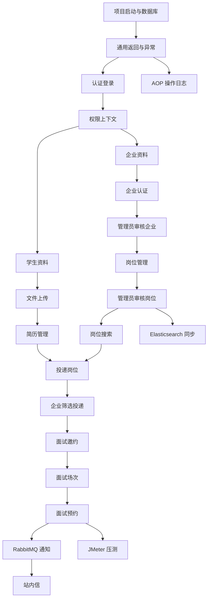

# 校园智能招聘与面试预约平台：开发任务拆分 TODO / Roadmap

文档版本：v1.0  
适用项目：校园智能招聘与面试预约平台  
适用仓库：`campus-recruitment-backend`  
推荐周期：8 周  
推荐人力：1 人后端主导，可选 1 人前端配合  
当前基础：已有 PRD、原型图、数据库设计、初始化 SQL、OpenAPI 草案、后端骨架、README

---

## 0. 文档目标

这份文档用于把项目从“设计文档齐全”推进到“能开发、能跑通、能演示、能写简历、能应对面试追问”。

它不是单纯的 TODO 清单，而是一个完整开发路线图，覆盖：

- Sprint 迭代计划
- 模块任务拆分
- 每个任务的优先级
- 前置依赖
- 预计工时
- 验收标准
- GitHub Issue 拆分
- 每日开发顺序
- 测试与压测计划
- 发布与演示准备
- 面试项目包装清单

---

## 1. 开发策略

### 1.1 总原则

项目开发顺序遵循：

```text
先能跑
  ↓
再能登录
  ↓
再能建业务数据
  ↓
再能跑通主流程
  ↓
再补中间件亮点
  ↓
最后补压测、文档、面试话术
```

不要一开始就追求所有技术点全部接入，否则容易卡死。

### 1.2 MVP 主流程

MVP 必须优先跑通这一条：

```text
学生注册登录
  ↓
学生上传简历
  ↓
企业注册登录
  ↓
企业提交认证
  ↓
管理员审核企业
  ↓
企业发布岗位
  ↓
管理员审核岗位
  ↓
学生搜索岗位
  ↓
学生投递岗位
  ↓
企业查看简历并邀约面试
  ↓
企业创建面试场次
  ↓
学生预约面试
  ↓
系统生成消息通知
```

### 1.3 优先级定义

| 优先级 | 含义 | 判断标准 |
|---|---|---|
| P0 | 必须做 | 不做主流程无法跑通 |
| P1 | 强烈建议 | 不做会影响项目完整度或面试讲述 |
| P2 | 可选增强 | 有时间再做，能增加亮点 |
| P3 | 后续扩展 | 不影响当前校招展示 |

### 1.4 任务类型

| 类型 | 说明 |
|---|---|
| `feature` | 新功能 |
| `bug` | 缺陷修复 |
| `refactor` | 重构 |
| `test` | 测试 |
| `docs` | 文档 |
| `infra` | 基础设施 |
| `perf` | 性能优化 |
| `security` | 安全 |
| `ops` | 部署运维 |

### 1.5 Definition of Done

每个 P0/P1 任务完成必须满足：

- 接口能正常调用。
- 参数校验完整。
- 错误码合理。
- 权限校验通过。
- 数据库数据正确。
- 核心异常场景有处理。
- Swagger / OpenAPI 描述同步。
- 至少有一条正常接口测试。
- 涉及状态流转的任务必须记录状态日志。
- 涉及 MQ 的任务必须考虑幂等。
- 涉及文件的任务必须校验数据权限。

---

## 2. 总体 Roadmap

### 2.1 八周开发路线

| 周期 | 主题 | 目标 | 核心产出 |
|---|---|---|---|
| Sprint 0 | 项目准备 | 保证项目能启动 | Docker、SQL、配置、启动成功 |
| Sprint 1 | 通用基础与认证 | 用户能注册登录 | Result、异常、登录、Token、权限上下文 |
| Sprint 2 | RBAC 与用户资料 | 权限和资料能用 | 角色权限、学生资料、企业资料 |
| Sprint 3 | 文件、简历、企业认证 | 文件链路跑通 | MinIO、简历、企业认证、管理员审核 |
| Sprint 4 | 岗位管理与搜索基础 | 岗位能发布审核搜索 | 岗位 CRUD、岗位审核、MySQL 搜索 |
| Sprint 5 | 投递流程 | 学生能投递，企业能筛选 | 投递、状态流转、投递日志 |
| Sprint 6 | 面试预约 | 核心亮点完成 | 场次、预约、Redis Lua 防超卖 |
| Sprint 7 | MQ、ES、日志 | 中间件亮点补齐 | RabbitMQ、ES、站内信、AOP 日志 |
| Sprint 8 | 测试、压测、交付 | 项目能展示 | JMeter、README、截图、简历话术 |

> 如果时间只有 3-4 周，优先做 P0 和部分 P1；ES、复杂日志、后台看板可以延后。

---

## 3. 依赖关系图



---

# 4. Sprint 0：项目准备与环境启动

## 4.1 目标

让项目从本地可以启动，包括：

- 后端工程能编译。
- Docker Compose 能启动依赖。
- MySQL 能执行初始化 SQL。
- Swagger UI 能打开。
- 基础目录规范清晰。

## 4.2 任务清单

| ID | 任务 | 类型 | 优先级 | 预计 | 依赖 | 验收标准 |
|---|---|---|---|---:|---|---|
| S0-001 | 拉取/解压后端骨架项目 | infra | P0 | 0.5h | 无 | IDEA 能打开项目 |
| S0-002 | 检查 JDK 17 和 Maven 版本 | infra | P0 | 0.5h | S0-001 | `java -version` 显示 17+ |
| S0-003 | 启动 Docker Compose 依赖 | infra | P0 | 1h | Docker | MySQL、Redis、RabbitMQ、MinIO、ES 均启动 |
| S0-004 | 执行数据库初始化 SQL | infra | P0 | 1h | S0-003 | `campus_recruitment` 库和表创建成功 |
| S0-005 | 启动 Spring Boot 应用 | infra | P0 | 1h | S0-004 | 8080 端口启动成功 |
| S0-006 | 打开 Swagger UI | docs | P0 | 0.5h | S0-005 | `/api/swagger-ui/index.html` 可访问 |
| S0-007 | 建立 Git 分支规范 | infra | P1 | 0.5h | S0-001 | `main/dev/feature/*` 分支约定完成 |
| S0-008 | 配置 `.env.example` 和本地配置说明 | docs | P1 | 0.5h | S0-003 | README 有本地启动说明 |

## 4.3 命令清单

```bash
cd deploy
docker compose up -d
```

```bash
mysql -uroot -p123456 < ../sql/V001__初始化数据库结构.sql
```

```bash
cd ..
mvn clean package -DskipTests
mvn spring-boot:run -Dspring-boot.run.profiles=dev
```

## 4.4 验收

- [ ] 项目能成功启动。
- [ ] 依赖服务全部正常。
- [ ] 数据库表创建成功。
- [ ] Swagger UI 可访问。
- [ ] README 中启动步骤与实际一致。

---

# 5. Sprint 1：通用基础与认证登录

## 5.1 目标

完成后端基础设施和账号体系，使学生、企业、管理员可以注册登录。

## 5.2 通用基础任务

| ID | 任务 | 类型 | 优先级 | 预计 | 依赖 | 验收标准 |
|---|---|---|---|---:|---|---|
| S1-001 | 完善统一返回 `Result` | feature | P0 | 1h | S0 | 所有接口统一返回 `code/message/data` |
| S1-002 | 完善错误码 `ErrorCode` | feature | P0 | 1h | S1-001 | 覆盖用户、企业、岗位、投递、面试、文件错误码 |
| S1-003 | 完善业务异常 `BizException` | feature | P0 | 1h | S1-002 | Service 可抛业务异常 |
| S1-004 | 完善全局异常处理 | feature | P0 | 2h | S1-003 | 参数错误、业务异常、系统异常统一处理 |
| S1-005 | 接入参数校验注解 | feature | P0 | 2h | S1-004 | DTO 必填字段能自动校验 |
| S1-006 | 完善分页返回 `PageResult` | feature | P0 | 1h | S1-001 | 列表接口统一分页格式 |
| S1-007 | MyBatis-Plus 分页插件验证 | infra | P0 | 1h | S0 | 分页查询可运行 |

## 5.3 认证任务

| ID | 任务 | 类型 | 优先级 | 预计 | 依赖 | 验收标准 |
|---|---|---|---|---:|---|---|
| S1-101 | 实现学生/企业注册 | feature | P0 | 4h | S1-001 | 可写入 `sys_user` 和 `sys_user_role` |
| S1-102 | 用户名/手机号/邮箱唯一校验 | feature | P0 | 2h | S1-101 | 重复注册返回对应错误码 |
| S1-103 | 密码 BCrypt 加密 | security | P0 | 2h | S1-101 | 数据库不保存明文密码 |
| S1-104 | 实现登录接口 | feature | P0 | 4h | S1-103 | 正确账号密码返回 Token |
| S1-105 | 实现 Token 生成与解析 | security | P0 | 4h | S1-104 | Token 可识别 userId、userType |
| S1-106 | Redis 保存登录态 | feature | P0 | 3h | S1-105 | Token 可设置过期时间 |
| S1-107 | 实现登出 | feature | P0 | 1h | S1-106 | 删除 Redis 登录态 |
| S1-108 | 实现当前用户接口 `/auth/me` | feature | P0 | 2h | S1-106 | 返回用户信息、角色、权限 |
| S1-109 | 记录登录日志 | feature | P1 | 2h | S1-104 | 成功/失败登录写入 `login_log` |

## 5.4 安全任务

| ID | 任务 | 类型 | 优先级 | 预计 | 依赖 | 验收标准 |
|---|---|---|---|---:|---|---|
| S1-201 | 实现登录拦截器 | security | P0 | 4h | S1-106 | 未登录访问受保护接口返回 401 |
| S1-202 | 实现 `UserContextHolder` 自动注入 | security | P0 | 2h | S1-201 | Controller/Service 可获取当前用户 |
| S1-203 | 白名单路径配置 | security | P0 | 1h | S1-201 | 登录、注册、岗位公开接口免登录 |
| S1-204 | 禁用用户登录限制 | security | P0 | 1h | S1-104 | `DISABLED` 用户不能登录 |

## 5.5 验收

- [ ] 学生可以注册登录。
- [ ] 企业可以注册登录。
- [ ] 管理员可以登录。
- [ ] 密码加密存储。
- [ ] 未登录访问受保护接口返回 401。
- [ ] Token 过期后无法访问。
- [ ] 当前用户接口返回角色和权限。
- [ ] 登录日志可入库。

---

# 6. Sprint 2：RBAC 权限与基础资料

## 6.1 目标

完成角色权限校验、学生资料、企业资料基础功能。

## 6.2 RBAC 任务

| ID | 任务 | 类型 | 优先级 | 预计 | 依赖 | 验收标准 |
|---|---|---|---|---:|---|---|
| S2-001 | 查询当前用户角色 | feature | P0 | 2h | S1 | 从 `sys_user_role` 查角色 |
| S2-002 | 查询当前用户权限 | feature | P0 | 3h | S2-001 | 从 `sys_role_menu` 查权限标识 |
| S2-003 | 权限缓存到 Redis | feature | P1 | 2h | S2-002 | 权限可缓存并设置 TTL |
| S2-004 | 实现 `@RequirePermission` | security | P0 | 3h | S2-002 | 无权限返回 403 |
| S2-005 | 补齐接口权限标识 | security | P0 | 2h | S2-004 | 核心接口都有权限注解 |
| S2-006 | 管理员权限绕过策略 | security | P1 | 1h | S2-004 | ADMIN 可访问后台接口 |

## 6.3 学生资料任务

| ID | 任务 | 类型 | 优先级 | 预计 | 依赖 | 验收标准 |
|---|---|---|---|---:|---|---|
| S2-101 | 获取学生资料 | feature | P0 | 2h | S1 | 学生可查询自己的资料 |
| S2-102 | 保存学生资料 | feature | P0 | 3h | S2-101 | 写入/更新 `student_profile` |
| S2-103 | 保存学生技能标签 | feature | P1 | 2h | S2-102 | 写入 `student_skill` |
| S2-104 | 学生资料数据权限 | security | P0 | 1h | S2-101 | 不能查询其他学生资料 |
| S2-105 | 学生资料参数校验 | feature | P0 | 1h | S2-102 | 姓名、学校、专业必填 |

## 6.4 企业资料任务

| ID | 任务 | 类型 | 优先级 | 预计 | 依赖 | 验收标准 |
|---|---|---|---|---:|---|---|
| S2-201 | 获取企业资料 | feature | P0 | 2h | S1 | 企业可查询自己的资料 |
| S2-202 | 保存企业资料 | feature | P0 | 3h | S2-201 | 写入/更新 `company_profile` |
| S2-203 | 企业资料数据权限 | security | P0 | 1h | S2-201 | 不能查询其他企业资料 |
| S2-204 | 企业资料参数校验 | feature | P0 | 1h | S2-202 | 企业名称、联系人、电话必填 |

## 6.5 验收

- [ ] 学生可维护个人资料。
- [ ] 企业可维护企业资料。
- [ ] 权限注解生效。
- [ ] 无权限接口返回 403。
- [ ] 当前用户权限可以返回给前端。
- [ ] 数据权限不允许水平越权。

---

# 7. Sprint 3：文件、简历、企业认证

## 7.1 目标

完成 MinIO 文件上传、简历管理、企业认证和管理员审核企业。

## 7.2 文件模块任务

| ID | 任务 | 类型 | 优先级 | 预计 | 依赖 | 验收标准 |
|---|---|---|---|---:|---|---|
| S3-001 | 创建 MinIO Bucket 初始化逻辑 | infra | P1 | 2h | S0 | resume/license bucket 存在 |
| S3-002 | 实现文件上传接口 | feature | P0 | 4h | S3-001 | 文件上传到 MinIO |
| S3-003 | 保存文件元数据 | feature | P0 | 2h | S3-002 | 写入 `file_object` |
| S3-004 | 文件后缀校验 | security | P0 | 1h | S3-002 | 非法后缀拒绝 |
| S3-005 | 文件大小校验 | security | P0 | 1h | S3-002 | 超过限制拒绝 |
| S3-006 | MIME 类型校验 | security | P1 | 2h | S3-002 | 防止伪装文件 |
| S3-007 | 文件下载接口 | feature | P0 | 3h | S3-003 | 可下载文件流 |
| S3-008 | 文件下载权限校验 | security | P0 | 3h | S3-007 | 简历/资质下载不越权 |

## 7.3 简历模块任务

| ID | 任务 | 类型 | 优先级 | 预计 | 依赖 | 验收标准 |
|---|---|---|---|---:|---|---|
| S3-101 | 创建简历记录 | feature | P0 | 2h | S3-003 | 写入 `resume` |
| S3-102 | 我的简历列表 | feature | P0 | 2h | S3-101 | 只返回当前学生简历 |
| S3-103 | 设置默认简历 | feature | P0 | 2h | S3-101 | 同一学生只有一个默认简历 |
| S3-104 | 删除简历 | feature | P1 | 1h | S3-101 | 逻辑删除 |
| S3-105 | 投递前默认简历查询 | feature | P0 | 1h | S3-103 | 能查到默认简历 |

## 7.4 企业认证任务

| ID | 任务 | 类型 | 优先级 | 预计 | 依赖 | 验收标准 |
|---|---|---|---|---:|---|---|
| S3-201 | 企业提交认证 | feature | P0 | 3h | S2, S3 | `audit_status` 变为 `PENDING` |
| S3-202 | 企业认证状态查询 | feature | P0 | 1h | S3-201 | 返回认证状态和原因 |
| S3-203 | 管理员企业审核列表 | feature | P0 | 3h | S3-201 | 分页查询待审核企业 |
| S3-204 | 管理员审核企业通过 | feature | P0 | 2h | S3-203 | 状态变 `APPROVED` |
| S3-205 | 管理员审核企业拒绝 | feature | P0 | 2h | S3-203 | 状态变 `REJECTED`，必须填写原因 |
| S3-206 | 企业审核记录 | feature | P1 | 2h | S3-204 | 写入 `company_audit` |
| S3-207 | 认证审核消息通知 | feature | P1 | 2h | S3-204 | 发送站内信或预留 MQ |

## 7.5 验收

- [ ] 简历 PDF/DOC/DOCX 可上传。
- [ ] 企业资质文件可上传。
- [ ] 文件元数据入库。
- [ ] 学生可管理自己的简历。
- [ ] 企业可提交认证。
- [ ] 管理员可审核企业。
- [ ] 未认证企业不能发布岗位。

---

# 8. Sprint 4：岗位管理与搜索基础

## 8.1 目标

完成企业岗位发布、岗位审核、岗位列表、岗位详情、岗位收藏和基础搜索。

## 8.2 企业岗位任务

| ID | 任务 | 类型 | 优先级 | 预计 | 依赖 | 验收标准 |
|---|---|---|---|---:|---|---|
| S4-001 | 创建岗位草稿 | feature | P0 | 3h | S3 企业认证 | 认证企业可创建岗位 |
| S4-002 | 未认证企业禁止发布岗位 | security | P0 | 1h | S4-001 | 未认证返回 20001 |
| S4-003 | 编辑岗位 | feature | P0 | 3h | S4-001 | 企业只能编辑自己的岗位 |
| S4-004 | 岗位标签保存 | feature | P1 | 2h | S4-001 | 写入 `job_tag` |
| S4-005 | 提交岗位审核 | feature | P0 | 2h | S4-001 | 状态变 `PENDING_REVIEW` |
| S4-006 | 企业岗位列表 | feature | P0 | 2h | S4-001 | 按企业分页查询 |
| S4-007 | 企业岗位详情 | feature | P0 | 1h | S4-001 | 企业可查看自己的岗位 |
| S4-008 | 企业下架岗位 | feature | P0 | 2h | S4-001 | `PUBLISHED -> OFFLINE` |

## 8.3 管理员岗位审核任务

| ID | 任务 | 类型 | 优先级 | 预计 | 依赖 | 验收标准 |
|---|---|---|---|---:|---|---|
| S4-101 | 岗位审核列表 | feature | P0 | 2h | S4-005 | 管理员可查看待审核岗位 |
| S4-102 | 审核岗位通过 | feature | P0 | 2h | S4-101 | 状态变 `PUBLISHED` |
| S4-103 | 审核岗位拒绝 | feature | P0 | 2h | S4-101 | 状态变 `REJECTED`，必须填写原因 |
| S4-104 | 岗位审核操作日志 | feature | P1 | 1h | S4-102 | 写入操作日志 |
| S4-105 | 岗位审核通知 | feature | P1 | 1h | S4-102 | 企业收到通知 |

## 8.4 岗位搜索任务

| ID | 任务 | 类型 | 优先级 | 预计 | 依赖 | 验收标准 |
|---|---|---|---|---:|---|---|
| S4-201 | 公开岗位列表 | feature | P0 | 3h | S4-102 | 只展示 `PUBLISHED` 岗位 |
| S4-202 | 岗位详情 | feature | P0 | 2h | S4-201 | 可查看岗位详情 |
| S4-203 | 关键词搜索 MySQL 版 | feature | P0 | 2h | S4-201 | 支持 title/company/tag 模糊搜索 |
| S4-204 | 城市/学历/薪资筛选 | feature | P0 | 2h | S4-201 | 多条件筛选正确 |
| S4-205 | 最新/热门排序 | feature | P1 | 2h | S4-201 | 支持排序 |
| S4-206 | 岗位浏览数统计 | feature | P1 | 2h | S4-202 | 查看详情增加浏览数 |
| S4-207 | Redis 缓存岗位详情 | perf | P1 | 3h | S4-202 | 热点岗位走缓存 |
| S4-208 | 收藏岗位 | feature | P1 | 2h | S4-201 | 防重复收藏 |
| S4-209 | 我的收藏 | feature | P2 | 2h | S4-208 | 学生查看收藏列表 |

## 8.5 验收

- [ ] 企业可创建岗位。
- [ ] 未认证企业不能创建岗位。
- [ ] 管理员可审核岗位。
- [ ] 审核通过岗位能被搜索。
- [ ] 审核拒绝岗位不可见。
- [ ] 学生可查看岗位详情。
- [ ] 岗位列表支持分页和筛选。
- [ ] 岗位数据权限不越权。

---

# 9. Sprint 5：投递流程与状态流转

## 9.1 目标

完成学生投递、企业查看投递、企业修改投递状态、投递日志。

## 9.2 投递任务

| ID | 任务 | 类型 | 优先级 | 预计 | 依赖 | 验收标准 |
|---|---|---|---|---:|---|---|
| S5-001 | 学生投递岗位 | feature | P0 | 4h | S3 简历, S4 岗位 | 投递记录入库 |
| S5-002 | 无简历禁止投递 | feature | P0 | 1h | S5-001 | 返回 `30001` |
| S5-003 | 未发布岗位禁止投递 | feature | P0 | 1h | S5-001 | 返回 `30004` |
| S5-004 | 防重复投递 | feature | P0 | 2h | S5-001 | 唯一索引兜底 |
| S5-005 | 投递成功更新岗位投递数 | feature | P1 | 1h | S5-001 | `apply_count + 1` |
| S5-006 | 写入投递状态日志 | feature | P0 | 2h | S5-001 | 写入 `application_log` |
| S5-007 | 投递成功通知 | feature | P1 | 1h | S5-001 | 生成站内信或 MQ 预留 |

## 9.3 学生投递管理任务

| ID | 任务 | 类型 | 优先级 | 预计 | 依赖 | 验收标准 |
|---|---|---|---|---:|---|---|
| S5-101 | 我的投递列表 | feature | P0 | 2h | S5-001 | 只显示当前学生投递 |
| S5-102 | 投递详情 | feature | P0 | 2h | S5-001 | 包含岗位、企业、状态日志 |
| S5-103 | 按状态筛选投递 | feature | P1 | 1h | S5-101 | 状态筛选正确 |

## 9.4 企业投递管理任务

| ID | 任务 | 类型 | 优先级 | 预计 | 依赖 | 验收标准 |
|---|---|---|---|---:|---|---|
| S5-201 | 企业投递列表 | feature | P0 | 3h | S5-001 | 企业只能看自己岗位的投递 |
| S5-202 | 企业查看简历 | feature | P0 | 3h | S5-201 | 文件权限校验正确 |
| S5-203 | 标记已查看 | feature | P0 | 2h | S5-201 | `DELIVERED -> VIEWED` |
| S5-204 | 邀约面试 | feature | P0 | 2h | S5-201 | `VIEWED -> INTERVIEW_INVITED` |
| S5-205 | 标记不合适 | feature | P0 | 2h | S5-201 | `VIEWED -> REJECTED` |
| S5-206 | 非法状态流转拦截 | feature | P0 | 2h | S5-203 | 非法流转返回错误 |
| S5-207 | 投递状态变更日志 | feature | P0 | 1h | S5-203 | 每次变更写日志 |
| S5-208 | 邀约通知 | feature | P1 | 1h | S5-204 | 学生收到通知 |

## 9.5 状态流转规则

| 当前状态 | 目标状态 | 是否允许 | 触发人 |
|---|---|---:|---|
| `DELIVERED` | `VIEWED` | 是 | 企业 |
| `VIEWED` | `INTERVIEW_INVITED` | 是 | 企业 |
| `VIEWED` | `REJECTED` | 是 | 企业 |
| `INTERVIEW_INVITED` | `BOOKED` | 是 | 学生预约成功 |
| `BOOKED` | `FINISHED` | 是 | 企业/系统 |
| `BOOKED` | `CANCELED` | 是 | 学生/企业 |
| `DELIVERED` | `BOOKED` | 否 | - |
| `REJECTED` | `BOOKED` | 否 | - |

## 9.6 验收

- [ ] 学生可以投递岗位。
- [ ] 重复投递会失败。
- [ ] 无简历无法投递。
- [ ] 企业只能查看自己岗位的投递。
- [ ] 企业可以邀约面试。
- [ ] 状态流转合法。
- [ ] 状态日志完整。

---

# 10. Sprint 6：面试场次与预约防超卖

## 10.1 目标

完成本项目最重要的后端亮点：面试预约防超卖。

## 10.2 面试场次任务

| ID | 任务 | 类型 | 优先级 | 预计 | 依赖 | 验收标准 |
|---|---|---|---|---:|---|---|
| S6-001 | 企业创建面试场次 | feature | P0 | 3h | S5 | 写入 `interview_slot` |
| S6-002 | 场次时间合法性校验 | feature | P0 | 1h | S6-001 | 结束时间大于开始时间 |
| S6-003 | 场次容量合法性校验 | feature | P0 | 1h | S6-001 | capacity > 0 |
| S6-004 | 初始化 Redis 库存 | feature | P0 | 2h | S6-001 | stock key = capacity |
| S6-005 | 企业场次列表 | feature | P0 | 2h | S6-001 | 企业查看自己的场次 |
| S6-006 | 关闭面试场次 | feature | P1 | 2h | S6-001 | `OPEN -> CLOSED` |
| S6-007 | 场次过期定时任务 | feature | P2 | 3h | S6-001 | 过期状态变 `EXPIRED` |

## 10.3 学生预约任务

| ID | 任务 | 类型 | 优先级 | 预计 | 依赖 | 验收标准 |
|---|---|---|---|---:|---|---|
| S6-101 | 查询可预约场次 | feature | P0 | 2h | S6-001 | 只显示开放且有资格的场次 |
| S6-102 | 校验面试邀约资格 | feature | P0 | 2h | S5 邀约 | 未邀约不能预约 |
| S6-103 | 接入 Redis Lua 脚本 | feature | P0 | 4h | S6-004 | 能原子扣减库存 |
| S6-104 | 预约成功写 MySQL | feature | P0 | 3h | S6-103 | 写入 `interview_booking` |
| S6-105 | 防重复预约 | feature | P0 | 2h | S6-104 | Redis + 唯一索引兜底 |
| S6-106 | 名额已满处理 | feature | P0 | 1h | S6-103 | 返回 `40003` |
| S6-107 | 更新投递状态为 `BOOKED` | feature | P0 | 2h | S6-104 | 投递状态同步变更 |
| S6-108 | 预约成功通知 | feature | P1 | 1h | S6-104 | 发送站内信/MQ |
| S6-109 | 我的预约列表 | feature | P0 | 2h | S6-104 | 学生查看自己的预约 |
| S6-110 | 取消预约 | feature | P1 | 3h | S6-104 | 恢复库存，状态变更 |
| S6-111 | 企业查看预约名单 | feature | P0 | 2h | S6-104 | 企业只能看自己场次预约 |

## 10.4 一致性补偿任务

| ID | 任务 | 类型 | 优先级 | 预计 | 依赖 | 验收标准 |
|---|---|---|---|---:|---|---|
| S6-201 | DB 写失败回滚 Redis 库存 | feature | P0 | 2h | S6-104 | 插入失败后库存恢复 |
| S6-202 | 删除预约去重 Key | feature | P0 | 1h | S6-201 | 失败后可重新预约 |
| S6-203 | 记录预约失败日志 | docs/test | P1 | 1h | S6-201 | 日志可定位问题 |
| S6-204 | 补偿任务表设计 | feature | P2 | 3h | S6-201 | 可后续扩展 |

## 10.5 验收

- [ ] 企业可创建面试场次。
- [ ] 学生获得邀约后可预约。
- [ ] 未邀约学生不能预约。
- [ ] 同一学生不能重复预约。
- [ ] 名额为 0 后不能继续预约。
- [ ] 并发预约不会超卖。
- [ ] 预约成功后投递状态变为已预约。
- [ ] 企业可查看预约名单。

---

# 11. Sprint 7：RabbitMQ、Elasticsearch、站内信、日志

## 11.1 目标

补齐中间件亮点，让项目从“能跑业务”升级为“能讲工程能力”。

## 11.2 RabbitMQ 任务

| ID | 任务 | 类型 | 优先级 | 预计 | 依赖 | 验收标准 |
|---|---|---|---|---:|---|---|
| S7-001 | 定义通知消息 DTO | feature | P0 | 1h | S5/S6 | `NotifyMessage` 完整 |
| S7-002 | 封装消息生产者 | feature | P0 | 2h | S7-001 | 可发送通知消息 |
| S7-003 | 实现通知消费者 | feature | P0 | 3h | S7-002 | 消费后写 `message` |
| S7-004 | MQ 消费幂等 | feature | P0 | 3h | S7-003 | `messageId` 重复不重复写消息 |
| S7-005 | 消费失败重试 | feature | P1 | 2h | S7-003 | 失败可重试 |
| S7-006 | MQ 消费日志 | feature | P1 | 2h | S7-003 | 写 `mq_message_log` |
| S7-007 | 投递成功消息接入 MQ | feature | P1 | 1h | S7-002 | 投递成功异步通知 |
| S7-008 | 预约成功消息接入 MQ | feature | P1 | 1h | S7-002 | 预约成功异步通知 |
| S7-009 | 审核结果消息接入 MQ | feature | P1 | 1h | S7-002 | 审核结果异步通知 |

## 11.3 站内信任务

| ID | 任务 | 类型 | 优先级 | 预计 | 依赖 | 验收标准 |
|---|---|---|---|---:|---|---|
| S7-101 | 我的消息列表 | feature | P0 | 2h | S7-003 | 只查看自己的消息 |
| S7-102 | 未读消息数 | feature | P0 | 1h | S7-101 | 返回未读数量 |
| S7-103 | 标记已读 | feature | P0 | 1h | S7-101 | 状态变 `READ` |
| S7-104 | 删除消息 | feature | P1 | 1h | S7-101 | 逻辑删除 |
| S7-105 | Redis 缓存未读数 | perf | P2 | 2h | S7-102 | 未读数可走缓存 |

## 11.4 Elasticsearch 任务

| ID | 任务 | 类型 | 优先级 | 预计 | 依赖 | 验收标准 |
|---|---|---|---|---:|---|---|
| S7-201 | 设计岗位 ES Document | feature | P1 | 2h | S4 | 字段覆盖岗位搜索 |
| S7-202 | 创建岗位索引初始化 | infra | P1 | 2h | S7-201 | ES 中存在 `campus_job` |
| S7-203 | 岗位审核通过同步 ES | feature | P1 | 3h | S4 审核 | `PUBLISHED` 后写入 ES |
| S7-204 | 岗位编辑同步 ES | feature | P1 | 2h | S7-203 | 修改后更新 ES |
| S7-205 | 岗位下架同步 ES | feature | P1 | 2h | S7-203 | 下架后 ES 不展示 |
| S7-206 | 岗位搜索改造为 ES | feature | P1 | 4h | S7-203 | 关键词搜索走 ES |
| S7-207 | ES 同步失败补偿 | feature | P2 | 3h | S7-203 | 失败可重试 |
| S7-208 | 搜索结果高亮 | feature | P2 | 2h | S7-206 | 命中关键词高亮 |

## 11.5 AOP 操作日志任务

| ID | 任务 | 类型 | 优先级 | 预计 | 依赖 | 验收标准 |
|---|---|---|---|---:|---|---|
| S7-301 | 完善 `@OperationLog` 注解 | feature | P1 | 1h | S1 | 支持模块和操作名 |
| S7-302 | AOP 获取请求信息 | feature | P1 | 2h | S7-301 | 记录 URL、方法、IP |
| S7-303 | 请求参数脱敏 | security | P1 | 2h | S7-302 | 密码/Token 不入日志 |
| S7-304 | 操作日志入库 | feature | P1 | 2h | S7-302 | 写 `operation_log` |
| S7-305 | 管理员查询操作日志 | feature | P1 | 2h | S7-304 | 后台分页查询 |
| S7-306 | 管理员查询登录日志 | feature | P1 | 2h | S1 登录日志 | 后台分页查询 |

## 11.6 验收

- [ ] 投递、预约、审核结果可异步生成站内信。
- [ ] MQ 重复消费不会生成重复消息。
- [ ] 岗位可同步到 ES。
- [ ] 岗位搜索可走 ES。
- [ ] 审核、投递、预约等关键操作有日志。
- [ ] 日志中不出现密码、Token。

---

# 12. Sprint 8：测试、压测、交付与面试包装

## 12.1 目标

让项目从“写完代码”变成“能证明自己真做过”。

## 12.2 单元测试任务

| ID | 任务 | 类型 | 优先级 | 预计 | 依赖 | 验收标准 |
|---|---|---|---|---:|---|---|
| S8-001 | AuthService 单元测试 | test | P1 | 2h | S1 | 覆盖登录注册 |
| S8-002 | JobService 单元测试 | test | P1 | 2h | S4 | 覆盖岗位状态 |
| S8-003 | ApplicationService 单元测试 | test | P1 | 3h | S5 | 覆盖重复投递 |
| S8-004 | InterviewService 单元测试 | test | P1 | 3h | S6 | 覆盖预约边界 |
| S8-005 | MessageService 单元测试 | test | P2 | 2h | S7 | 覆盖消息幂等 |

## 12.3 接口测试任务

| ID | 任务 | 类型 | 优先级 | 预计 | 依赖 | 验收标准 |
|---|---|---|---|---:|---|---|
| S8-101 | 创建 Apifox/Postman 环境 | test | P0 | 1h | S1 | 有 baseUrl/token |
| S8-102 | 注册登录接口测试 | test | P0 | 1h | S1 | 正常/异常都通过 |
| S8-103 | 企业认证接口测试 | test | P0 | 1h | S3 | 认证流程通过 |
| S8-104 | 岗位审核接口测试 | test | P0 | 1h | S4 | 岗位发布流程通过 |
| S8-105 | 投递接口测试 | test | P0 | 1h | S5 | 投递流程通过 |
| S8-106 | 面试预约接口测试 | test | P0 | 2h | S6 | 预约流程通过 |
| S8-107 | 消息接口测试 | test | P1 | 1h | S7 | 消息可读可改 |

## 12.4 JMeter 压测任务

| ID | 任务 | 类型 | 优先级 | 预计 | 依赖 | 验收标准 |
|---|---|---|---|---:|---|---|
| S8-201 | 准备压测数据 | test | P0 | 2h | S6 | 100 个学生、1 个场次 |
| S8-202 | 编写预约接口压测脚本 | test | P0 | 3h | S8-201 | JMX 文件可运行 |
| S8-203 | 并发 100 预约测试 | test | P0 | 2h | S8-202 | 成功数不超过容量 |
| S8-204 | 验证数据库预约记录 | test | P0 | 1h | S8-203 | 记录数等于容量 |
| S8-205 | 验证 Redis 库存 | test | P0 | 1h | S8-203 | 库存不为负 |
| S8-206 | 输出压测报告 | docs | P0 | 2h | S8-203 | 有截图、指标、结论 |

## 12.5 文档与交付任务

| ID | 任务 | 类型 | 优先级 | 预计 | 依赖 | 验收标准 |
|---|---|---|---|---:|---|---|
| S8-301 | 更新 README | docs | P0 | 2h | 全部 | 启动说明、功能说明准确 |
| S8-302 | 更新接口文档 | docs | P0 | 2h | 全部 | OpenAPI 和真实接口一致 |
| S8-303 | 添加项目截图 | docs | P1 | 2h | 前端/Swagger | README 有截图 |
| S8-304 | 添加架构图 | docs | P1 | 1h | 全部 | README 有 Mermaid 图 |
| S8-305 | 添加 ER 图 | docs | P1 | 1h | 数据库 | README/docs 有 ER 图 |
| S8-306 | 添加核心流程图 | docs | P1 | 1h | 全部 | 投递/预约流程清晰 |
| S8-307 | 整理面试话术 | docs | P0 | 2h | 全部 | 有项目亮点和追问答案 |
| S8-308 | 整理部署步骤 | docs | P1 | 1h | Docker | 新机器可按步骤启动 |

## 12.6 验收

- [ ] 主流程完整跑通。
- [ ] 压测证明无超卖。
- [ ] README 可直接展示给面试官。
- [ ] OpenAPI 与接口一致。
- [ ] 简历话术完整。
- [ ] 核心技术点均有业务落地场景。

---

# 13. 模块级 Backlog 总表

## 13.1 Auth 认证模块

| Issue | 标题 | 类型 | 优先级 | 预计 |
|---|---|---|---|---:|
| #001 | 实现学生/企业注册接口 | feature | P0 | 4h |
| #002 | 实现 BCrypt 密码加密 | security | P0 | 2h |
| #003 | 实现登录接口并返回 Token | feature | P0 | 4h |
| #004 | Redis 保存登录态 | feature | P0 | 3h |
| #005 | 实现登出接口 | feature | P0 | 1h |
| #006 | 实现当前用户接口 | feature | P0 | 2h |
| #007 | 实现登录日志记录 | feature | P1 | 2h |

## 13.2 RBAC 权限模块

| Issue | 标题 | 类型 | 优先级 | 预计 |
|---|---|---|---|---:|
| #008 | 查询当前用户角色和权限 | feature | P0 | 4h |
| #009 | 实现登录拦截器 | security | P0 | 4h |
| #010 | 实现权限注解校验 | security | P0 | 3h |
| #011 | 权限数据缓存到 Redis | perf | P1 | 2h |
| #012 | 补齐接口权限注解 | security | P0 | 2h |

## 13.3 File 文件模块

| Issue | 标题 | 类型 | 优先级 | 预计 |
|---|---|---|---|---:|
| #013 | MinIO Bucket 初始化 | infra | P1 | 2h |
| #014 | 文件上传到 MinIO | feature | P0 | 4h |
| #015 | 文件元数据入库 | feature | P0 | 2h |
| #016 | 文件类型和大小校验 | security | P0 | 2h |
| #017 | 文件下载接口 | feature | P0 | 3h |
| #018 | 文件下载权限校验 | security | P0 | 3h |

## 13.4 Resume 简历模块

| Issue | 标题 | 类型 | 优先级 | 预计 |
|---|---|---|---|---:|
| #019 | 创建简历记录 | feature | P0 | 2h |
| #020 | 我的简历列表 | feature | P0 | 2h |
| #021 | 设置默认简历 | feature | P0 | 2h |
| #022 | 删除简历 | feature | P1 | 1h |

## 13.5 Company 企业模块

| Issue | 标题 | 类型 | 优先级 | 预计 |
|---|---|---|---|---:|
| #023 | 企业资料保存与查询 | feature | P0 | 4h |
| #024 | 企业提交认证 | feature | P0 | 3h |
| #025 | 管理员企业审核列表 | feature | P0 | 3h |
| #026 | 管理员审核企业通过/拒绝 | feature | P0 | 4h |
| #027 | 企业审核记录 | feature | P1 | 2h |

## 13.6 Job 岗位模块

| Issue | 标题 | 类型 | 优先级 | 预计 |
|---|---|---|---|---:|
| #028 | 企业创建岗位 | feature | P0 | 3h |
| #029 | 企业编辑岗位 | feature | P0 | 3h |
| #030 | 岗位提交审核 | feature | P0 | 2h |
| #031 | 管理员审核岗位 | feature | P0 | 4h |
| #032 | 岗位列表和详情 | feature | P0 | 5h |
| #033 | 岗位搜索筛选排序 | feature | P0 | 4h |
| #034 | 岗位收藏 | feature | P1 | 2h |
| #035 | Redis 缓存岗位详情 | perf | P1 | 3h |

## 13.7 Application 投递模块

| Issue | 标题 | 类型 | 优先级 | 预计 |
|---|---|---|---|---:|
| #036 | 学生投递岗位 | feature | P0 | 4h |
| #037 | 防重复投递 | feature | P0 | 2h |
| #038 | 我的投递列表和详情 | feature | P0 | 4h |
| #039 | 企业投递列表 | feature | P0 | 3h |
| #040 | 企业查看简历 | feature | P0 | 3h |
| #041 | 投递状态流转 | feature | P0 | 4h |
| #042 | 投递状态日志 | feature | P0 | 2h |

## 13.8 Interview 面试模块

| Issue | 标题 | 类型 | 优先级 | 预计 |
|---|---|---|---|---:|
| #043 | 企业创建面试场次 | feature | P0 | 3h |
| #044 | 初始化 Redis 场次库存 | feature | P0 | 2h |
| #045 | 查询可预约场次 | feature | P0 | 2h |
| #046 | 接入 Redis Lua 预约扣减 | feature | P0 | 4h |
| #047 | 预约记录入库 | feature | P0 | 3h |
| #048 | 防重复预约 | feature | P0 | 2h |
| #049 | 预约失败库存补偿 | feature | P0 | 2h |
| #050 | 我的预约和预约名单 | feature | P0 | 4h |
| #051 | 取消预约 | feature | P1 | 3h |

## 13.9 Message 消息模块

| Issue | 标题 | 类型 | 优先级 | 预计 |
|---|---|---|---|---:|
| #052 | RabbitMQ 通知生产者 | feature | P0 | 2h |
| #053 | RabbitMQ 通知消费者 | feature | P0 | 3h |
| #054 | MQ 消费幂等 | feature | P0 | 3h |
| #055 | 我的消息列表 | feature | P0 | 2h |
| #056 | 未读消息数 | feature | P0 | 1h |
| #057 | 标记已读和删除消息 | feature | P1 | 2h |

## 13.10 Admin 后台模块

| Issue | 标题 | 类型 | 优先级 | 预计 |
|---|---|---|---|---:|
| #058 | 管理后台数据看板 | feature | P1 | 3h |
| #059 | 用户列表 | feature | P1 | 2h |
| #060 | 禁用/恢复用户 | feature | P0 | 2h |
| #061 | 字典管理 | feature | P2 | 4h |
| #062 | 操作日志查询 | feature | P1 | 2h |
| #063 | 登录日志查询 | feature | P1 | 2h |

## 13.11 Search 搜索模块

| Issue | 标题 | 类型 | 优先级 | 预计 |
|---|---|---|---|---:|
| #064 | 设计 ES 岗位索引 | feature | P1 | 2h |
| #065 | 岗位同步 ES | feature | P1 | 4h |
| #066 | 岗位搜索改造为 ES | feature | P1 | 4h |
| #067 | ES 同步失败补偿 | feature | P2 | 3h |
| #068 | 搜索关键词高亮 | feature | P2 | 2h |

## 13.12 Test 测试与交付

| Issue | 标题 | 类型 | 优先级 | 预计 |
|---|---|---|---|---:|
| #069 | Postman/Apifox 接口集合 | test | P0 | 4h |
| #070 | 面试预约 JMeter 压测脚本 | test | P0 | 4h |
| #071 | 输出压测报告 | docs | P0 | 2h |
| #072 | 更新 README 项目截图 | docs | P1 | 2h |
| #073 | 整理面试话术 | docs | P0 | 2h |

---

# 14. 推荐开发顺序：30 天执行版

如果你想快速做出能放简历的版本，按这个顺序执行。

## 第 1-3 天：项目跑起来

| 天数 | 任务 |
|---|---|
| Day 1 | 启动 Docker、初始化数据库、跑通 Spring Boot |
| Day 2 | 完善 Result、ErrorCode、异常处理、参数校验 |
| Day 3 | 实现注册、登录、Token、Redis 登录态 |

## 第 4-7 天：权限和资料

| 天数 | 任务 |
|---|---|
| Day 4 | 实现登录拦截器、UserContext、白名单 |
| Day 5 | 实现 RBAC 权限查询和权限注解 |
| Day 6 | 实现学生资料、企业资料 |
| Day 7 | 补数据权限校验、登录日志 |

## 第 8-11 天：文件、简历、企业认证

| 天数 | 任务 |
|---|---|
| Day 8 | 接入 MinIO 文件上传 |
| Day 9 | 文件元数据、下载、权限校验 |
| Day 10 | 简历创建、默认简历、简历列表 |
| Day 11 | 企业认证提交、管理员审核企业 |

## 第 12-16 天：岗位主流程

| 天数 | 任务 |
|---|---|
| Day 12 | 企业创建岗位、编辑岗位 |
| Day 13 | 岗位提交审核、管理员审核岗位 |
| Day 14 | 岗位列表、详情、筛选 |
| Day 15 | 岗位标签、收藏、浏览数 |
| Day 16 | 岗位缓存、岗位搜索优化 |

## 第 17-20 天：投递主流程

| 天数 | 任务 |
|---|---|
| Day 17 | 学生投递岗位、防重复投递 |
| Day 18 | 我的投递、投递详情 |
| Day 19 | 企业投递列表、查看简历 |
| Day 20 | 投递状态流转、状态日志 |

## 第 21-24 天：面试预约

| 天数 | 任务 |
|---|---|
| Day 21 | 企业创建面试场次、Redis 库存初始化 |
| Day 22 | 查询可预约场次、校验邀约资格 |
| Day 23 | Redis Lua 扣减库存、预约入库 |
| Day 24 | 取消预约、预约名单、防超卖异常处理 |

## 第 25-27 天：中间件亮点

| 天数 | 任务 |
|---|---|
| Day 25 | RabbitMQ 通知生产者和消费者 |
| Day 26 | 消息中心、MQ 幂等 |
| Day 27 | Elasticsearch 岗位同步和搜索 |

## 第 28-30 天：测试和包装

| 天数 | 任务 |
|---|---|
| Day 28 | Apifox/Postman 接口测试集合 |
| Day 29 | JMeter 面试预约压测 |
| Day 30 | README、截图、简历话术、面试追问 |

---

# 15. GitHub Project 看板建议

## 15.1 看板列

```text
Backlog
  ↓
Ready
  ↓
In Progress
  ↓
Code Review
  ↓
Testing
  ↓
Done
```

## 15.2 Issue Label

| Label | 含义 |
|---|---|
| `priority/P0` | 必须完成 |
| `priority/P1` | 强烈建议 |
| `priority/P2` | 可选增强 |
| `type/feature` | 新功能 |
| `type/bug` | Bug |
| `type/docs` | 文档 |
| `type/test` | 测试 |
| `type/security` | 安全 |
| `type/perf` | 性能 |
| `module/auth` | 认证 |
| `module/job` | 岗位 |
| `module/application` | 投递 |
| `module/interview` | 面试 |
| `module/message` | 消息 |
| `module/admin` | 后台 |

## 15.3 Issue 模板

```markdown
## 背景

说明为什么要做这个任务。

## 需求

- [ ] 需求点 1
- [ ] 需求点 2

## 技术方案

说明涉及表、接口、缓存、MQ、权限等。

## 验收标准

- [ ] 接口可调用
- [ ] 数据写入正确
- [ ] 权限校验正确
- [ ] 异常场景正确
- [ ] Swagger 文档更新

## 关联文档

- PRD:
- OpenAPI:
- 数据库设计:
```

---

# 16. 分支与提交规范

## 16.1 分支规范

| 分支 | 说明 |
|---|---|
| `main` | 稳定可展示版本 |
| `dev` | 日常开发主分支 |
| `feature/auth-login` | 功能开发分支 |
| `feature/job-management` | 岗位模块分支 |
| `feature/interview-booking` | 面试预约分支 |
| `fix/booking-stock-rollback` | Bug 修复分支 |

## 16.2 Commit 规范

```text
feat(auth): implement login with token
fix(interview): rollback redis stock when booking failed
docs(readme): update quick start guide
test(application): add duplicate application test
refactor(job): extract job status machine
perf(job): add redis cache for job detail
```

常用类型：

| 类型 | 说明 |
|---|---|
| `feat` | 新功能 |
| `fix` | 修复 |
| `docs` | 文档 |
| `test` | 测试 |
| `refactor` | 重构 |
| `perf` | 性能优化 |
| `chore` | 构建/工具 |

---

# 17. 发布里程碑

## 17.1 v0.1 基础可启动版

目标：

- 项目能启动。
- 数据库能初始化。
- Swagger 可访问。
- 基础接口返回 mock 数据。

验收：

- [ ] Docker Compose 正常。
- [ ] Spring Boot 正常。
- [ ] README 启动步骤正确。

## 17.2 v0.2 登录权限版

目标：

- 用户能注册登录。
- Token 鉴权可用。
- 权限注解可用。

验收：

- [ ] 学生/企业/管理员能登录。
- [ ] 未登录返回 401。
- [ ] 无权限返回 403。

## 17.3 v0.3 招聘主流程版

目标：

- 企业认证。
- 岗位发布审核。
- 学生搜索和投递。
- 企业筛选投递。

验收：

- [ ] 主招聘流程跑通。
- [ ] 状态日志可查。
- [ ] 数据权限正确。

## 17.4 v0.4 面试预约版

目标：

- 企业创建面试场次。
- 学生预约面试。
- Redis Lua 防超卖。

验收：

- [ ] 预约流程跑通。
- [ ] 重复预约失败。
- [ ] 并发预约不超卖。

## 17.5 v1.0 完整展示版

目标：

- MQ 通知。
- ES 搜索。
- MinIO 文件。
- AOP 日志。
- 压测报告。
- README 完整。

验收：

- [ ] 能完整演示。
- [ ] 有压测结果。
- [ ] 有简历话术。
- [ ] 有核心截图。

---

# 18. 风险清单

| 风险 | 影响 | 应对 |
|---|---|---|
| 功能太多做不完 | 项目烂尾 | 先做 MVP，ES/MQ 可后补 |
| 登录权限卡太久 | 主流程推迟 | 先用简单 Token，后续再增强 |
| MinIO 调试耗时 | 简历流程受阻 | 先本地存储兜底，再切 MinIO |
| Redis Lua 预约复杂 | 核心亮点推迟 | 先用 MySQL 条件更新实现，再替换 Redis Lua |
| MQ 一致性复杂 | 通知重复/丢失 | 先同步写消息，再改异步 MQ |
| ES 同步失败 | 搜索数据不一致 | MySQL 搜索兜底，ES 后续增强 |
| 前端来不及 | 演示困难 | 用 Swagger/Apifox 演示接口主流程 |
| 压测数据准备麻烦 | 无法证明防超卖 | 写 SQL 批量造学生和投递数据 |

---

# 19. 最小可交付 MVP 清单

如果时间不够，只做这些：

## 19.1 必做后端接口

- [ ] 注册
- [ ] 登录
- [ ] 当前用户
- [ ] 上传文件
- [ ] 创建简历
- [ ] 提交企业认证
- [ ] 审核企业
- [ ] 创建岗位
- [ ] 审核岗位
- [ ] 岗位列表
- [ ] 岗位详情
- [ ] 投递岗位
- [ ] 企业投递列表
- [ ] 修改投递状态为邀约面试
- [ ] 创建面试场次
- [ ] 预约面试
- [ ] 我的预约
- [ ] 我的消息

## 19.2 必做技术点

- [ ] MySQL 表结构和索引
- [ ] Redis 登录态
- [ ] Redis Lua 防超卖
- [ ] RabbitMQ 预约通知
- [ ] MinIO 简历上传
- [ ] RBAC 权限控制
- [ ] 数据权限校验
- [ ] Docker Compose
- [ ] Swagger/OpenAPI
- [ ] JMeter 压测

## 19.3 可以暂缓

- [ ] Elasticsearch 高级搜索
- [ ] 搜索高亮
- [ ] 字典管理页面
- [ ] 登录设备管理
- [ ] 邮件通知
- [ ] 复杂推荐算法
- [ ] 定时补偿任务
- [ ] 死信队列可视化

---

# 20. 面试展示前检查清单

## 20.1 项目运行检查

- [ ] `docker compose up -d` 成功。
- [ ] MySQL 表存在。
- [ ] Redis 连接正常。
- [ ] RabbitMQ 管理台可访问。
- [ ] MinIO 控制台可访问。
- [ ] Spring Boot 启动成功。
- [ ] Swagger UI 可访问。

## 20.2 主流程检查

- [ ] 学生注册登录成功。
- [ ] 企业注册登录成功。
- [ ] 企业认证提交成功。
- [ ] 管理员审核企业成功。
- [ ] 企业发布岗位成功。
- [ ] 管理员审核岗位成功。
- [ ] 学生搜索岗位成功。
- [ ] 学生上传简历成功。
- [ ] 学生投递岗位成功。
- [ ] 企业邀约面试成功。
- [ ] 企业创建面试场次成功。
- [ ] 学生预约面试成功。
- [ ] 消息通知生成成功。

## 20.3 技术亮点检查

- [ ] Redis 中能看到面试库存 Key。
- [ ] 并发预约后库存不为负。
- [ ] 数据库预约记录数不超过容量。
- [ ] RabbitMQ 能看到消息流转。
- [ ] MinIO 能看到简历文件。
- [ ] ES 能查到岗位文档。
- [ ] 操作日志能查到审核记录。
- [ ] README 有架构图和压测结论。

---

# 21. 最终交付物清单

| 文件/目录 | 状态 | 说明 |
|---|---|---|
| `README.md` | 必须 | GitHub 首页展示 |
| `docs/PRD.md` | 已有 | 产品需求 |
| `docs/wireframes.md` | 已有 | 原型图 |
| `docs/数据库设计文档.md` | 已有 | 数据库设计 |
| `docs/OpenAPI接口草案.yaml` | 已有 | 接口草案 |
| `docs/development-roadmap.md` | 当前文档 | 开发任务拆分 |
| `docs/test-plan.md` | 待补 | 测试计划 |
| `docs/jmeter-report.md` | 待补 | 压测报告 |
| `docs/interview-notes.md` | 待补 | 面试话术 |
| `sql/V001__初始化数据库结构.sql` | 已有 | 初始化 SQL |
| `deploy/docker-compose.yml` | 已有 | 环境编排 |
| `src/main/java` | 已有骨架 | 后端代码 |
| `postman/` 或 `apifox/` | 待补 | 接口集合 |
| `jmeter/` | 待补 | 压测脚本 |

---

# 22. 下一步建议

当前最建议你按这个顺序开干：

```text
1. 跑通后端项目和数据库
2. 实现注册登录 Token
3. 实现权限上下文
4. 实现文件上传和简历
5. 实现企业认证与岗位审核
6. 实现投递
7. 实现面试预约 Redis Lua
8. 接 RabbitMQ 通知
9. 接 Elasticsearch 搜索
10. 做 JMeter 压测和面试话术
```

最重要的是别被“我要先把所有技术点都搞完”拖住。  
先把主流程跑通，再往里面塞亮点，项目才不会变成一堆中间件的样板间。
