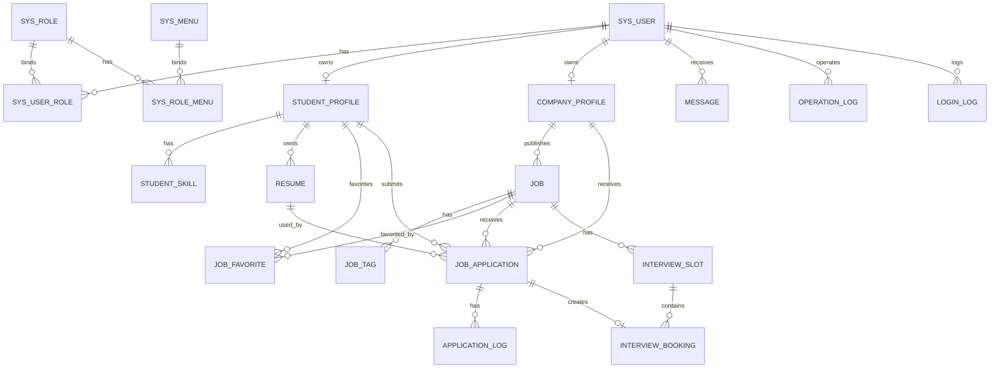

# 校园智能招聘与面试预约平台：数据库设计文档

版本：v1.0  
数据库：MySQL 8.x  
字符集：utf8mb4  
排序规则：utf8mb4_0900_ai_ci  
存储引擎：InnoDB  
项目名称：校园智能招聘与面试预约平台

---

## 1. 设计目标

本数据库设计服务于“校园智能招聘与面试预约平台”，支撑以下核心业务闭环：

```text
学生注册登录
  ↓
完善资料 / 上传简历
  ↓
搜索岗位 / 查看岗位
  ↓
投递岗位
  ↓
企业查看简历 / 修改投递状态
  ↓
企业发起面试邀约
  ↓
学生预约面试场次
  ↓
消息通知 / 后台审核 / 日志审计
```

数据库设计重点：

| 目标 | 说明 |
|---|---|
| 业务闭环完整 | 支持用户、学生、企业、岗位、简历、投递、面试、消息、日志 |
| 权限边界清晰 | 支持学生、企业、管理员三类角色 |
| 并发安全 | 通过唯一索引防重复投递、防重复预约 |
| 可审计 | 企业审核、岗位审核、投递状态、操作日志均可追踪 |
| 易扩展 | 状态字段使用枚举字符串，便于后续扩展 |
| 工程友好 | 统一通用字段，适配 MyBatis-Plus |
| 面试可讲 | 表设计能自然引出索引、事务、幂等、状态机、缓存、MQ |

---

## 2. 总体设计原则

### 2.1 命名规范

| 类型 | 规范 | 示例 |
|---|---|---|
| 表名 | 小写下划线 | `sys_user` |
| 字段名 | 小写下划线 | `create_time` |
| 主键 | 统一使用 `id` | `id BIGINT UNSIGNED` |
| 唯一索引 | `uk_表名_字段` | `uk_sys_user_username` |
| 普通索引 | `idx_表名_字段` | `idx_job_status_city` |
| 逻辑删除 | `deleted` | 0 未删除，1 已删除 |
| 状态字段 | `status` / `audit_status` | `NORMAL`、`PENDING` |

### 2.2 主键策略

本初始化脚本使用：

```sql
BIGINT UNSIGNED NOT NULL AUTO_INCREMENT
```

原因：

- 开发演示简单，初始化数据方便。
- 与 MyBatis-Plus 兼容。
- 后续如果要使用雪花 ID，可将 `AUTO_INCREMENT` 去掉，并在后端使用 `ASSIGN_ID`。

### 2.3 通用字段

大部分业务表包含以下字段：

| 字段 | 类型 | 说明 |
|---|---|---|
| `id` | BIGINT UNSIGNED | 主键 |
| `create_time` | DATETIME(3) | 创建时间 |
| `update_time` | DATETIME(3) | 更新时间 |
| `create_by` | BIGINT UNSIGNED | 创建人 |
| `update_by` | BIGINT UNSIGNED | 更新人 |
| `deleted` | TINYINT | 逻辑删除 |
| `remark` | VARCHAR(500) | 备注 |

### 2.4 外键策略

本项目建议使用**逻辑外键**，即：

- 字段上保留关联 ID。
- 建普通索引。
- 不强制创建物理外键。

原因：

| 原因 | 说明 |
|---|---|
| 便于开发迭代 | 校招项目表结构可能频繁调整 |
| 降低删除/更新阻塞 | 避免外键级联带来的复杂影响 |
| 便于逻辑删除 | 大多数业务表使用 `deleted` 逻辑删除 |
| 仍可保证性能 | 通过索引提升关联查询效率 |

需要注意：逻辑外键要求业务代码保证数据一致性。

---

## 3. ER 关系图



---

## 4. 表清单

| 模块 | 表名 | 说明 |
|---|---|---|
| 系统权限 | `sys_user` | 用户表 |
| 系统权限 | `sys_role` | 角色表 |
| 系统权限 | `sys_menu` | 菜单/按钮/API 权限表 |
| 系统权限 | `sys_user_role` | 用户角色关联表 |
| 系统权限 | `sys_role_menu` | 角色菜单关联表 |
| 学生 | `student_profile` | 学生资料表 |
| 学生 | `student_skill` | 学生技能表 |
| 企业 | `company_profile` | 企业资料表 |
| 企业 | `company_audit` | 企业认证审核记录 |
| 文件 | `file_object` | 文件对象表 |
| 简历 | `resume` | 简历表 |
| 岗位 | `job` | 岗位表 |
| 岗位 | `job_tag` | 岗位标签表 |
| 岗位 | `job_favorite` | 岗位收藏表 |
| 岗位 | `job_view_history` | 岗位浏览记录表 |
| 投递 | `job_application` | 岗位投递表 |
| 投递 | `application_log` | 投递状态日志表 |
| 面试 | `interview_slot` | 面试场次表 |
| 面试 | `interview_booking` | 面试预约表 |
| 消息 | `message` | 站内信表 |
| 消息 | `mq_message_log` | MQ 消费幂等日志表 |
| 日志 | `operation_log` | 操作日志表 |
| 日志 | `login_log` | 登录日志表 |
| 系统配置 | `sys_dict` | 数据字典表 |
| 系统配置 | `sys_config` | 系统配置表 |

---

## 5. 核心状态枚举

### 5.1 用户状态

| 值 | 含义 |
|---|---|
| `NORMAL` | 正常 |
| `DISABLED` | 禁用 |
| `PENDING` | 待完善资料 |

### 5.2 用户类型

| 值 | 含义 |
|---|---|
| `STUDENT` | 学生 |
| `COMPANY` | 企业 |
| `ADMIN` | 管理员 |

### 5.3 企业认证状态

| 值 | 含义 |
|---|---|
| `UNVERIFIED` | 未认证 |
| `PENDING` | 待审核 |
| `APPROVED` | 审核通过 |
| `REJECTED` | 审核拒绝 |

### 5.4 岗位状态

| 值 | 含义 |
|---|---|
| `DRAFT` | 草稿 |
| `PENDING_REVIEW` | 待审核 |
| `PUBLISHED` | 已发布 |
| `REJECTED` | 审核拒绝 |
| `OFFLINE` | 已下架 |
| `EXPIRED` | 已过期 |

### 5.5 投递状态

| 值 | 含义 |
|---|---|
| `DELIVERED` | 已投递 |
| `VIEWED` | 已查看 |
| `INTERVIEW_INVITED` | 邀约面试 |
| `BOOKED` | 已预约 |
| `REJECTED` | 不合适 |
| `CANCELED` | 已取消 |
| `FINISHED` | 已完成 |

### 5.6 面试场次状态

| 值 | 含义 |
|---|---|
| `OPEN` | 开放预约 |
| `FULL` | 已约满 |
| `CLOSED` | 已关闭 |
| `EXPIRED` | 已过期 |

### 5.7 预约状态

| 值 | 含义 |
|---|---|
| `BOOKED` | 已预约 |
| `CANCELED` | 已取消 |
| `FINISHED` | 已完成 |

### 5.8 消息状态

| 值 | 含义 |
|---|---|
| `UNREAD` | 未读 |
| `READ` | 已读 |
| `DELETED` | 已删除 |

---

## 6. 详细表设计

## 6.1 sys_user 用户表

### 用途

存储学生、企业、管理员的统一账号信息。

### 字段设计

| 字段 | 类型 | 必填 | 默认值 | 说明 |
|---|---|---:|---|---|
| `id` | BIGINT UNSIGNED | 是 | AUTO_INCREMENT | 用户 ID |
| `username` | VARCHAR(64) | 是 | - | 用户名，唯一 |
| `password_hash` | VARCHAR(255) | 是 | - | 加密密码 |
| `nickname` | VARCHAR(64) | 否 | NULL | 昵称 |
| `phone` | VARCHAR(20) | 否 | NULL | 手机号 |
| `email` | VARCHAR(128) | 否 | NULL | 邮箱 |
| `avatar_url` | VARCHAR(512) | 否 | NULL | 头像 URL |
| `user_type` | VARCHAR(32) | 是 | - | STUDENT / COMPANY / ADMIN |
| `status` | VARCHAR(32) | 是 | NORMAL | 用户状态 |
| `last_login_time` | DATETIME(3) | 否 | NULL | 最近登录时间 |
| `create_time` | DATETIME(3) | 是 | CURRENT_TIMESTAMP | 创建时间 |
| `update_time` | DATETIME(3) | 是 | CURRENT_TIMESTAMP | 更新时间 |
| `deleted` | TINYINT | 是 | 0 | 逻辑删除 |

### 索引设计

| 索引 | 字段 | 类型 | 说明 |
|---|---|---|---|
| `uk_sys_user_username` | `username` | 唯一索引 | 防用户名重复 |
| `uk_sys_user_phone` | `phone` | 唯一索引 | 手机号唯一，允许 NULL |
| `uk_sys_user_email` | `email` | 唯一索引 | 邮箱唯一，允许 NULL |
| `idx_sys_user_type_status` | `user_type`, `status` | 普通索引 | 后台用户筛选 |

---

## 6.2 sys_role 角色表

### 用途

存储系统角色：学生、企业、管理员。

| 字段 | 类型 | 必填 | 默认值 | 说明 |
|---|---|---:|---|---|
| `id` | BIGINT UNSIGNED | 是 | AUTO_INCREMENT | 角色 ID |
| `role_code` | VARCHAR(64) | 是 | - | 角色编码 |
| `role_name` | VARCHAR(64) | 是 | - | 角色名称 |
| `status` | VARCHAR(32) | 是 | NORMAL | 状态 |
| `sort` | INT | 是 | 0 | 排序 |

### 索引设计

| 索引 | 字段 | 类型 |
|---|---|---|
| `uk_sys_role_code` | `role_code` | 唯一索引 |

---

## 6.3 sys_menu 菜单权限表

### 用途

统一存储目录、菜单、按钮、API 权限标识。

| 字段 | 类型 | 必填 | 默认值 | 说明 |
|---|---|---:|---|---|
| `id` | BIGINT UNSIGNED | 是 | AUTO_INCREMENT | 菜单 ID |
| `parent_id` | BIGINT UNSIGNED | 是 | 0 | 父级 ID |
| `menu_name` | VARCHAR(64) | 是 | - | 菜单名称 |
| `menu_type` | VARCHAR(32) | 是 | MENU | DIR / MENU / BUTTON / API |
| `path` | VARCHAR(255) | 否 | NULL | 前端路由 |
| `component` | VARCHAR(255) | 否 | NULL | 前端组件 |
| `permission` | VARCHAR(128) | 否 | NULL | 权限标识 |
| `visible` | TINYINT | 是 | 1 | 是否显示 |
| `sort` | INT | 是 | 0 | 排序 |
| `status` | VARCHAR(32) | 是 | NORMAL | 状态 |

### 索引设计

| 索引 | 字段 | 类型 |
|---|---|---|
| `uk_sys_menu_permission` | `permission` | 唯一索引 |
| `idx_sys_menu_parent` | `parent_id` | 普通索引 |

---

## 6.4 student_profile 学生资料表

### 用途

存储学生的求职资料。与 `sys_user` 一对一。

| 字段 | 类型 | 说明 |
|---|---|---|
| `user_id` | BIGINT UNSIGNED | 关联 `sys_user.id` |
| `real_name` | VARCHAR(64) | 真实姓名 |
| `gender` | VARCHAR(16) | 性别 |
| `school` | VARCHAR(128) | 学校 |
| `major` | VARCHAR(128) | 专业 |
| `grade` | VARCHAR(32) | 年级 |
| `education` | VARCHAR(32) | 学历 |
| `city` | VARCHAR(64) | 期望城市 |
| `job_intention` | VARCHAR(255) | 求职意向 |
| `advantage` | TEXT | 个人优势 |

### 关键约束

| 约束 | 说明 |
|---|---|
| `uk_student_profile_user` | 一个用户只能有一份学生资料 |

---

## 6.5 company_profile 企业资料表

### 用途

存储企业认证资料和企业信息。与 `sys_user` 一对一。

| 字段 | 类型 | 说明 |
|---|---|---|
| `user_id` | BIGINT UNSIGNED | 企业账号 ID |
| `company_name` | VARCHAR(128) | 企业名称 |
| `industry` | VARCHAR(64) | 行业 |
| `scale` | VARCHAR(64) | 规模 |
| `city` | VARCHAR(64) | 城市 |
| `address` | VARCHAR(255) | 地址 |
| `contact_name` | VARCHAR(64) | 联系人 |
| `contact_phone` | VARCHAR(20) | 联系电话 |
| `license_file_id` | BIGINT UNSIGNED | 营业执照文件 ID |
| `audit_status` | VARCHAR(32) | 认证状态 |
| `audit_reason` | VARCHAR(500) | 最近审核原因 |

### 索引设计

| 索引 | 字段 | 说明 |
|---|---|---|
| `uk_company_profile_user` | `user_id` | 一个账号对应一个企业资料 |
| `idx_company_profile_audit_status` | `audit_status` | 管理员审核筛选 |
| `idx_company_profile_name` | `company_name` | 企业名称查询 |

---

## 6.6 file_object 文件表

### 用途

统一管理简历、企业资质、头像、附件等文件元数据。

| 字段 | 类型 | 说明 |
|---|---|---|
| `owner_id` | BIGINT UNSIGNED | 上传人 |
| `biz_type` | VARCHAR(32) | RESUME / AVATAR / LICENSE |
| `bucket_name` | VARCHAR(64) | MinIO bucket |
| `object_name` | VARCHAR(255) | MinIO object name |
| `original_name` | VARCHAR(255) | 原始文件名 |
| `file_size` | BIGINT UNSIGNED | 文件大小 |
| `content_type` | VARCHAR(128) | MIME 类型 |
| `file_ext` | VARCHAR(32) | 文件后缀 |
| `access_url` | VARCHAR(512) | 访问地址 |
| `status` | VARCHAR(32) | NORMAL / DELETED |

---

## 6.7 resume 简历表

### 用途

存储学生简历记录。文件内容由 `file_object` 管理。

| 字段 | 类型 | 说明 |
|---|---|---|
| `student_id` | BIGINT UNSIGNED | 学生用户 ID |
| `resume_name` | VARCHAR(128) | 简历名称 |
| `file_id` | BIGINT UNSIGNED | 文件 ID |
| `is_default` | TINYINT | 是否默认简历 |
| `status` | VARCHAR(32) | NORMAL / DISABLED |

### 索引设计

| 索引 | 字段 | 说明 |
|---|---|---|
| `idx_resume_student` | `student_id` | 我的简历列表 |
| `idx_resume_file` | `file_id` | 文件关联查询 |

> 注意：MySQL 不支持“同一学生仅一条 is_default=1”的简单部分唯一索引。建议通过业务代码保证设置默认简历时先将其他简历置为 0，再设置当前简历为 1。

---

## 6.8 job 岗位表

### 用途

存储企业发布的岗位信息。

| 字段 | 类型 | 说明 |
|---|---|---|
| `company_id` | BIGINT UNSIGNED | 企业 ID |
| `title` | VARCHAR(128) | 岗位名称 |
| `category` | VARCHAR(64) | 岗位分类 |
| `city` | VARCHAR(64) | 城市 |
| `salary_min` | INT UNSIGNED | 最低薪资 |
| `salary_max` | INT UNSIGNED | 最高薪资 |
| `salary_unit` | VARCHAR(32) | DAY / MONTH |
| `education` | VARCHAR(32) | 学历 |
| `experience` | VARCHAR(32) | 经验 |
| `description` | TEXT | 岗位描述 |
| `requirement` | TEXT | 岗位要求 |
| `status` | VARCHAR(32) | 岗位状态 |
| `audit_reason` | VARCHAR(500) | 审核原因 |
| `expire_time` | DATETIME(3) | 过期时间 |
| `view_count` | INT UNSIGNED | 浏览数 |
| `apply_count` | INT UNSIGNED | 投递数 |
| `favorite_count` | INT UNSIGNED | 收藏数 |

### 索引设计

| 索引 | 字段 | 用途 |
|---|---|---|
| `idx_job_company` | `company_id` | 企业管理岗位 |
| `idx_job_status_city` | `status`, `city` | 岗位列表筛选 |
| `idx_job_category_status` | `category`, `status` | 分类查询 |
| `idx_job_expire_time` | `expire_time` | 定时下架 |
| `idx_job_create_time` | `create_time` | 最新排序 |

---

## 6.9 job_application 投递表

### 用途

存储学生对岗位的投递记录。

| 字段 | 类型 | 说明 |
|---|---|---|
| `student_id` | BIGINT UNSIGNED | 学生用户 ID |
| `company_id` | BIGINT UNSIGNED | 企业 ID |
| `job_id` | BIGINT UNSIGNED | 岗位 ID |
| `resume_id` | BIGINT UNSIGNED | 简历 ID |
| `status` | VARCHAR(32) | 投递状态 |
| `apply_time` | DATETIME(3) | 投递时间 |

### 关键约束

| 约束 | 说明 |
|---|---|
| `uk_application_student_job` | 防止同一学生重复投递同一岗位 |

### 索引设计

| 索引 | 字段 | 用途 |
|---|---|---|
| `idx_application_student_status` | `student_id`, `status` | 我的投递 |
| `idx_application_company_status` | `company_id`, `status` | 企业投递列表 |
| `idx_application_job_status` | `job_id`, `status` | 岗位下投递 |

---

## 6.10 interview_slot 面试场次表

### 用途

企业为岗位创建面试场次，支持容量和剩余名额。

| 字段 | 类型 | 说明 |
|---|---|---|
| `company_id` | BIGINT UNSIGNED | 企业 ID |
| `job_id` | BIGINT UNSIGNED | 岗位 ID |
| `title` | VARCHAR(128) | 场次标题 |
| `start_time` | DATETIME(3) | 开始时间 |
| `end_time` | DATETIME(3) | 结束时间 |
| `capacity` | INT UNSIGNED | 总名额 |
| `remain_count` | INT UNSIGNED | 剩余名额 |
| `interview_type` | VARCHAR(32) | ONLINE / OFFLINE |
| `location` | VARCHAR(255) | 地点或会议链接 |
| `status` | VARCHAR(32) | OPEN / FULL / CLOSED / EXPIRED |

### 索引设计

| 索引 | 字段 | 用途 |
|---|---|---|
| `idx_slot_job_status_time` | `job_id`, `status`, `start_time` | 查询可预约场次 |
| `idx_slot_company_status` | `company_id`, `status` | 企业场次管理 |
| `idx_slot_start_time` | `start_time` | 定时过期处理 |

---

## 6.11 interview_booking 面试预约表

### 用途

记录学生预约某个面试场次的结果。

| 字段 | 类型 | 说明 |
|---|---|---|
| `slot_id` | BIGINT UNSIGNED | 面试场次 ID |
| `application_id` | BIGINT UNSIGNED | 投递 ID |
| `student_id` | BIGINT UNSIGNED | 学生 ID |
| `company_id` | BIGINT UNSIGNED | 企业 ID |
| `job_id` | BIGINT UNSIGNED | 岗位 ID |
| `status` | VARCHAR(32) | 预约状态 |
| `booking_time` | DATETIME(3) | 预约时间 |
| `cancel_reason` | VARCHAR(500) | 取消原因 |

### 关键约束

| 约束 | 说明 |
|---|---|
| `uk_booking_slot_student` | 防止同一学生重复预约同一场次 |
| `uk_booking_application` | 一个投递记录最多对应一个有效预约记录，MVP 简化处理 |

---

## 6.12 message 站内信表

### 用途

存储系统站内消息。

| 字段 | 类型 | 说明 |
|---|---|---|
| `message_id` | VARCHAR(128) | MQ 消息唯一 ID |
| `receiver_id` | BIGINT UNSIGNED | 接收人 |
| `sender_id` | BIGINT UNSIGNED | 发送人 |
| `message_type` | VARCHAR(32) | 消息类型 |
| `title` | VARCHAR(128) | 标题 |
| `content` | TEXT | 内容 |
| `business_type` | VARCHAR(64) | 业务类型 |
| `business_id` | BIGINT UNSIGNED | 业务 ID |
| `read_status` | VARCHAR(32) | 阅读状态 |
| `read_time` | DATETIME(3) | 阅读时间 |

### 关键约束

| 约束 | 说明 |
|---|---|
| `uk_message_message_id` | 防止 MQ 重复消费生成重复消息 |

---

## 7. 核心唯一约束汇总

| 表 | 唯一约束 | 解决问题 |
|---|---|---|
| `sys_user` | `username` | 防重复注册 |
| `sys_role` | `role_code` | 防角色编码重复 |
| `sys_menu` | `permission` | 防权限标识重复 |
| `student_profile` | `user_id` | 一个账号一份学生资料 |
| `company_profile` | `user_id` | 一个账号一份企业资料 |
| `student_skill` | `student_id`, `skill_name` | 防重复技能标签 |
| `job_tag` | `job_id`, `tag_name` | 防重复岗位标签 |
| `job_favorite` | `student_id`, `job_id` | 防重复收藏 |
| `job_application` | `student_id`, `job_id` | 防重复投递 |
| `interview_booking` | `slot_id`, `student_id` | 防重复预约 |
| `message` | `message_id` | MQ 消费幂等 |
| `mq_message_log` | `message_id` | MQ 消费日志幂等 |

---

## 8. Redis Key 映射建议

| 场景 | Key | 类型 | 说明 |
|---|---|---|---|
| 登录 Token | `campus:login:token:{token}` | String | 存用户登录态 |
| 用户权限 | `campus:user:permission:{userId}` | String / Hash | 缓存权限列表 |
| 岗位详情 | `campus:job:detail:{jobId}` | String | 缓存岗位详情 |
| 热门岗位 | `campus:job:hot:zset` | ZSet | 热门岗位排行 |
| 岗位浏览 | `campus:job:view:zset:{userId}` | ZSet | 用户浏览记录 |
| 面试场次库存 | `campus:interview:slot:stock:{slotId}` | String | 场次剩余名额 |
| 预约去重 | `campus:interview:booking:user:{slotId}:{studentId}` | String | 防重复预约 |
| 消息未读数 | `campus:message:unread:{userId}` | String | 未读消息计数 |
| 验证码 | `campus:captcha:{uuid}` | String | 验证码 |

---

## 9. SQL 文件说明

初始化脚本文件：

```text
V001__初始化数据库结构.sql
```

包含：

1. 创建数据库。
2. 删除旧表。
3. 创建所有核心表。
4. 创建索引和唯一约束。
5. 初始化系统角色。
6. 初始化部分菜单权限。
7. 初始化字典数据。
8. 初始化管理员账号。

默认管理员账号：

| 字段 | 值 |
|---|---|
| username | `admin` |
| password_hash | `$2a$10$REPLACE_WITH_BCRYPT_HASH` |
| 说明 | 请在项目启动前替换为真实 BCrypt 密码 |

---

## 10. 开发注意事项

### 10.1 关于逻辑删除

所有业务查询默认加：

```sql
deleted = 0
```

### 10.2 关于状态流转

不要在业务代码中随意更新状态，应统一通过状态机判断。

例如投递状态：

```text
DELIVERED -> VIEWED -> INTERVIEW_INVITED -> BOOKED -> FINISHED
```

非法流转必须拒绝。

### 10.3 关于投递幂等

投递表使用：

```sql
UNIQUE KEY uk_application_student_job(student_id, job_id)
```

即使业务层判断失败，数据库仍可兜底防重复投递。

### 10.4 关于预约防超卖

建议：

1. Redis 初始化场次库存。
2. 预约时执行 Redis Lua 判断库存并扣减。
3. MySQL 插入预约记录。
4. MySQL 插入失败时回滚 Redis 库存或记录补偿任务。
5. 数据库唯一索引兜底防重复预约。

### 10.5 关于 MQ 幂等

`message.message_id` 和 `mq_message_log.message_id` 都可以做幂等控制。

推荐消费者流程：

```text
收到消息
  ↓
检查 message_id 是否已消费
  ↓
未消费则执行业务
  ↓
写入消费日志
  ↓
ACK
```

---

## 11. 后续扩展

| 扩展方向 | 说明 |
|---|---|
| 物理外键 | 稳定后可增加外键约束 |
| 分库分表 | 当前不需要，后续高并发可考虑 |
| 审核流扩展 | 企业审核、岗位审核可抽象成统一审核表 |
| ES 索引表 | 可单独设计 `job_search_index` 或通过 MQ 同步 |
| AI 简历解析 | 可增加 `resume_parse_result` 表 |
| 在线聊天 | 可增加 `chat_session`、`chat_message` 表 |
| 邮件通知 | 可增加 `notification_task` 表 |

---

## 12. 与技术点的对应关系

| 技术点 | 数据库支撑 |
|---|---|
| RBAC | `sys_user`、`sys_role`、`sys_menu`、`sys_user_role`、`sys_role_menu` |
| 文件上传 | `file_object`、`resume`、`company_profile.license_file_id` |
| 岗位搜索 | `job`、`job_tag`、相关索引 |
| 防重复投递 | `job_application.uk_application_student_job` |
| 状态机 | `job.status`、`job_application.status`、`interview_slot.status` |
| 面试预约 | `interview_slot`、`interview_booking` |
| 防重复预约 | `interview_booking.uk_booking_slot_student` |
| MQ 幂等 | `message.message_id`、`mq_message_log.message_id` |
| 操作日志 | `operation_log` |
| 登录审计 | `login_log` |
| 系统字典 | `sys_dict` |
