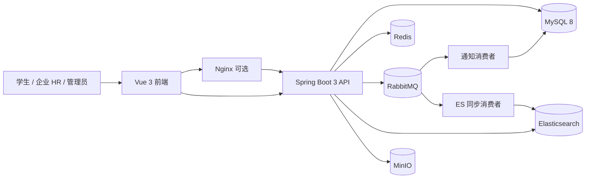
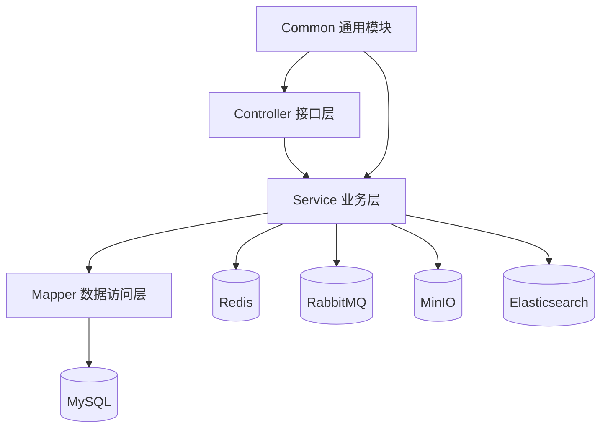
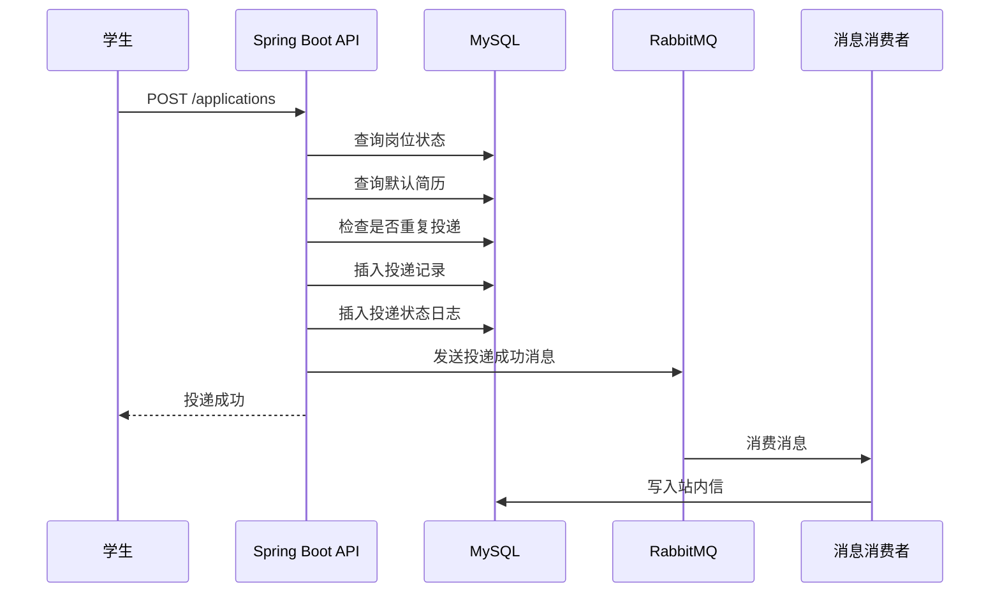
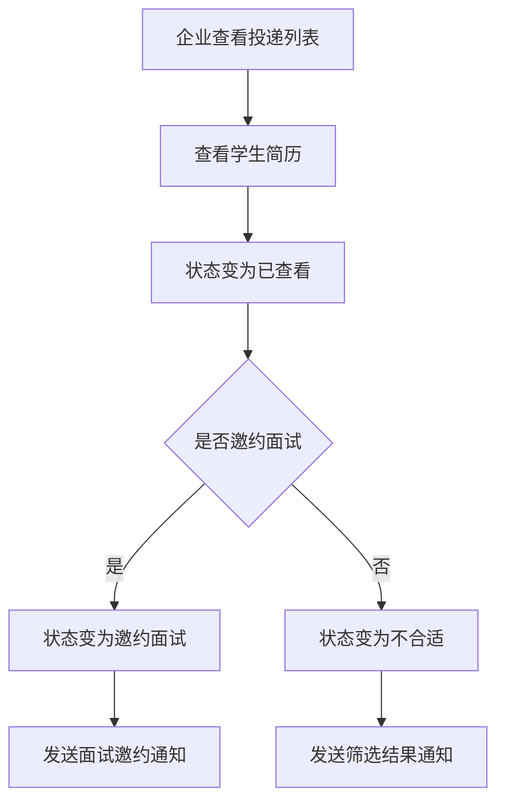
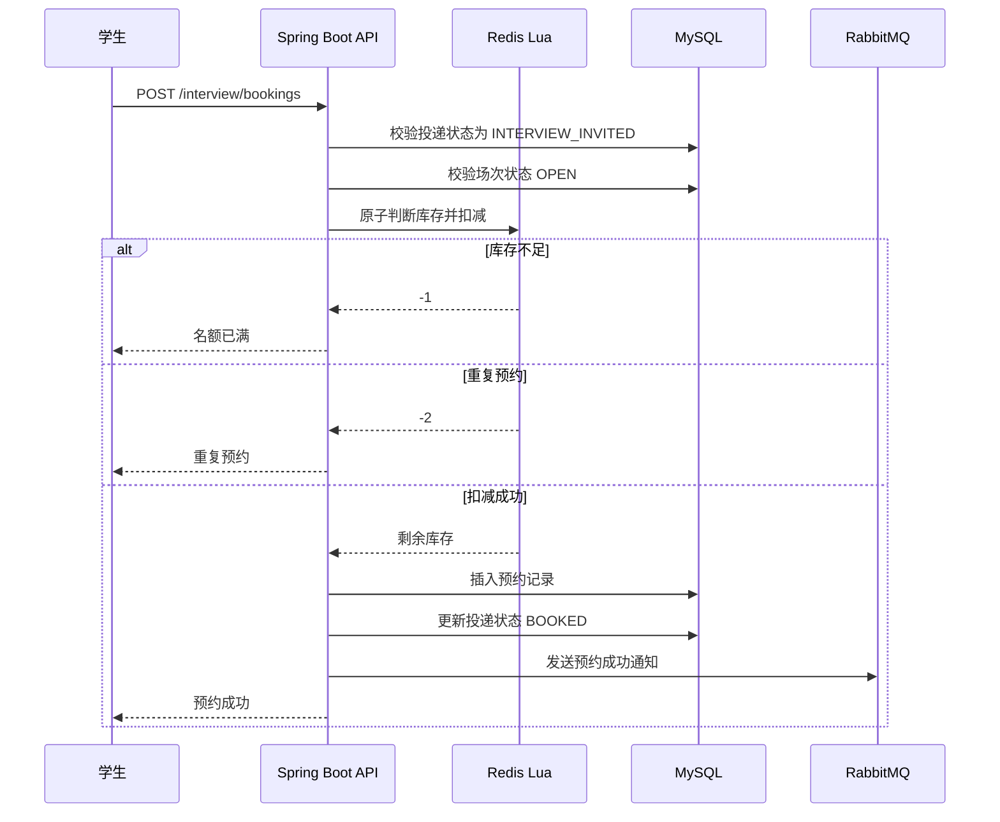
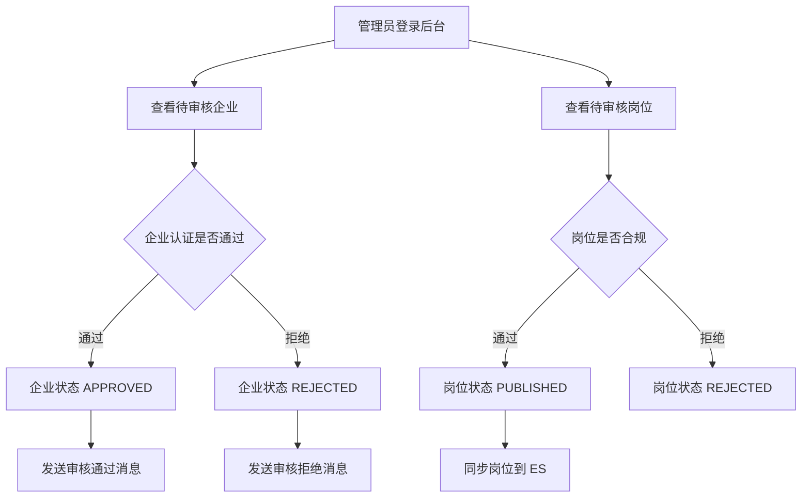
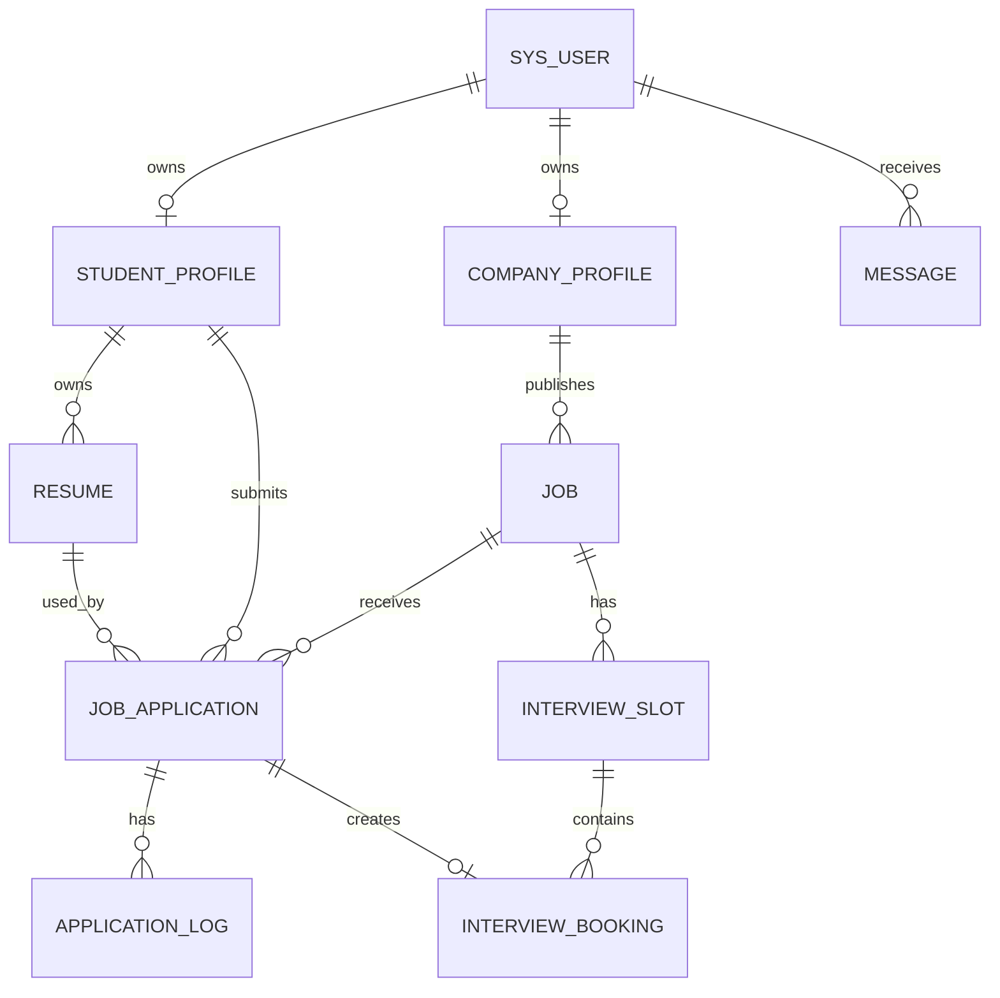
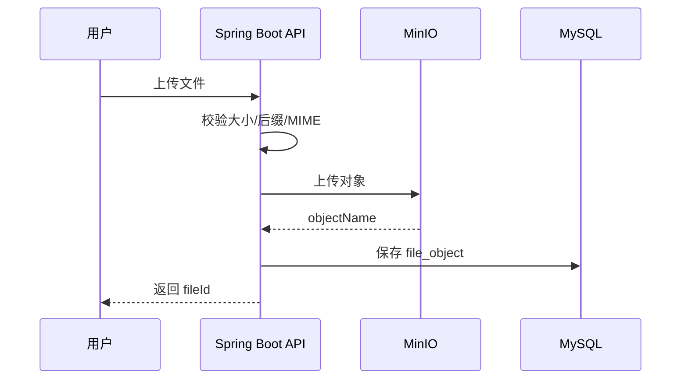

# 校园智能招聘与面试预约平台

> 一个面向校招展示的 Java 后端项目：用完整的“校园招聘 + 简历投递 + 面试预约”业务闭环，把 Spring Boot、MySQL、Redis、RabbitMQ、Elasticsearch、MinIO、Docker Compose 等后端技术点自然落地。


---

## 目录

- [1. 项目介绍](#1-项目介绍)
- [2. 项目亮点](#2-项目亮点)
- [3. 技术栈](#3-技术栈)
- [4. 系统架构](#4-系统架构)
- [5. 功能模块](#5-功能模块)
- [6. 核心业务流程](#6-核心业务流程)
- [7. 项目目录结构](#7-项目目录结构)
- [8. 快速启动](#8-快速启动)
- [9. 配置说明](#9-配置说明)
- [10. 数据库设计](#10-数据库设计)
- [11. 接口文档](#11-接口文档)
- [12. 核心接口](#12-核心接口)
- [13. Redis Key 设计](#13-redis-key-设计)
- [14. RabbitMQ 设计](#14-rabbitmq-设计)
- [15. Elasticsearch 设计](#15-elasticsearch-设计)
- [16. MinIO 文件存储设计](#16-minio-文件存储设计)
- [17. 权限设计](#17-权限设计)
- [18. 状态机设计](#18-状态机设计)
- [19. 并发预约防超卖方案](#19-并发预约防超卖方案)
- [20. 测试与压测](#20-测试与压测)
- [21. 开发计划](#21-开发计划)
- [22. 常见问题](#22-常见问题)
- [23. 简历写法](#23-简历写法)
- [24. 面试追问准备](#24-面试追问准备)
- [25. 参考资料](#25-参考资料)

---

## 1. 项目介绍

### 1.1 项目背景

校园招聘、实习招聘、实验室招新、社团技术岗招新等场景中，学生通常需要在微信群、表格、公众号、学校就业系统之间切换，岗位信息分散、投递状态不透明、面试预约效率低。

企业或组织侧也存在类似问题：

- 岗位发布和审核流程不统一。
- 简历收集方式分散。
- 投递状态难追踪。
- 面试时间协调成本高。
- 通知依赖人工沟通。
- 无法直观看到岗位投递效果。

本项目希望构建一个面向校园场景的招聘与面试预约平台，打通：

```text
岗位发布
  ↓
岗位审核
  ↓
岗位搜索
  ↓
简历投递
  ↓
企业筛选
  ↓
面试邀约
  ↓
面试预约
  ↓
消息通知
```

### 1.2 项目定位

| 项目 | 内容 |
|---|---|
| 项目名称 | 校园智能招聘与面试预约平台 |
| 项目类型 | 校园招聘系统 / 实习投递系统 / 面试预约系统 |
| 服务对象 | 学生、企业 HR、平台管理员 |
| 项目目标 | 用真实业务闭环承载 Java 后端核心技术点 |
| 当前状态 | 后端骨架已完成，业务实现逐步开发中 |

### 1.3 适合人群

这个项目适合：

- 准备 Java 后端校招项目。
- 想做一个不是纯 CRUD 的业务系统。
- 想把 Redis、MQ、ES、MinIO、Docker 自然塞进项目。
- 想在面试中讲清楚权限、缓存、异步、搜索、文件、并发控制。

---

## 2. 项目亮点

### 2.1 业务亮点

| 亮点 | 说明 |
|---|---|
| 完整招聘闭环 | 学生从搜索岗位到投递、预约面试完整可演示 |
| 企业审核机制 | 企业认证、岗位审核，避免虚假岗位 |
| 投递状态流转 | 已投递、已查看、邀约面试、已预约、不合适 |
| 面试预约系统 | 企业创建场次，学生自主预约 |
| 防重复投递 | 业务校验 + 数据库唯一索引双重兜底 |
| 防预约超卖 | Redis Lua 原子扣减 + 数据库唯一约束 |
| 消息通知 | 投递、审核、预约结果通过站内信通知 |
| 后台管理 | 用户管理、企业审核、岗位审核、日志审计 |

### 2.2 技术亮点

| 技术点 | 落地场景 | 面试可讲点 |
|---|---|---|
| Spring Boot 3 | 后端 API 服务 | 分层架构、统一异常、参数校验 |
| MyBatis-Plus | 数据访问层 | BaseMapper、分页插件、逻辑删除 |
| MySQL | 核心业务数据 | 索引、事务、唯一约束、状态机 |
| Redis | 缓存与并发控制 | 热点岗位缓存、库存扣减、防重复预约 |
| Redis Lua | 面试预约 | 原子判断库存并扣减，防止超卖 |
| RabbitMQ | 异步通知 | 投递成功、预约成功、审核结果通知 |
| Elasticsearch | 岗位搜索 | 关键词搜索、筛选、排序 |
| MinIO | 文件存储 | 简历、企业资质、头像、附件 |
| AOP | 操作日志 | 审核、投递、预约等关键操作审计 |
| Docker Compose | 本地部署 | 一键启动 MySQL、Redis、MQ、ES、MinIO |
| OpenAPI | 接口文档 | Swagger UI / Apifox / Postman 联调 |

---

## 3. 技术栈

### 3.1 后端技术栈

| 技术 | 版本建议 | 用途 |
|---|---|---|
| Java | 17+ | 开发语言 |
| Spring Boot | 3.x | 后端框架 |
| Spring Web | 3.x | REST API |
| Spring Validation | 3.x | 参数校验 |
| Spring AOP | 3.x | 操作日志、权限拦截 |
| MyBatis-Plus | 3.5.x | ORM 增强工具 |
| MySQL | 8.x | 关系型数据库 |
| Redis | 7.x | 缓存、库存、登录态 |
| RabbitMQ | 3.x | 消息队列 |
| Elasticsearch | 8.x | 岗位搜索 |
| MinIO | 8.x Java SDK | 对象存储 |
| springdoc-openapi | 2.x | Swagger / OpenAPI 文档 |
| Lombok | latest | 简化实体类代码 |
| Docker Compose | v2 | 本地依赖编排 |

### 3.2 前端技术栈建议

> 当前仓库主要是后端骨架，前端可后续单独创建。

| 技术 | 用途 |
|---|---|
| Vue 3 | 前端框架 |
| Vite | 构建工具 |
| TypeScript | 类型约束 |
| Element Plus | UI 组件库 |
| Pinia | 状态管理 |
| Axios | HTTP 请求 |
| Vue Router | 路由 |

### 3.3 开发工具建议

| 工具 | 用途 |
|---|---|
| IntelliJ IDEA | Java 开发 |
| DataGrip / DBeaver | 数据库管理 |
| Apifox / Postman | 接口调试 |
| Docker Desktop | 容器运行 |
| GitHub | 代码托管 |
| JMeter | 压测 |
| RedisInsight | Redis 可视化 |
| RabbitMQ Management | MQ 管理后台 |
| MinIO Console | 文件管理 |
| Kibana | ES 可视化，可选 |

---

## 4. 系统架构

### 4.1 总体架构图



### 4.2 后端分层架构



### 4.3 模块架构

```text
用户认证 Auth
  ├── 注册
  ├── 登录
  ├── Token
  └── 当前用户

权限系统 RBAC
  ├── 用户
  ├── 角色
  ├── 菜单
  └── 权限标识

招聘业务
  ├── 学生资料
  ├── 企业认证
  ├── 文件上传
  ├── 简历管理
  ├── 岗位管理
  ├── 岗位搜索
  ├── 投递管理
  ├── 面试预约
  └── 消息通知

后台管理
  ├── 用户管理
  ├── 企业审核
  ├── 岗位审核
  ├── 字典管理
  ├── 操作日志
  └── 登录日志
```

---

## 5. 功能模块

### 5.1 用户认证模块

| 功能 | 说明 | 状态 |
|---|---|---|
| 学生注册 | 学生账号注册 | 待实现 |
| 企业注册 | 企业账号注册 | 待实现 |
| 用户登录 | 账号密码登录，返回 Token | 待实现 |
| 用户登出 | 清理登录态 | 待实现 |
| 当前用户 | 返回用户信息、角色、权限 | 骨架完成 |
| 登录日志 | 记录成功/失败登录 | 待实现 |

### 5.2 权限模块

| 功能 | 说明 | 状态 |
|---|---|---|
| RBAC 模型 | 用户-角色-菜单-权限 | SQL 已设计 |
| 权限注解 | `@RequirePermission` | 骨架完成 |
| 登录注解 | `@RequireLogin` | 骨架完成 |
| 数据权限 | 学生/企业只能访问自己的数据 | 待实现 |
| 水平越权防护 | 根据 studentId/companyId 校验 | 待实现 |

### 5.3 学生模块

| 功能 | 说明 | 状态 |
|---|---|---|
| 学生资料 | 姓名、学校、专业、学历、求职意向 | 骨架完成 |
| 技能标签 | Java、Redis、MySQL 等 | 待实现 |
| 求职意向 | 城市、方向、岗位类型 | 待实现 |

### 5.4 企业模块

| 功能 | 说明 | 状态 |
|---|---|---|
| 企业资料 | 企业名称、行业、规模、地址 | 骨架完成 |
| 企业认证 | 上传资质并提交审核 | 骨架完成 |
| 认证状态 | 未认证、待审核、通过、拒绝 | 骨架完成 |
| 审核记录 | 管理员审核历史 | 待实现 |

### 5.5 文件模块

| 功能 | 说明 | 状态 |
|---|---|---|
| 文件上传 | 简历、资质、头像上传 | 骨架完成 |
| 文件下载 | 权限校验后下载 | 待实现 |
| 文件元数据 | 保存 bucket、object、size、type | SQL 已设计 |
| 文件类型校验 | 后缀、MIME、大小限制 | 待实现 |

### 5.6 简历模块

| 功能 | 说明 | 状态 |
|---|---|---|
| 创建简历 | 上传文件后创建简历记录 | 骨架完成 |
| 我的简历 | 学生查看自己的简历 | 骨架完成 |
| 默认简历 | 设置默认投递简历 | 骨架完成 |
| 删除简历 | 逻辑删除简历 | 骨架完成 |
| 企业查看简历 | 只能查看投递到自己岗位的简历 | 待实现 |

### 5.7 岗位模块

| 功能 | 说明 | 状态 |
|---|---|---|
| 岗位列表 | 游客和学生可浏览已发布岗位 | 骨架完成 |
| 岗位详情 | 查看岗位描述、要求、企业信息 | 骨架完成 |
| 创建岗位 | 企业发布岗位草稿 | 骨架完成 |
| 编辑岗位 | 企业编辑自己的岗位 | 骨架完成 |
| 提交审核 | 岗位进入待审核 | 骨架完成 |
| 岗位下架 | 已发布岗位下架 | 骨架完成 |
| 收藏岗位 | 学生收藏/取消收藏 | 骨架完成 |
| ES 搜索 | 岗位关键词搜索 | 待实现 |

### 5.8 投递模块

| 功能 | 说明 | 状态 |
|---|---|---|
| 投递岗位 | 学生投递已发布岗位 | 骨架完成 |
| 我的投递 | 学生查看投递状态 | 骨架完成 |
| 企业投递列表 | 企业查看自己岗位的投递 | 骨架完成 |
| 修改状态 | 企业标记已查看、邀约、不合适 | 骨架完成 |
| 投递日志 | 记录状态流转 | 待实现 |
| 投递通知 | MQ 异步发送站内信 | 待实现 |

### 5.9 面试模块

| 功能 | 说明 | 状态 |
|---|---|---|
| 创建场次 | 企业创建面试时间段 | 骨架完成 |
| 场次列表 | 企业查看面试场次 | 骨架完成 |
| 可预约场次 | 学生查看可预约场次 | 骨架完成 |
| 预约面试 | 学生预约场次 | 骨架完成 |
| 取消预约 | 学生或企业取消 | 骨架完成 |
| 预约名单 | 企业查看预约学生 | 骨架完成 |
| Redis Lua 防超卖 | 原子扣减名额 | 脚本已提供，逻辑待接入 |

### 5.10 消息模块

| 功能 | 说明 | 状态 |
|---|---|---|
| 我的消息 | 查看站内信 | 骨架完成 |
| 未读数量 | 返回未读消息数 | 骨架完成 |
| 标记已读 | 消息改为已读 | 骨架完成 |
| 删除消息 | 逻辑删除消息 | 骨架完成 |
| MQ 消费幂等 | 防止重复消息 | 待实现 |

### 5.11 后台管理模块

| 功能 | 说明 | 状态 |
|---|---|---|
| 数据看板 | 用户、企业、岗位、投递统计 | 骨架完成 |
| 用户管理 | 禁用/恢复用户 | 骨架完成 |
| 企业审核 | 审核企业认证 | 骨架完成 |
| 岗位审核 | 审核岗位上线 | 骨架完成 |
| 字典管理 | 学历、岗位分类等 | SQL 已设计 |
| 操作日志 | 关键操作审计 | 骨架完成 |
| 登录日志 | 登录记录查询 | 骨架完成 |

---

## 6. 核心业务流程

### 6.1 学生投递流程



### 6.2 企业筛选流程



### 6.3 面试预约流程



### 6.4 管理员审核流程



---

## 7. 项目目录结构

```text
campus-recruitment-backend/
├── pom.xml
├── README.md
├── .env.example
├── deploy/
│   └── docker-compose.yml
├── docs/
│   ├── backend-architecture.md
│   └── OpenAPI接口草案.yaml
├── sql/
│   └── V001__初始化数据库结构.sql
└── src/
    ├── main/
    │   ├── java/com/example/campus/
    │   │   ├── CampusRecruitmentApplication.java
    │   │   ├── common/
    │   │   │   ├── annotation/
    │   │   │   ├── aspect/
    │   │   │   ├── constant/
    │   │   │   ├── context/
    │   │   │   ├── enums/
    │   │   │   ├── exception/
    │   │   │   └── result/
    │   │   ├── config/
    │   │   ├── entity/
    │   │   ├── mapper/
    │   │   └── module/
    │   │       ├── admin/
    │   │       ├── application/
    │   │       ├── auth/
    │   │       ├── company/
    │   │       ├── file/
    │   │       ├── interview/
    │   │       ├── job/
    │   │       ├── log/
    │   │       ├── message/
    │   │       ├── resume/
    │   │       ├── student/
    │   │       └── user/
    │   └── resources/
    │       ├── application.yml
    │       ├── application-dev.yml
    │       ├── lua/
    │       │   └── interview_booking.lua
    │       └── mapper/
    └── test/
```

### 7.1 分层说明

| 层级 | 说明 |
|---|---|
| controller | 接收 HTTP 请求，参数校验，返回统一结果 |
| service | 业务逻辑、事务、状态机、权限校验 |
| mapper | MyBatis-Plus 数据访问 |
| entity | 数据库实体 |
| dto | 请求参数对象 |
| vo | 响应展示对象 |
| common | 通用返回、异常、枚举、注解、AOP、上下文 |
| config | Redis、RabbitMQ、MinIO、OpenAPI、MyBatis-Plus 配置 |

---

## 8. 快速启动

### 8.1 环境要求

| 环境 | 版本 |
|---|---|
| JDK | 17+ |
| Maven | 3.8+ |
| Docker | 24+ |
| Docker Compose | v2 |
| MySQL | 8.x |
| Redis | 7.x |
| RabbitMQ | 3.x |
| Elasticsearch | 8.x |
| MinIO | latest |

### 8.2 克隆项目

```bash
git clone https://github.com/yourname/campus-recruitment-backend.git
cd campus-recruitment-backend
```

### 8.3 启动中间件

```bash
cd deploy
docker compose up -d
```

启动后可访问：

| 服务 | 地址 | 账号 |
|---|---|---|
| MySQL | `localhost:3306` | `root / 123456` |
| Redis | `localhost:6379` | 无密码 |
| RabbitMQ 管理台 | `http://localhost:15672` | `campus / campus123` |
| MinIO 控制台 | `http://localhost:9001` | `minioadmin / minioadmin` |
| Elasticsearch | `http://localhost:9200` | 无认证，开发环境 |

### 8.4 初始化数据库

```bash
mysql -uroot -p123456 < sql/V001__初始化数据库结构.sql
```

如果你在 `deploy` 目录下执行：

```bash
mysql -uroot -p123456 < ../sql/V001__初始化数据库结构.sql
```

### 8.5 启动后端

```bash
mvn spring-boot:run -Dspring-boot.run.profiles=dev
```

或打包后运行：

```bash
mvn clean package -DskipTests
java -jar target/campus-recruitment-backend-0.0.1-SNAPSHOT.jar --spring.profiles.active=dev
```

### 8.6 访问接口文档

```text
http://localhost:8080/api/swagger-ui/index.html
```

OpenAPI JSON：

```text
http://localhost:8080/api/v3/api-docs
```

### 8.7 健康检查

```bash
curl http://localhost:8080/api/auth/permissions
```

未登录时应该返回未认证或空权限，具体取决于你后续鉴权实现。

---

## 9. 配置说明

### 9.1 application.yml

主要配置：

```yaml
server:
  port: 8080
  servlet:
    context-path: /api

spring:
  application:
    name: campus-recruitment-backend

mybatis-plus:
  configuration:
    map-underscore-to-camel-case: true
```

### 9.2 application-dev.yml

开发环境配置：

```yaml
spring:
  datasource:
    url: jdbc:mysql://localhost:3306/campus_recruitment
    username: root
    password: 123456

  data:
    redis:
      host: localhost
      port: 6379

  rabbitmq:
    host: localhost
    port: 5672
    username: campus
    password: campus123

  elasticsearch:
    uris: http://localhost:9200
```

### 9.3 MinIO 配置

```yaml
app:
  minio:
    endpoint: http://localhost:9000
    access-key: minioadmin
    secret-key: minioadmin
    bucket-resume: resume
    bucket-license: license
```

建议正式环境把账号密码放到环境变量，不要直接写在配置文件里。

---

## 10. 数据库设计

### 10.1 核心表

| 表名 | 说明 |
|---|---|
| `sys_user` | 用户表 |
| `sys_role` | 角色表 |
| `sys_menu` | 菜单与权限表 |
| `sys_user_role` | 用户角色关联表 |
| `sys_role_menu` | 角色菜单关联表 |
| `student_profile` | 学生资料表 |
| `student_skill` | 学生技能表 |
| `company_profile` | 企业资料表 |
| `company_audit` | 企业审核记录表 |
| `file_object` | 文件对象表 |
| `resume` | 简历表 |
| `job` | 岗位表 |
| `job_tag` | 岗位标签表 |
| `job_favorite` | 岗位收藏表 |
| `job_application` | 投递表 |
| `application_log` | 投递状态日志表 |
| `interview_slot` | 面试场次表 |
| `interview_booking` | 面试预约表 |
| `message` | 站内信表 |
| `mq_message_log` | MQ 消费日志表 |
| `operation_log` | 操作日志表 |
| `login_log` | 登录日志表 |
| `sys_dict` | 字典表 |
| `sys_config` | 系统配置表 |

### 10.2 ER 图



### 10.3 关键唯一约束

| 表 | 唯一约束 | 作用 |
|---|---|---|
| `sys_user` | `username` | 防重复注册 |
| `student_profile` | `user_id` | 一个用户一份学生资料 |
| `company_profile` | `user_id` | 一个用户一份企业资料 |
| `job_favorite` | `student_id + job_id` | 防重复收藏 |
| `job_application` | `student_id + job_id` | 防重复投递 |
| `interview_booking` | `slot_id + student_id` | 防重复预约 |
| `message` | `message_id` | 防 MQ 重复消费 |
| `mq_message_log` | `message_id` | 消费幂等 |

---

## 11. 接口文档

### 11.1 Swagger UI

启动项目后访问：

```text
http://localhost:8080/api/swagger-ui/index.html
```

### 11.2 OpenAPI 草案

项目内置：

```text
docs/OpenAPI接口草案.yaml
```

可导入：

- Apifox
- Postman
- Swagger Editor
- Swagger UI

### 11.3 统一响应格式

```json
{
  "code": 0,
  "message": "success",
  "data": {}
}
```

### 11.4 分页响应格式

```json
{
  "code": 0,
  "message": "success",
  "data": {
    "records": [],
    "total": 100,
    "pageNum": 1,
    "pageSize": 10
  }
}
```

---

## 12. 核心接口

### 12.1 认证接口

| 方法 | 路径 | 说明 |
|---|---|---|
| POST | `/api/auth/register` | 注册 |
| POST | `/api/auth/login` | 登录 |
| POST | `/api/auth/logout` | 登出 |
| GET | `/api/auth/me` | 当前用户 |
| GET | `/api/auth/permissions` | 当前权限 |

### 12.2 学生接口

| 方法 | 路径 | 说明 |
|---|---|---|
| GET | `/api/student/profile` | 获取学生资料 |
| PUT | `/api/student/profile` | 保存学生资料 |

### 12.3 企业接口

| 方法 | 路径 | 说明 |
|---|---|---|
| GET | `/api/company/profile` | 企业资料 |
| PUT | `/api/company/profile` | 保存企业资料 |
| POST | `/api/company/certification` | 提交企业认证 |
| GET | `/api/company/certification/status` | 获取认证状态 |

### 12.4 文件接口

| 方法 | 路径 | 说明 |
|---|---|---|
| POST | `/api/files/upload` | 文件上传 |
| GET | `/api/files/{fileId}/download` | 文件下载 |

### 12.5 简历接口

| 方法 | 路径 | 说明 |
|---|---|---|
| POST | `/api/resumes` | 创建简历 |
| GET | `/api/resumes/my` | 我的简历 |
| PUT | `/api/resumes/{id}/default` | 设置默认简历 |
| DELETE | `/api/resumes/{id}` | 删除简历 |

### 12.6 岗位接口

| 方法 | 路径 | 说明 |
|---|---|---|
| GET | `/api/jobs` | 岗位列表 |
| GET | `/api/jobs/{id}` | 岗位详情 |
| POST | `/api/jobs/{id}/favorite` | 收藏岗位 |
| DELETE | `/api/jobs/{id}/favorite` | 取消收藏 |
| GET | `/api/company/jobs` | 企业岗位列表 |
| POST | `/api/company/jobs` | 创建岗位 |
| PUT | `/api/company/jobs/{id}` | 编辑岗位 |
| PUT | `/api/company/jobs/{id}/submit` | 提交审核 |
| PUT | `/api/company/jobs/{id}/offline` | 下架岗位 |

### 12.7 投递接口

| 方法 | 路径 | 说明 |
|---|---|---|
| POST | `/api/applications` | 投递岗位 |
| GET | `/api/applications/my` | 我的投递 |
| GET | `/api/company/applications` | 企业投递列表 |
| PUT | `/api/company/applications/{id}/status` | 修改投递状态 |

### 12.8 面试接口

| 方法 | 路径 | 说明 |
|---|---|---|
| POST | `/api/company/interview/slots` | 创建面试场次 |
| GET | `/api/company/interview/slots` | 企业场次列表 |
| PUT | `/api/company/interview/slots/{id}/close` | 关闭场次 |
| GET | `/api/company/interview/slots/{id}/bookings` | 场次预约名单 |
| GET | `/api/interview/slots` | 可预约场次 |
| POST | `/api/interview/bookings` | 预约面试 |
| GET | `/api/interview/bookings/my` | 我的预约 |
| PUT | `/api/interview/bookings/{id}/cancel` | 取消预约 |

### 12.9 消息接口

| 方法 | 路径 | 说明 |
|---|---|---|
| GET | `/api/messages/my` | 我的消息 |
| GET | `/api/messages/unread-count` | 未读消息数 |
| PUT | `/api/messages/{id}/read` | 标记已读 |
| DELETE | `/api/messages/{id}` | 删除消息 |

### 12.10 后台接口

| 方法 | 路径 | 说明 |
|---|---|---|
| GET | `/api/admin/dashboard` | 数据看板 |
| GET | `/api/admin/users` | 用户列表 |
| PUT | `/api/admin/users/{id}/disable` | 禁用用户 |
| PUT | `/api/admin/users/{id}/enable` | 恢复用户 |
| PUT | `/api/admin/companies/{id}/audit` | 审核企业 |
| PUT | `/api/admin/jobs/{id}/audit` | 审核岗位 |
| GET | `/api/admin/logs/operation` | 操作日志 |
| GET | `/api/admin/logs/login` | 登录日志 |

---

## 13. Redis Key 设计

| 场景 | Key | 类型 | 说明 |
|---|---|---|---|
| 登录 Token | `campus:login:token:{token}` | String | 用户登录态 |
| 用户权限 | `campus:user:permission:{userId}` | String/Hash | 权限缓存 |
| 岗位详情 | `campus:job:detail:{jobId}` | String | 岗位详情缓存 |
| 热门岗位 | `campus:job:hot:zset` | ZSet | 热门岗位排行 |
| 面试库存 | `campus:interview:slot:stock:{slotId}` | String | 面试场次剩余名额 |
| 预约去重 | `campus:interview:booking:user:{slotId}:{studentId}` | String | 防重复预约 |
| 未读消息 | `campus:message:unread:{userId}` | String | 未读消息数 |

---

## 14. RabbitMQ 设计

### 14.1 交换机与队列

| Exchange | Queue | Routing Key | 用途 |
|---|---|---|---|
| `campus.notify.exchange` | `campus.notify.queue` | `campus.notify` | 站内信通知 |
| `campus.job.exchange` | `campus.job.es.sync.queue` | `campus.job.es.sync` | 岗位 ES 同步 |

### 14.2 通知消息体

```json
{
  "messageId": "uuid",
  "receiverId": 10001,
  "senderId": 20001,
  "messageType": "INTERVIEW",
  "title": "面试预约成功",
  "content": "你已成功预约 Java 后端实习生面试",
  "businessType": "INTERVIEW_BOOKING",
  "businessId": 1
}
```

### 14.3 消费幂等方案

```text
收到消息
  ↓
根据 messageId 查询 mq_message_log
  ↓
如果已消费成功，则直接 ACK
  ↓
如果未消费，则执行业务
  ↓
写入 message 表
  ↓
写入 mq_message_log SUCCESS
  ↓
ACK
```

---

## 15. Elasticsearch 设计

### 15.1 索引名称

```text
campus_job
```

### 15.2 文档结构

```json
{
  "id": 1,
  "companyId": 20001,
  "companyName": "XX科技有限公司",
  "title": "Java 后端实习生",
  "category": "backend",
  "city": "北京",
  "salaryMin": 150,
  "salaryMax": 300,
  "education": "BACHELOR",
  "experience": "NONE",
  "description": "参与后端业务开发",
  "requirement": "熟悉 Java、MySQL、Redis",
  "tags": ["Java", "Spring Boot", "Redis"],
  "status": "PUBLISHED",
  "viewCount": 100,
  "applyCount": 20,
  "createTime": "2026-05-13T10:00:00"
}
```

### 15.3 同步策略

| 场景 | 策略 |
|---|---|
| 岗位审核通过 | 发送 MQ，同步写入 ES |
| 岗位编辑 | 发送 MQ，更新 ES 文档 |
| 岗位下架 | 发送 MQ，删除或标记 ES 文档 |
| ES 同步失败 | 记录失败日志，定时补偿 |

---

## 16. MinIO 文件存储设计

### 16.1 Bucket 建议

| Bucket | 用途 |
|---|---|
| `resume` | 学生简历 |
| `license` | 企业资质 |
| `avatar` | 用户头像 |
| `job-attachment` | 岗位附件 |

### 16.2 文件上传流程



### 16.3 文件权限

| 文件类型 | 权限规则 |
|---|---|
| 简历 | 学生本人、投递目标企业、管理员可访问 |
| 企业资质 | 企业本人、管理员可访问 |
| 头像 | 登录用户可访问，公开展示可走 CDN |
| 岗位附件 | 岗位发布企业、管理员可管理 |

---

## 17. 权限设计

### 17.1 角色

| 角色 | 说明 |
|---|---|
| `STUDENT` | 学生 |
| `COMPANY` | 企业 HR |
| `ADMIN` | 管理员 |

### 17.2 权限标识

| 权限 | 说明 |
|---|---|
| `resume:upload` | 上传简历 |
| `application:create` | 投递岗位 |
| `application:view:company` | 企业查看投递 |
| `application:update-status` | 修改投递状态 |
| `job:create` | 创建岗位 |
| `job:update` | 编辑岗位 |
| `job:audit` | 审核岗位 |
| `interview:slot:create` | 创建面试场次 |
| `interview:booking:create` | 预约面试 |
| `company:audit` | 审核企业 |
| `user:manage` | 管理用户 |
| `log:view` | 查看日志 |

### 17.3 数据权限

| 数据 | 权限规则 |
|---|---|
| 学生资料 | 只能本人查看和修改 |
| 简历 | 学生本人管理，企业只能看投递到自己岗位的简历 |
| 企业资料 | 企业只能管理自己的资料 |
| 岗位 | 企业只能管理自己发布的岗位 |
| 投递 | 学生看自己的，企业看投递到自己岗位的 |
| 预约 | 学生看自己的，企业看自己岗位下的 |
| 日志 | 管理员可查看 |

---

## 18. 状态机设计

### 18.1 企业认证状态

```text
UNVERIFIED -> PENDING -> APPROVED
                       -> REJECTED -> PENDING
```

### 18.2 岗位状态

```text
DRAFT -> PENDING_REVIEW -> PUBLISHED -> OFFLINE
                        -> REJECTED -> DRAFT
PUBLISHED -> EXPIRED
```

### 18.3 投递状态

```text
DELIVERED -> VIEWED -> INTERVIEW_INVITED -> BOOKED -> FINISHED
                  \-> REJECTED
BOOKED -> CANCELED
```

### 18.4 面试场次状态

```text
OPEN -> FULL
OPEN -> CLOSED
OPEN -> EXPIRED
FULL -> OPEN
FULL -> EXPIRED
```

### 18.5 预约状态

```text
BOOKED -> CANCELED
BOOKED -> FINISHED
CANCELED -> BOOKED
```

---

## 19. 并发预约防超卖方案

### 19.1 问题

面试场次有固定名额，比如 10 个名额。若 100 个学生同时预约，必须保证：

- 最多只有 10 人成功。
- 不能出现剩余名额为负数。
- 同一学生不能重复预约。
- MySQL 与 Redis 最终一致。

### 19.2 方案

```text
1. 创建面试场次时，将 capacity 同步到 Redis。
2. 学生预约时，先校验投递状态和场次状态。
3. 执行 Redis Lua 脚本。
4. Lua 内部完成：
   - 判断是否重复预约。
   - 判断库存是否大于 0。
   - 扣减库存。
   - 写入预约去重 Key。
5. Lua 成功后写 MySQL 预约记录。
6. MySQL 写入成功后发送 MQ 通知。
7. MySQL 写入失败时，回滚 Redis 库存或记录补偿任务。
```

### 19.3 Lua 脚本

```lua
-- KEYS[1] = stock key
-- KEYS[2] = user booking key
-- ARGV[1] = studentId
-- ARGV[2] = ttl seconds

if redis.call('exists', KEYS[2]) == 1 then
    return -2
end

local stock = tonumber(redis.call('get', KEYS[1]) or '0')
if stock <= 0 then
    return -1
end

redis.call('decr', KEYS[1])
redis.call('set', KEYS[2], ARGV[1], 'EX', ARGV[2])
return stock - 1
```

### 19.4 返回值约定

| 返回值 | 含义 |
|---:|---|
| `-2` | 重复预约 |
| `-1` | 名额不足 |
| `>=0` | 扣减成功，值为剩余库存 |

---

## 20. 测试与压测

### 20.1 单元测试建议

| 模块 | 测试点 |
|---|---|
| AuthService | 注册、登录、密码错误、禁用用户 |
| JobService | 创建岗位、提交审核、下架、权限校验 |
| ApplicationService | 投递成功、重复投递、无简历、岗位未发布 |
| InterviewService | 正常预约、重复预约、库存不足、取消预约 |
| MessageService | 消息生成、标记已读、幂等消费 |

### 20.2 接口测试建议

建议用 Apifox 或 Postman 建立接口集合，覆盖：

```text
注册
登录
当前用户
上传文件
创建简历
企业认证
管理员审核企业
企业发布岗位
管理员审核岗位
学生搜索岗位
学生投递岗位
企业邀约面试
企业创建面试场次
学生预约面试
查看消息
```

### 20.3 JMeter 压测目标

| 项目 | 值 |
|---|---|
| 场次总名额 | 10 |
| 并发线程数 | 100 |
| 请求接口 | `POST /api/interview/bookings` |
| 预期成功数 | 10 |
| 预期失败数 | 90 |
| 数据库预约记录 | 10 条 |
| Redis 剩余库存 | 0 |
| 是否超卖 | 否 |

### 20.4 压测报告建议内容

| 指标 | 说明 |
|---|---|
| 线程数 | 并发用户数 |
| QPS | 每秒请求数 |
| 平均响应时间 | Avg RT |
| 最大响应时间 | Max RT |
| 成功请求数 | 预约成功数 |
| 失败请求数 | 库存不足/重复预约 |
| DB 最终记录数 | 验证无超卖 |
| Redis 最终库存 | 验证库存正确 |

---

## 21. 开发计划

### 21.1 迭代安排

| 迭代 | 目标 | 交付 |
|---|---|---|
| Sprint 0 | 项目初始化 | 工程骨架、Docker Compose、数据库脚本 |
| Sprint 1 | 用户与权限 | 注册、登录、Token、权限注解 |
| Sprint 2 | 企业与学生资料 | 学生资料、企业认证、文件上传 |
| Sprint 3 | 岗位管理 | 岗位 CRUD、提交审核、管理员审核 |
| Sprint 4 | 简历投递 | 简历管理、投递岗位、状态流转 |
| Sprint 5 | 面试预约 | 场次、预约、Redis Lua 防超卖 |
| Sprint 6 | MQ 与消息 | RabbitMQ 通知、消费幂等、站内信 |
| Sprint 7 | ES 搜索 | 岗位索引、关键词搜索、筛选排序 |
| Sprint 8 | 日志与压测 | AOP 日志、JMeter 压测、README 完善 |

### 21.2 当前 TODO

- [ ] 注册登录接入 MySQL。
- [ ] 密码使用 BCrypt 加密。
- [ ] Token 生成与 Redis 登录态。
- [ ] 权限注解接入真实权限。
- [ ] 文件上传接入 MinIO。
- [ ] 岗位 CRUD 接入 MySQL。
- [ ] 企业认证与岗位审核。
- [ ] 投递唯一约束与状态日志。
- [ ] RabbitMQ 通知。
- [ ] Redis Lua 面试预约。
- [ ] Elasticsearch 岗位搜索。
- [ ] AOP 操作日志入库。
- [ ] JMeter 压测报告。

---

## 22. 常见问题

### 22.1 为什么不用微服务？

校招项目优先保证业务闭环和代码质量。当前系统用单体分模块架构即可支撑需求，过早拆微服务会增加部署、链路追踪、分布式事务等复杂度，反而影响交付。

### 22.2 为什么用 Redis Lua 做预约？

因为预约名额扣减需要“判断库存 + 扣减库存 + 写去重标记”具备原子性。Redis Lua 脚本在 Redis 内部执行，可以避免多请求并发时出现超卖。

### 22.3 为什么数据库还要唯一索引？

Redis 是性能层，数据库才是最终数据落点。唯一索引用来兜底防重复投递、防重复预约，防止业务层遗漏或并发异常导致脏数据。

### 22.4 Redis 扣减成功但 MySQL 写入失败怎么办？

可以采用两种方案：

1. 立即回滚 Redis 库存和预约去重 Key。
2. 记录补偿任务，由定时任务恢复库存。

MVP 推荐先实现立即回滚，后续再补偿任务表。

### 22.5 RabbitMQ 重复消费怎么办？

消息体中携带 `messageId`，消费前检查 `mq_message_log` 或 `message.message_id` 是否已存在。若已消费成功，直接 ACK；否则执行业务并记录消费日志。

### 22.6 Elasticsearch 和 MySQL 不一致怎么办？

岗位数据以 MySQL 为准。岗位审核通过、编辑、下架时发送 MQ 同步 ES。如果 MQ 消费失败，记录失败日志并通过定时任务补偿同步。

### 22.7 文件下载怎么防止越权？

下载文件前必须校验业务关系：

- 学生只能下载自己的简历。
- 企业只能下载投递到自己岗位的简历。
- 管理员可查看审核相关文件。
- 其他情况返回 403。

---

## 23. 简历写法

### 23.1 项目描述

> 基于 Spring Boot 3、MyBatis-Plus、MySQL、Redis、RabbitMQ、Elasticsearch、MinIO 和 Docker Compose 构建校园智能招聘与面试预约平台，实现学生简历投递、企业岗位发布、岗位搜索、投递筛选、面试预约、消息通知和后台审核管理。

### 23.2 项目职责

可以写成：

```text
1. 负责用户认证与 RBAC 权限模块设计，实现学生、企业、管理员角色隔离。
2. 负责岗位发布、审核、搜索和投递模块设计，使用唯一索引防止重复投递。
3. 负责面试预约模块，使用 Redis Lua 实现场次名额原子扣减，解决高并发预约超卖问题。
4. 负责 RabbitMQ 异步通知模块，使用 messageId 实现消费幂等，避免重复生成站内信。
5. 负责 MinIO 文件上传模块，实现简历、企业资质等对象文件存储，并在下载前进行数据权限校验。
6. 负责 Docker Compose 本地环境编排，一键启动 MySQL、Redis、RabbitMQ、MinIO、Elasticsearch。
```

### 23.3 技术亮点写法

```text
- 使用 Redis Lua 脚本实现面试场次库存的原子判断与扣减，结合数据库唯一索引防止重复预约，并通过 JMeter 压测验证高并发场景下无超卖。
- 使用 RabbitMQ 对投递成功、审核结果、预约成功等通知进行异步解耦，并通过 messageId 唯一约束实现消费幂等。
- 使用 Elasticsearch 构建岗位搜索索引，支持岗位标题、企业名称、描述、标签等字段的关键词检索和多条件筛选。
- 使用 MinIO 存储学生简历和企业资质文件，数据库仅保存文件元数据，并在文件下载前进行数据权限校验。
- 设计用户-角色-权限 RBAC 模型，结合自定义权限注解和 AOP 实现接口级权限控制。
```

---

## 24. 面试追问准备

### 24.1 Redis Lua 为什么能防超卖？

因为库存判断和库存扣减在同一个 Lua 脚本里执行，Redis 执行 Lua 脚本期间不会被其他命令插入打断，保证了原子性。

### 24.2 为什么还要 MySQL 唯一索引？

因为 Redis 只能保证缓存层面的并发控制，最终数据仍然要落到 MySQL。唯一索引是最终兜底，防止重复投递、重复预约。

### 24.3 MQ 消费失败怎么办？

可以设置重试机制。多次失败后进入死信队列或记录失败日志，后续由定时任务补偿处理。

### 24.4 ES 数据和 MySQL 数据不一致怎么办？

MySQL 是主数据源。岗位变更后通过 MQ 同步 ES，如果同步失败则记录失败任务，定时补偿重新同步。

### 24.5 如何防止水平越权？

核心是不能只看前端传来的 ID。后端要根据当前登录用户查询对应的 `studentId` 或 `companyId`，并校验资源归属。

例如：

```text
企业查看投递详情时：
1. 根据 applicationId 查询投递记录。
2. 判断 application.companyId 是否等于当前企业 companyId。
3. 不一致则返回 403。
```

### 24.6 如何处理缓存穿透？

可采用：

- 缓存空值。
- 布隆过滤器。
- 参数校验。
- 限流。

MVP 中岗位详情查询可以先采用“缓存空值 + 较短 TTL”。

### 24.7 如何处理缓存击穿？

热点岗位详情可以：

- 设置互斥锁。
- 提前预热。
- 逻辑过期。
- 热点不过期，异步刷新。

### 24.8 为什么不直接用数据库扣库存？

可以用数据库乐观锁或条件更新：

```sql
UPDATE interview_slot
SET remain_count = remain_count - 1
WHERE id = ? AND remain_count > 0;
```

但在高并发场景下数据库压力更大。Redis Lua 更适合高频库存扣减，MySQL 用作最终记录和兜底约束。

---

## 25. 参考资料

- Spring Boot System Requirements: https://docs.spring.io/spring-boot/system-requirements.html
- MyBatis-Plus Install Guide: https://baomidou.com/getting-started/install/
- Docker Compose Documentation: https://docs.docker.com/compose/
- OpenAPI Specification: https://swagger.io/specification/
- RabbitMQ with Spring Boot: https://docs.spring.io/spring-boot/reference/messaging/amqp.html
- MinIO Java SDK: https://min.io/docs/minio/linux/developers/java/minio-java.html

---

## License

本项目用于学习、校招展示和个人作品集，可按需自行修改。

---

## Star

如果这个项目对你有帮助，欢迎点个 Star。  
虽然现在还只是骨架，但别慌，楼已经打地基了，后面就不是空中楼阁。
